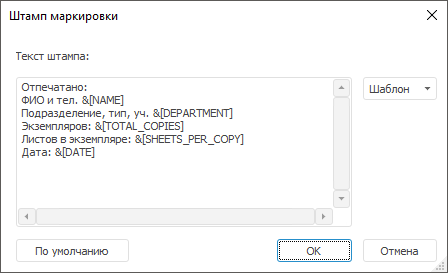
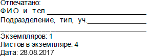

# Добавление штампа маркировки

Добавление штампа маркировки
-

# Добавление штампа маркировки

Штамп маркировки используется при выборе [мандатного
 метода](../Admin_PermSep_M.htm) или [метода разграничения доступа
 по уровням](../Security_levels.htm) для маркировки документов при экспорте и печати.

Для добавления штампа маркировки:

	- Установите флажок «Маркировать
	 объекты при экспорте и печати» в окне «[Параметры уровня
	 безопасности](../../03_Admin/Admin_MandatAccessParam.htm)».

	- Откройте окно «Штамп маркировки»:

		- в веб-приложении из раздела «[Мандатный доступ](../Admin_MandatAccess.htm)»
		 или «[Уровни
		 безопасности](../Security_levels_section.htm)» нажмите кнопку «Штамп
		 маркировки» на [панели
		 инструментов](../../01_RunSecManager/Admin_Organizational_Starting.htm);

		- в настольном приложении:

			- из раздела «[Мандатный
			 доступ](../Admin_MandatAccess.htm)» выполните команду «Мандатный
			 доступ > Штамп маркировки» в [главном
			 меню](../../01_RunSecManager/Admin_Organizational_Starting.htm);

			- из раздела «[Уровни
			 безопасности](../Security_levels_section.htm)» выполните команду «Уровни
			 безопасности > Штамп маркировки» в [главном
			 меню](../../01_RunSecManager/Admin_Organizational_Starting.htm).

После выполнения одного из действий будет
 отображен диалог с текущим шаблоном штампа:

	- Настройте содержание штампа маркировки в области «Текст
	 штампа». Штамп может содержать произвольный текст.

Примечание.
 Настройка штампа маркировки будет применяться для всех отчетов и документов
 репозитория. Для определенного отчета можно настроить уникальный штамп
 маркировки, используя свойство [IGxDocument.Stamps](ModDrawing.chm::/Interface/IGxDocument/IGxDocument.Stamps.htm).

При нажатии на кнопку «По
 умолчанию» сбрасывается текст штампа к виду, установленному по
 умолчанию:

При нажатии на кнопку «Шаблон»
 открывается список автоматически заполняемых полей для вставки в содержание
 штампа маркировки:

		- &[TOTAL_COPIES]. Число отпечатанных экземпляров. Заполняется
		 автоматически. При экспорте значение подстановки будет равно единице;

		- &[SHEETS_PER_COPY]. Число листов в экземпляре. Заполняется
		 автоматически;

		- &[DATE]. Дата печати или экспорта. Заполняется автоматически;

		- &[NAME]. Имя пользователя;

		- &[DEPARTMENT]. Наименование подразделения.

После выполнения действий при экспорте и печати на маркированных документах
 будет содержаться штамп маркировки.

См. также:

[Настройка
 мандатного метода](../Admin_PermSep_M.htm) | [Настройка метода
 разграничения доступа по уровням](../Security_levels.htm) | [Настройка
 параметров уровня безопасности](../../03_Admin/Admin_MandatAccessParam.htm)

		Справочная
		 система на версию 10.9
		 от 18/08/2025,
		 © ООО «ФОРСАЙТ»,
