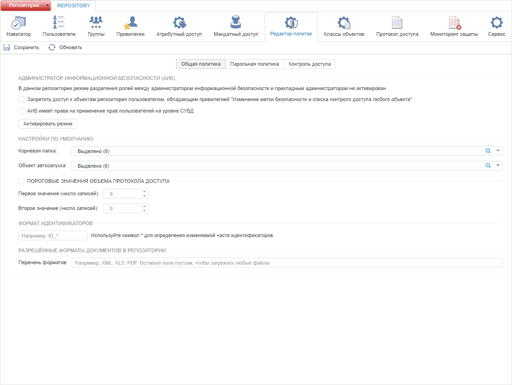
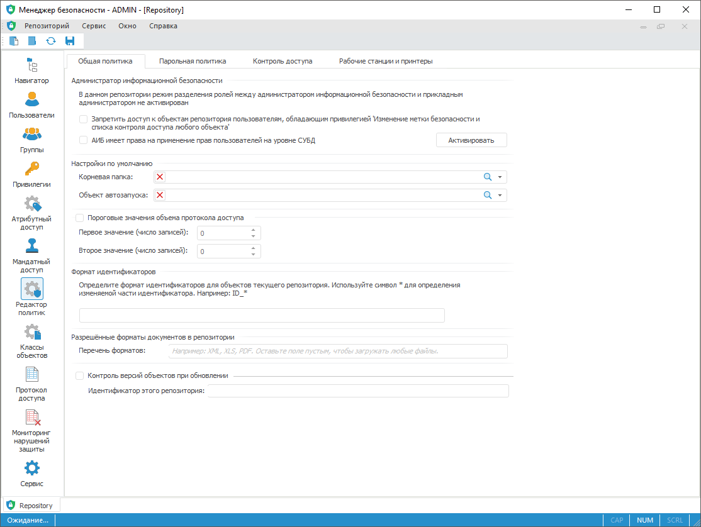

# Общие настройки политики

Общие настройки политики
-

# Общие настройки политики

Для общей настройки политики безопасности используйте вкладку «Общая политика» в разделе «Редактор политик» [панели
 навигации](../../01_RunSecManager/Admin_Organizational_Starting.htm).

Общая политика включает в себя: разделение ролей администраторов, настройки
 по умолчанию, пороговые значения объема протокола доступа, формат идентификаторов
 для объектов репозитория, ограничение загрузки документов в репозиторий,
 контроль версий объектов при обновлении.

Примечание.
 При [разделении ролей](Security_EditorPoliticy_Adm.htm) между
 администратором информационной безопасности и прикладным администратором
 раздел «Редактор политик» будет
 доступен только администратору информационной безопасности.

Вкладка «Общая политика»:

	Веб-приложение

	 Настольное
	 приложение

		

		

[Разделение
 ролей администраторов](javascript:TextPopup(this))

	В группе параметров «Администратор
	 информационной безопасности» содержится информация о разделении
	 ролей между администратором информационной безопасности (АИБ) и прикладным
	 администратором. Если режим не активирован, то в данном поле будет
	 отображаться кнопка «Активировать»,
	 если активирован - «Деактивировать».

	Для активации режима нажмите кнопку «Активировать».
	 Для деактивации режима нажмите кнопку «Деактивировать».

	Для получения подробной информации о разделении ролей администраторов
	 обратитесь к разделу «[Разделение
	 ролей администраторов](Security_EditorPoliticy_Adm.htm)».

	Флажок «Запретить доступ к объектам
	 репозитория пользователям, обладающим привилегией 'Изменение метки
	 безопасности и списка контроля доступа любого объекта'» определяет,
	 будет ли у пользователей, имеющих привилегию как у АИБ'а, возможность
	 открывать объекты репозитория. При установленном флажке игнорируется
	 наличие у пользователя привилегии «Право
	 чтения и открытия всех объектов», и при попытке открыть объект
	 репозитория будет выдано сообщение о том, что недостаточно прав для
	 выполнения операции. Флажок доступен для изменения, когда разделение
	 ролей не активировано.

	Флажок «АИБ имеет права на применение
	 прав пользователей на уровне СУБД» определяет, будет ли разрешено
	 АИБ производить обновление пользователей. При снятом флажке обновление
	 пользователей сможет производить только прикладной администратор,
	 при установленном флажке оба администратора.

	При разделении ролей прикладному администратору в менеджере безопасности
	 будут доступны только разделы «[Протокол доступа](../../05_AccessProtocol/Admin_AccessProtocol.htm)»
	 и «[Пользователи](../../03_Admin/Users/Admin_Users.htm)»,
	 причем будут недоступны операции отключения подключенного пользователя
	 и смены пароля пользователя. Для АИБ будут доступны все разделы, но
	 в разделе «[Пользователи](../../03_Admin/Users/Admin_Users.htm)»
	 будут недоступны операции создания, обновления (если флажок «АИБ имеет права на применение прав пользователей
	 на уровне СУБД» был снят) и удаления пользователей.

	При активации/деактивации АИБ и при наличии не сохраненных изменений
	 в политике безопасности будет выдан запрос на их применение. При положительном
	 ответе изменения в политике безопасности будут сохранены и будет запущен
	 процесс активации/деактивации АИБ.

[Настройки
 по умолчанию](javascript:TextPopup(this))

		- Корневая папка.
		 В раскрывающемся списке объектов выберите одну из папок репозитория.
		 Указанная папка будет использована в качестве корневой папки репозитория,
		 если вход осуществляется под пользователем, который не является
		 администратором или администратором информационной безопасности
		 (АИБ).

		По умолчанию корневая папка не задана, при этом пользователям доступен
		 весь репозиторий.

	Примечание.
	 Для доступа к объектам репозитория пользователь должен обладать соответствующими
	 [правами](../../03_Admin/Admin_AdminObjects.htm).

		- Объект автозапуска.
		 В раскрывающемся списке объектов выберите объект автозапуска для
		 репозитория. При входе в схему указанный объект автоматически
		 открывается. Объектом автозапуска может выступать лишь объект,
		 доступный текущему пользователю для [чтения](../../03_Admin/Admin_AdminObjects.htm).

		Если при входе в систему необходимо, чтобы открылся весь репозиторий,
		 а не объект автозапуска, то нужно в окне регистрации при нажатии
		 кнопки «OK», удерживать
		 на клавишу SHIFT.

	Примечание.
	 Помимо объекта автозапуска для репозитория может быть определен [объект автозапуска
	 для пользователя](../../03_Admin/Users/Admin_UserProp_Common.htm). При этом объект автозапуска для пользователя
	 имеет более высокий приоритет при запуске, чем объект автозапуска
	 для репозитория. В веб-приложении автозапуск недоступен.

[Пороговые
 значения объема протокола доступа](javascript:TextPopup(this))

	При достижении пороговых значений администратору системы будут выданы
	 предупреждающие сообщения.

	Для задания пороговых значений установите флажок «Пороговые
	 значения объема протокола доступа», а затем задайте значения
	 первого и второго пороговых значений. Первое пороговое значение должно
	 быть меньше второго.

	При каждом входе в менеджер безопасности под пользователем, имеющим
	 привилегию «Очистка протокола доступа»,
	 выполняется проверка достижения пороговых значений объёма протокола
	 доступа. Если пороговое значение было достигнуто, то будет предложено
	 очистить протокол доступа. При положительном ответе будет запущен
	 процесс [очистки
	 протокола доступа](../../05_AccessProtocol/Admin_AccessProtoclo_Clean.htm).

[Формат
 идентификаторов](javascript:TextPopup(this))

	Раздел «Формат идентификаторов»
	 используется для определения шаблона, по которому будут формироваться
	 идентификаторы объектов. Если задать шаблон, то при создании объектов
	 к идентификаторам по умолчанию будет добавлен заданный префикс или
	 суффикс.

	Шаблон может состоять из постоянной (префикс, суффикс) и изменяемой
	 частей. Постоянная часть определяется латинскими символами и цифрами
	 и является не обязательной. Изменяемая часть является обязательной,
	 для ее определения используйте символ *. Например: «ADMIN_*».
	 Вместо * будет подставляться идентификатор по умолчанию, данную часть
	 можно будет изменять.

	При задании формата строка проверяется на наличие некорректных данных
	 (отсутствие *, русский язык, первый символ - цифра, и т.п.). Некорректный
	 формат не будет сохранен при применении политики и не будет использоваться
	 для формирования идентификаторов объектов.

	Данная опция необходима для исключения пересечения идентификаторов
	 при [обновлении
	 объектов репозитория](UpdManager.chm::/Admin_UpMBObj_DoUpdate.htm). Если в разных репозиториях задать
	 различные приставки, то при обновлении идентификаторы не пересекутся.
	 Опция является дополнительной степенью защиты прикладной системы от
	 некорректного обновления.

[Разрешённые
 форматы документов в репозитории](javascript:TextPopup(this))

	Раздел «Разрешённые форматы документов
	 в репозитории» используется для ограничения допустимых форматов
	 [документов](UiNavObj.chm::/UiNavObj_document.htm)
	 для загрузки и открытия в репозитории. Введите в поле «Перечень
	 форматов» расширения файлов, например: XML, XLS, PDF. Если
	 заданы разрешённые форматы, то при попытке загрузки или открытия документа,
	 который не соответствует заданным форматам, будет выдаваться сообщение
	 о нарушении политики безопасности. По умолчанию доступна загрузка
	 и открытие документов любого формата.

	Примечание.
	 Если заданы разрешённые форматы, то автоматически будет заблокирована
	 загрузка обновлений в репозиторий - файлов с расширением PEF, PEFX
	 и UPDPACK. Для наличия возможности установки обновлений добавьте данные
	 расширения в список разрешённых форматов.

[Контроль
 версий объектов при обновлении](javascript:TextPopup(this))

	Контроль версий объектов при обновлении позволяет задать произвольный
	 идентификатор репозитория, который будет содержаться в текущей версии
	 объекта. У каждого объекта в репозитории отслеживается номер версии
	 с заданным идентификатором репозитория. При редактировании и сохранении
	 объекта номер версии увеличивается на единицу, идентификатор репозитория
	 обновляется на заданный идентификатор репозитория в контроле версий
	 объектов при обновлении, если он был изменен.

	Примечание.
	 Контроль версий объектов при обновлении доступен только в настольном
	 приложении.

	В процессе установки обновления проверяются версии объектов:

		- если идентификаторы репозиториев для версий объектов в [файле
		 обновления](UpdManager.chm::/Admin_UpMBObj_RunManager.htm#open_update) и в целевом репозитории не совпадают,
		 то выдаётся предупреждение о возможности прервать процесс обновления
		 или продолжить;

		- если идентификаторы совпадают,
		 то выполняется проверка номеров версий. Для обновляемых объектов
		 версия в [файле
		 обновления](UpdManager.chm::/Admin_UpMBObj_RunManager.htm#open_update) должна быть не ниже версии в целевом
		 репозитории;

		- если версии связанных объектов,
		 от которых зависят обновляемые объекты, в [файле
		 обновления](UpdManager.chm::/Admin_UpMBObj_RunManager.htm#open_update) и в целевом репозитории не совпадают,
		 то выдаётся предупреждение о возможности прервать процесс обновления
		 или продолжить. Версии связанных объектов сохраняются при создании
		 в [файле
		 обновления](UpdManager.chm::/Admin_UpMBObj_RunManager.htm#open_update).

	Для контроля версий объектов:

		- Установите флажок «Контроль
		 версий объектов при обновлении».

		- Задайте идентификатор репозитория
		 в поле «Идентификатор этого репозитория».

	В [свойствах
	 объекта](UiNav.chm::/03_Objects/UiNav_Obj_BasicProp.htm) будет учитываться заданный идентификатор
	 репозитория и номер версии в поле «Текущая
	 версия», например: «DEV: 15».

	Примечание.
	 Если идентификатор для репозитория не задан, он считается пустым.

Для применения заданных настроек политики безопасности:

	- в веб-приложении нажмите кнопку  «Сохранить»
	 на [панели
	 инструментов](../../01_RunSecManager/Admin_Organizational_Starting.htm) или на [боковой
	 панели](../../01_RunSecManager/Admin_Organizational_Starting.htm);

	- в настольном приложении выполните
	 одно из действий:

		- выполните команду «Репозиторий
		 > Применить политику безопасности» в [главном
		 меню](../../01_RunSecManager/Admin_Organizational_Starting.htm);

		- нажмите кнопку 
		 «Применить политику безопасности»
		 на [панели
		 инструментов](../../01_RunSecManager/Admin_Organizational_Starting.htm).

Примечание.
 Если параметры раздела были изменены, то при попытке перехода на другой
 раздел или при закрытии менеджера безопасности будет выдан запрос о применении
 измененных настроек.

При необходимости можно [экспортировать
 настройки политики безопасности](../PolicyExport.htm) в файл.

См. также:

[Выбор
 методов разграничения доступа и их настройка](../Admin_SecPolicy.htm) | [Настройка
 проверки паролей пользователей](Security_EditorPoliticy_General_Parole.htm)

		Справочная
		 система на версию 10.9
		 от 18/08/2025,
		 © ООО «ФОРСАЙТ»,
