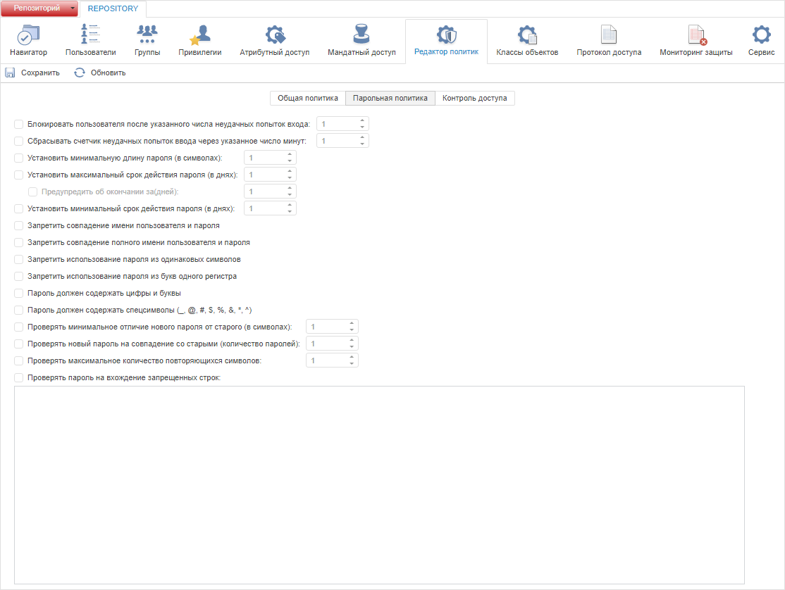
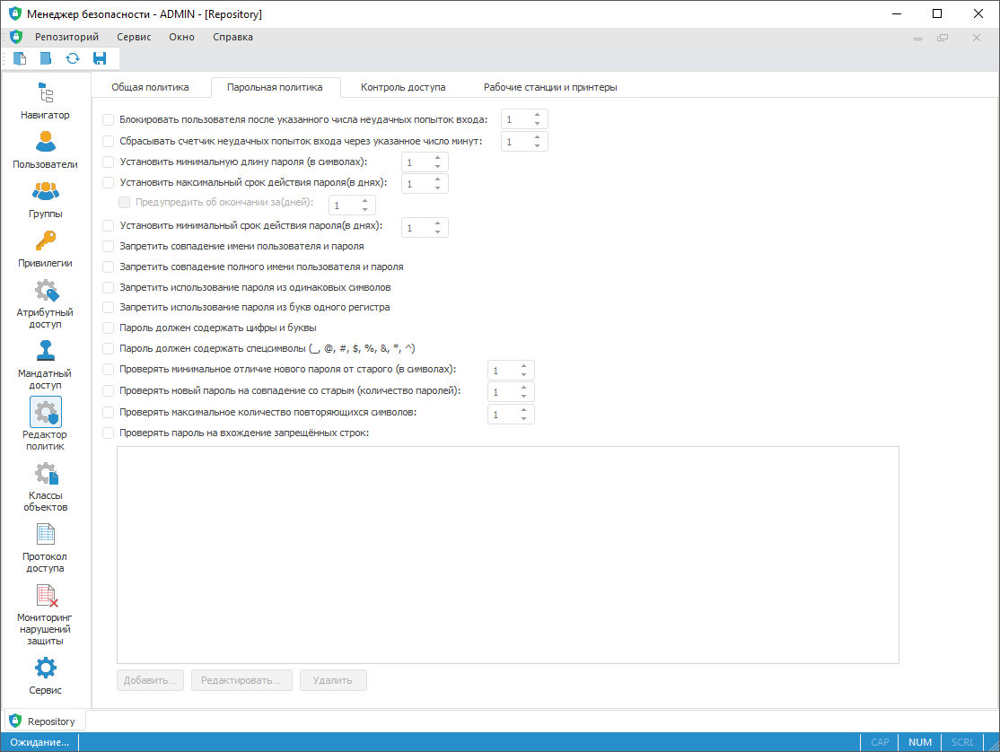

# Настройка проверки паролей пользователей

Настройка проверки паролей пользователей
-

# Настройка проверки паролей пользователей

Для настройки проверки паролей пользователей используйте вкладку «Парольная политика» в разделе «Редактор политик» [панели
 навигации](../../01_RunSecManager/Admin_Organizational_Starting.htm).

Примечание.
 При [разделении ролей](Security_EditorPoliticy_Adm.htm) между
 администратором информационной безопасности и прикладным администратором
 раздел «Редактор политик» будет
 доступен только администратору информационной безопасности.

Вкладка «Парольная политика»:

	Веб-приложение
	 Настольное
	 приложение

		

		

[Блокировка
 пользователя и сброс неудачных попыток входа](javascript:TextPopup(this))

		- Блокировать пользователя
		 после указанного числа неудачных попыток входа. Установка
		 флажка позволяет задать число неудачных попыток входа, после которого
		 происходит блокировка пользователя и выдача соответствующего сообщения
		 при запуске «Форсайт. Аналитическая платформа».
		 Данный параметр учитывает случаи ошибочного ввода логина/пароля
		 и защищает от подбора. Число неудачных попыток определяется в
		 редакторе напротив флажка.

	Примечание.
	 Блокировка пользователей после указанного числа неудачных попыток
	 входа распространяется на всех существующих и несуществующих пользователей
	 в СУБД и в менеджере безопасности. При ошибочном вводе логина/пароля
	 несуществующий пользователь также будет заблокирован. Для разблокировки
	 такого пользователя создайте его [учётную
	 запись](../../03_Admin/Users/Admin_Users.htm) в менеджере безопасности и снимите флажок «[Заблокировать
	 учётную запись](../../03_Admin/Users/Admin_UserProp_Common.htm)» в [свойствах
	 пользователя](../../03_Admin/Users/Admin_UserCreate.htm). Данная особенность блокировки позволяет защитить
	 от выявления существующих пользователей вследствие перебора логина/пароля.

		- Сбрасывать счетчик неудачных
		 попыток входа через указанное число минут. Установка флажка
		 позволяет задать количество минут, после которого происходит сброс
		 счетчика неудачных попыток входа: количество неудачных входов
		 будет равно нулю. Количество минут определяется в редакторе напротив
		 флажка. Например, пользователь блокируется после трех неудачных
		 попыток входа. При втором неудачном входе пользователь может подождать
		 заданный промежуток времени, после чего у него снова будет три
		 попытки для входа в систему. Если количество неудачных входов
		 превысит установленный порог, то пользователь будет заблокирован.

[Установка
 длины и срока действия пароля](javascript:TextPopup(this))

		- Установить минимальную
		 длину пароля (в символах). Установка флажка позволяет задавать
		 ограничение на минимальную длину пароля в символах. Минимальная
		 длина пароля определяется в редакторе напротив флажка;

		- Установить максимальный
		 срок действия пароля (в днях). Установка флажка позволяет
		 задавать максимальный срок действия пароля, по истечении которого
		 пользователю необходимо сменить пароль;

			- Предупредить об окончании
			 за (дней). Установка флажка позволяет задавать количество
			 дней, за которое при каждом входе в систему пользователю будет
			 выдаваться информационное сообщение об истечении срока действия
			 пароля и оставшегося количества дней. При необходимости пользователь
			 может изменить пароль с помощью окна «[Смена пароля](UiNav.chm::/02_Navigator/UiNav_ChangePass.htm)»
			 через информационное сообщение;

		- Установить минимальный
		 срок действия пароля (в днях). Установка флажка позволяет
		 задавать минимальный срок действия пароля, в течение которого
		 запрещена смена пароля пользователем.

	Примечание.
	 Максимальный/минимальный срок действия пароля может быть отменен флажком
	 «[Срок
	 действия пароля не ограничен](../../03_Admin/Users/Admin_UserProp_Common.htm)» конкретного пользователя.

[Запрет
 совпадения имени пользователя и пароля](javascript:TextPopup(this))

		- Запретить совпадение имени
		 пользователя и пароля. При установке флажка пароль пользователя
		 и его [имя](../../03_Admin/Users/Admin_UserProp_Common.htm#description)
		 должны быть различными;

		- Запретить совпадение полного
		 имени пользователя и пароля. При установке флажка пароль
		 пользователя и его [полное
		 имя](../../03_Admin/Users/Admin_UserProp_Common.htm#description) должны быть различными.

[Параметры
 использования пароля](javascript:TextPopup(this))

		- Запретить использование
		 пароля из одинаковых символов. При установке флажка пароль
		 пользователя не может состоять из одинаковых символов;

		- Запретить использование
		 пароля из букв одного регистра. При установке флажка пароль
		 пользователя должен состоять из букв разного регистра;

		- Пароль должен содержать
		 цифры и буквы. При установке флажка пароль пользователя
		 проверяется на наличие букв и цифр;

		- Пароль должен содержать
		 спецсимволы (_,@, #,$,%,&,*,^). При установке флажка
		 пароль пользователя проверяется на наличие спецсимволов.

[Проверка
 пароля](javascript:TextPopup(this))

		- Проверять минимальное отличие
		 нового пароля от старого (в символах). Установка флажка
		 позволяет наложить ограничение на совпадение старого и нового
		 пароля пользователя. Количество символов задается в редакторе
		 чисел напротив флажка;

		- Проверять новый пароль
		 на совпадение со старым (количество паролей). Установка
		 флажка позволяет хранить историю паролей пользователя и наложить
		 ограничение на полное совпадение старого и нового пароля. Количество
		 хранимых и проверяемых старых паролей задается в редакторе чисел
		 напротив флажка. Снятие данного флажка очищает хранимый список
		 старых паролей пользователя;

	Примечание.
	 Пароль пользователя, изменённый администратором, не сохраняется в
	 истории паролей.

		- Проверять максимальное
		 количество повторяющихся символов. Установка флажка позволяет
		 использовать в пароле заданное количество повторяющихся символов.
		 Количество символов задается в редакторе чисел напротив флажка;

		- Проверять пароль на вхождение
		 запрещенных строк. Установка флажка позволяет проверять
		 пароль пользователя на вхождение запрещенных строк. Проверка происходит
		 при [смене
		 пароля](../../03_Admin/Users/Admin_User_EditPass.htm). Запрещенные строки отображаются в списке, расположенном
		 под флажком. Работа со списком доступна, только если флажок установлен:

		-

			- для добавления запрещенной строки в настольном приложении:

			-

				- нажмите кнопку «Добавить»;

				- нажмите клавишу INSERT;

				- дважды щёлкните по свободному от элементов
				 пространству;

				- выполните команду «Добавить»
				 в контекстном меню списка запрещенных строк.

	После этого в список будет добавлен новый
	 элемент, текст которого доступен для редактирования. Необходимо указать
	 текст запрещенной строки:

	

	Для сохранения изменений нажмите клавишу ENTER либо щёлкните
	 по свободному от элементов пространству. Нажатие клавиши ESC отменяет
	 добавление запрещенной строки.

		-

			- для редактирования выбранной запрещенной строки в настольном
			 приложении:

			-

				- нажмите кнопку «Редактировать»;

				- выполните команду «Редактировать»
				 контекстного меню запрещенной строки;

				- дважды щёлкните по запрещенной строке.

	После этого запрещенная строка будет
	 доступна для редактирования. После внесения изменений нажмите клавишу
	 ENTER либо щелкните по свободному от элементов пространству. Нажатие
	 клавиши ESC отменяет редактирование запрещенной строки.

		-

			- для удаления выбранных запрещенных строк в настольном
			 приложении:

			-

				- нажмите кнопку «Удалить»;

				- выполните команду «Удалить»
				 контекстного меню;

				- нажмите клавишу DELETE.

	После чего появится диалог подтверждения
	 выполняемых действий.

	Множественный выбор строк осуществляется
	 с зажатой клавишей CTRL.

	Для удаления всех строк выполните пункт
	 контекстного меню «Очистить».

		-

			- для выбора всех строк в настольном приложении:

			-

				- выполните команду контекстного меню «Выделить
				 все»;

				- нажмите сочетание клавиш CTRL+A.

	Примечание.
	 В веб-приложении ввод запрещенных строк осуществляется в текстовом
	 формате, разделяя их пробелами, запятыми или точками с запятой.

Для применения заданных настроек парольной политики:

	- в веб-приложении нажмите кнопку  «Сохранить»
	 на [панели
	 инструментов](../../01_RunSecManager/Admin_Organizational_Starting.htm) или на [боковой
	 панели](../../01_RunSecManager/Admin_Organizational_Starting.htm);

	- в настольном приложении выполните
	 одно из действий:

		- выполните команду «Репозиторий
		 > Применить политику безопасности» в [главном
		 меню](../../01_RunSecManager/Admin_Organizational_Starting.htm);

		- нажмите кнопку 
		 «Применить политику безопасности»
		 на [панели
		 инструментов](../../01_RunSecManager/Admin_Organizational_Starting.htm).

Примечание.
 Если параметры раздела были изменены, то при попытке перехода на другой
 раздел или при закрытии менеджера безопасности будет выдан запрос о применении
 измененных настроек.

См. также:

[Выбор
 методов разграничения доступа и их настройка](../Admin_SecPolicy.htm) | [Общие
 настройки политики](Security_EditorPoliticy_General.htm) | [Дополнительные
 настройки контроля доступа](../../03_Admin/Access_control_settings.htm)

		Справочная
		 система на версию 10.9
		 от 18/08/2025,
		 © ООО «ФОРСАЙТ»,
