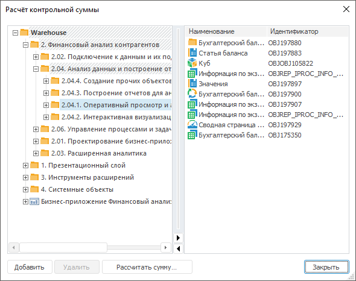
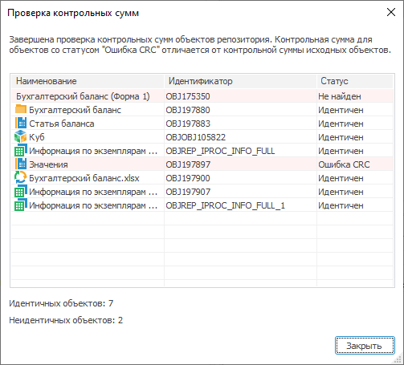
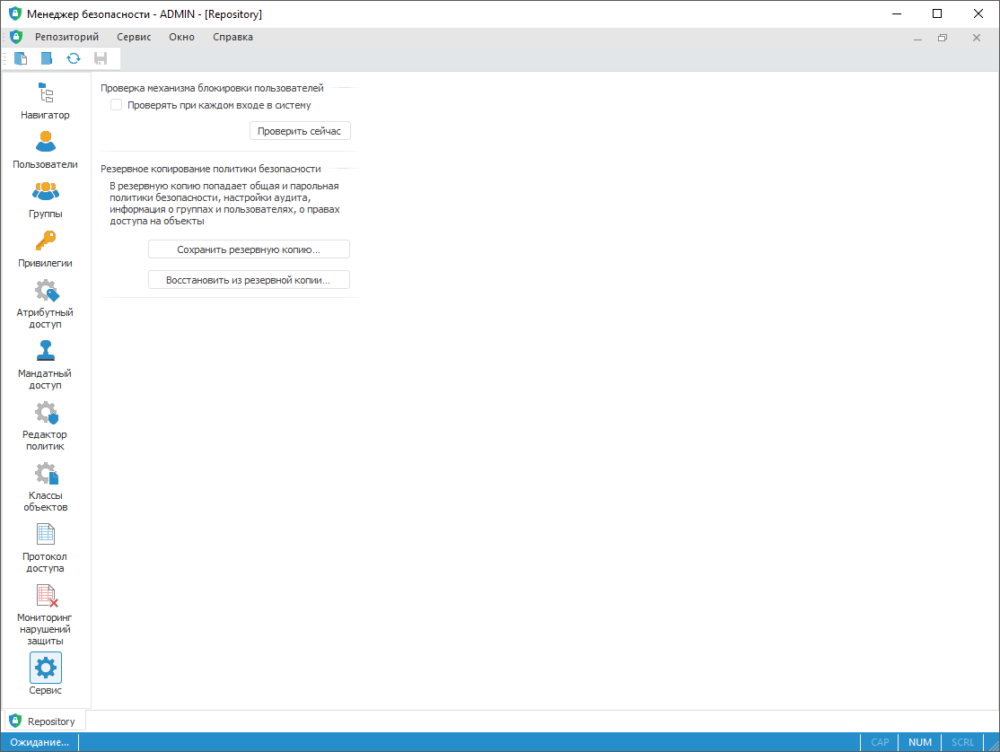

# Контроль целостности продукта и метаданных

Контроль целостности продукта и метаданных
-

# Контроль целостности продукта «Форсайт. Аналитическая платформа»
	 и метаданных

	Контроль целостности продукта «Форсайт. Аналитическая платформа»
	 и метаданных репозитория производится в результате:

		- [проверки целостности продукта](#product);

		- [проверки целостности метаданных репозитория](#metadata);

		- [проверки корректности аудита пользователей](#users).

## Проверка целостности продукта

	Проверка целостности продукта выполняется, если был установлен флажок
	 «Проверять контрольные суммы при
	 каждом запуске платформы»:

		- при [установке
		 настольного приложения продукта «Форсайт. Аналитическая платформа»](Setup.chm::/02_AK_Install/Setup_AK_Install.htm#sum);

		- при [установке
		 BI-сервера продукта «Форсайт. Аналитическая платформа»
		 в ОС Windows](Setup.chm::/UiWebSetup/Install_Web_on_Windows.htm#installation_type).

	Примечание.
	 Если при установке веб-приложения или настольного приложения проверка
	 контрольных сумм не была включена, то для её активации заново запустите
	 инсталлятор и установите флажок «Проверять
	 контрольные суммы при каждом запуске платформы».

	Проверка контрольных сумм для исполняемых файлов производится в
	 момент их загрузки. При каждом запуске «Форсайт. Аналитическая платформа»
	 загружается минимальный набор исполняемых файлов, а по мере обращения
	 к функциональности загружаются дополнительные библиотеки, необходимые
	 для работы. В случае обнаружения нарушения целостности пользователю
	 выдается соответствующее сообщение с указанием нарушенных файлов.
	 Дальнейшая работа с «Форсайт. Аналитическая платформа»
	 блокируется.

	Для восстановления целостности необходимо вмешательство администратора.

	Повредить исполняемые файлы или их содержимое могут:

		- действия злоумышленников;

		- ошибочные действия пользователей;

		- вирусы;

		- прочие причины.

	Примечание.
	 Проверка контрольных сумм выполняется только при запуске настольного
	 приложения или при работе BI-сервера, установленного в ОС Windows.
	 В ОС Linux проверка контрольных сумм выполняется средствами операционной
	 системы.

## Проверка целостности метаданных репозитория

	Для проверки целостности метаданных репозитория используется расчёт
	 контрольных сумм, которые вычисляются определенным образом по содержимому
	 объекта. Контрольная сумма меняется при любом изменении объекта. Для
	 проверки суммы необходимо первоначально её рассчитать. При последующей
	 проверке объекта сверяется предыдущая контрольная сумма с текущей.
	 Если сумма изменена, значит, объект был изменен.

	Проверка целостности метаданных объектов репозитория доступна:

		- в веб-приложении только из [менеджера
		 обновлений](UpdManager.chm::/Admin_UpMBObj_RunManager.htm#main_window);

		- в настольном приложении из [менеджера
		 безопасности](../01_RunSecManager/Admin_Organizational_Starting.htm#main_window) и [менеджера
		 обновлений](UpdManager.chm::/Admin_UpMBObj_RunManager.htm#main_window);

### Расчёт контрольной суммы

	Расчёт контрольной суммы в настольном и веб-приложении отличается.

		Веб-приложение
		 Настольное приложение

			Для расчёта контрольной суммы в веб-приложении в [менеджере
			 обновлений](UpdManager.chm::/Admin_UpMBObj_RunManager.htm#main_window) выполните команду контекстного
			 меню объектов обновления «Рассчитать
			 контрольные суммы».

			После выполнения команды диалог «Расчёт
			 контрольной суммы», как в настольном приложении, открыт
			 не будет. Контрольная сумма будет рассчитана для всех объектов,
			 находящихся в обновлении, и сохранена в файл с наименованием
			 «Контрольная сумма.crc» в папку «Загрузки» локального компьютера.
			 Переместите файл в другую папку при необходимости.

			Для расчёта контрольной суммы в настольном приложении:

				- Откройте окно «Расчёт
				 контрольной суммы» одним из способов:

					- из [менеджера
					 безопасности](../01_RunSecManager/Admin_Organizational_Starting.htm#main_window) выполните команду главного меню «Репозиторий > Рассчитать
					 контрольные суммы»;

					- из [менеджера
					 обновлений](UpdManager.chm::/Admin_UpMBObj_RunManager.htm#main_window) выполните команду главного
					 меню «Обновление
					 > Рассчитать контрольные
					 суммы».

			После выполнения действий будет
			 открыто окно «Расчёт контрольной
			 суммы»:

			

				- Сформируйте список объектов, для которых будет рассчитана
				 сумма.

			Для добавления в список выбранного
			 объекта в дереве объектов:

					- нажмите кнопку «Добавить»;

					- выполните команду контекстного меню «Добавить
					 объект»;

					- переместите объект в правую часть с помощью
					 механизма Drag&Drop.

			Для настройки отображения объектов
			 в контекстном меню дерева объектов установите переключатель:

					- Отображать
					 наименования. Отображаются только наименования
					 объектов;

					- Отображать
					 идентификаторы. Отображаются только идентификаторы
					 объектов;

					- Отображать
					 наименования и идентификаторы. Отображаются
					 наименования и идентификаторы объектов.

			Для поиска объекта в дереве объектов:

					- выполните команду контекстного меню объекта
					 «Поиск»;

					- нажмите сочетание клавиш CTRL+F.

			После выполнения одного из действий
			 будет открыт [стандартный
			 диалог поиска](UiNav.chm::/02_Navigator/UiNav_FindObject.htm).

			Для удаления выбранных объектов
			 из списка нажмите кнопку «Удалить»,
			 после чего будет открыт диалог подтверждения действия.

			После выполнения
			 действия будет сформирован список объектов для расчёта суммы
			 в правой части окна.

			Примечание.
			 Если вызов окна был произведен из [менеджера
			 обновлений](UpdManager.chm::/Admin_UpMBObj_RunManager.htm#main_window), то в правой части окна будут
			 отображены объекты, содержащиеся на панели «[Обновление](UpdManager.chm::/Admin_UpMBObj_RunManager.htm#main_window)».

				- Рассчитайте сумму для выбранных объектов с помощью
				 кнопки «Рассчитать сумму».

			После выполнения действий будет рассчитана сумма для выбранных
			 объектов и открыт стандартный диалог сохранения файла. При
			 нажатии на кнопку «Сохранить»
			 сумма будет сохранена в файл с расширением *.crc.

### Проверка контрольных сумм

	Для проверки контрольных сумм:

		- Откройте стандартный диалог выбора файла:

			- в веб-приложении в [менеджера
			 обновлений](UpdManager.chm::/Admin_UpMBObj_RunManager.htm#main_window) выполните команду контекстного
			 меню объектов обновления «Проверить
			 контрольные суммы»;

			- в настольном приложении:

				- из [менеджера
				 безопасности](../01_RunSecManager/Admin_Organizational_Starting.htm#main_window) выполните команду главного меню «Репозиторий > Проверить
				 контрольные суммы»;

				- из [менеджера
				 обновлений](UpdManager.chm::/Admin_UpMBObj_RunManager.htm#main_window) выполните команду главного
				 меню «Обновление >
				 Проверить контрольные суммы».

		- Выберите файл с расширением *.crc, содержащий ранее сохраненную
		 сумму.

	После выполнения действий будет открыто окно «Проверка
	 контрольных сумм», отображающее результаты проверки предыдущей
	 контрольной суммы с текущей, например:

	

	В окне отображается таблица, содержащая результаты проверки предыдущей
	 контрольной суммы с текущей. Для объектов отображаются идентификаторы,
	 наименования и статус проведенной проверки.

	Возможные статусы проверки контрольных сумм:

		- Идентичен. Контрольная
		 сумма объекта не изменилась;

		- Не найден. Объект
		 отсутствует в репозитории;

		- Ошибка CRC.
		 Контрольная сумма объектов изменилась.

## Проверка корректности аудита пользователей

	Для проверки [служебного
	 пользователя](Setup.chm::/05_RepoMngr/Setup_RepoMngr_Service_User.htm), который необходим для корректного
	 аудита пользователей, используется проверка механизма блокировки пользователей.
	 Служебный пользователь создается в [менеджере
	 репозитория](Setup.chm::/05_RepoMngr/Setup_RepoMngr_Work_Main.htm). Вследствие неправильного создания
	 служебного пользователя, переустановки схем или действий злоумышленников
	 система безопасности может не функционировать должным образом.

	Примечание.
	 Проверка механизма блокировки пользователей доступна только в настольном
	 приложении. Использование проверки механизма блокировки пользователей
	 при каждом входе в систему увеличивает время ожидания запуска продукта
	 «Форсайт. Аналитическая платформа».

	Для проверки механизма блокировки пользователей при каждом входе
	 администратора в менеджер безопасности установите флажок «Проверять
	 при каждом входе в систему» в разделе «Сервис»:

	

	В случае обнаружения ошибок будет выдано соответствующее сообщение.
	 Состояние флажка сохраняется для текущего пользователя ОС.

	Для проверки механизма блокировки пользователей в данный момент
	 нажмите кнопку «Проверить сейчас».
	 По результатам проверки будет выдано соответствующее сообщение.

См. также:

[Администрирование
 и контроль доступа](../Admin_Title.htm)

		Справочная
		 система на версию 10.9
		 от 18/08/2025,
		 © ООО «ФОРСАЙТ»,
