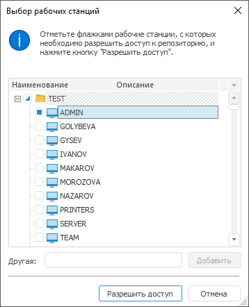
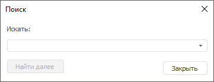

# Выбор рабочих станций

Выбор рабочих станций
-

# Выбор рабочих станций

Для выбора рабочих станций при настройке доступа [рабочих
 станций](../03_Admin/Workstation_and_printer_access.htm#workstations), при настройке [управления
 доступом](../03_Admin/Users/Admin_UserProp_Time.htm) пользователя и параметров [анализа изменений](UpdManager.chm::/Admin_UpMBObj_ChangeAnalysis.htm)
 используйте окно «Выбор рабочих станций»
 в настольном приложении и задайте наименования рабочих станций в текстовом
 формате в веб-приложении:

В верхней части окна содержится информационное сообщение, которое отображает
 причину вызова диалога.

Отметьте флажками те рабочие станции, с которых необходимо запретить/разрешить
 доступ или для которых необходимо произвести анализ.

При отметке домена все рабочие станции, относящиеся к домену, будут
 отмечены.

Для работы с флажками доступно контекстное меню:

	- Развернуть всю иерархию.
	 Разворачивает иерархию списка;

	- Свернуть всю иерархию.
	 Сворачивает иерархию списка.

Для добавления рабочей станции вручную укажите в поле «Другая»
 путь к рабочей станции в виде: «Домен/Рабочая
 станция», и нажмите кнопку «Добавить».

[Поиск
 рабочей станции](javascript:TextPopup(this))

	Для поиска рабочей станции нажмите сочетание клавиш CTRL+F, после
	 чего будет открыто стандартное окно поиска:

	

	Введите наименование рабочей станции и нажмите кнопку «Найти
	 далее».

	Будут найдены все рабочие станции, содержащие указанное наименование.
	 Если не найдена ни одна рабочая станция по указанному наименованию,
	 то будет выдано соответственное информационное сообщение.

После выбора рабочих станций нажмите кнопку «Разрешить
 доступ».

См. также:

[Создание
 учетных записей пользователей и работа с ними](../03_Admin/Users/Admin_Users.htm) | [Выбор
 пользователей и групп](../03_Admin/Admin_UsersGroups.htm)

		Справочная
		 система на версию 10.9
		 от 18/08/2025,
		 © ООО «ФОРСАЙТ»,
