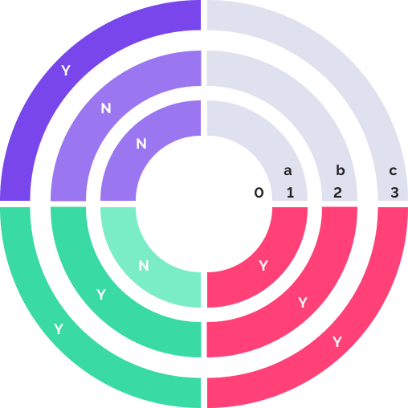

# Настройка метода разграничения доступа по уровням

Настройка метода разграничения доступа по уровням
-

# Настройка метода разграничения
 доступа по уровням

Метод разграничения доступа по уровням безопасности раздает права средствами
 платформы и основан на присвоении объектам и субъектам системы метки критичности.
 Метод похож на [мандатный метод разграничения
 доступа](Admin_PermSep_M.htm).

Примечание.
 Метод разграничения доступа по уровням безопасности доступен для одновременного
 использования с [дискреционным методом](Admin_PermSep_D.htm).

При использовании метода разграничения доступа по уровням безопасности
 всем объектам и субъектам системы присваивается уровень безопасности.
 Все уровни безопасности имеют разные метки критичности. Уровень безопасности
 имеет большую степень секретности, если значение его метки критичности
 меньше.

Настройка метода разграничения доступа по уровням осуществляется:

	- владельцем схемы ADMIN;

	- членами группы «[Администраторы](../03_Admin/Groups/Admin_Groups.htm)»;

	- пользователями с [привилегиями](Admin_Priv.htm) «Вход в систему», «Изменение
	 прав пользователей, раздача ролей, изменение политики», «Изменение метки безопасности и списка контроля
	 доступа любого объекта. Просмотр всех объектов в навигаторе»,
	 «Право чтения и открытия всех объектов»;

	- [администратором
	 информационной безопасности](Editor_of_Politicy/Security_EditorPoliticy_Adm.htm) при разделении ролей администраторов.

Для использования метода разграничения доступа по уровням:

	- Установите флажок «Использовать
	 уровни безопасности» на вкладке «[Контроль доступа](Admin_SecPolicy.htm#access_control)»
	 редактора политик.

	- Создайте [учетные
	 записи пользователей](../03_Admin/Users/Admin_Users.htm) и [группы
	 пользователей](../03_Admin/Groups/Admin_Groups.htm).

	- Добавьте [уровни безопасности](Security_levels_section.htm).

	- Задайте уровни безопасности для [субъектов](../03_Admin/Users/Admin_UserProp_SecLevels.htm)
	 и [объектов](../03_Admin/Admin_AdminObjects_Discretionary_seclevels.htm).

## Механизм контроля доступа

Контроль по уровням определяет возможность чтения и изменения объекта,
 права на удаление объекта с помощью доступа по уровням не определяются.
 К изменению объекта относятся все операции, каким-либо образом меняющие
 содержимое объекта или права доступа к нему.

Субъект может производить операцию чтения и записи, если метка критичности
 пользователя меньше или равна метке критичности объекта.

Специфический уровень с меткой критичности «0» означает запрет операций
 чтения и записи. Если он установлен для пользователя, то этот пользователь
 не сможет получить доступа ни к одному объекту репозитория. Если этот
 уровень установлен для объекта, то ни один из пользователей не сможет
 получить доступ к данному объекту.

## Пример

Допустим, имеется несколько уровней безопасности:

0.
 Доступ запрещен;

1.
 Для служебного пользования;

2.
 Ограниченный доступ;

3.
 Свободный доступ (для общего пользования).

Три пользователя с уровнями безопасности:

 Пользователь1. Для
 служебного пользования (1);

 Пользователь2. Ограниченный
 доступ (2);

 Пользователь3. Свободный
 доступ (3).

Три объекта с уровнями безопасности:

a.
 Для служебного пользования (1);

b.
 Ограниченный доступ (2);

c.
 Свободный доступ (3).

Тогда структуру системы можно представить в виде диаграммы:

Кольца диаграммы - это объекты, секторы диаграммы - пользователи.

	- Y. Объекты, которые
	 доступны для чтения и редактирования;

	- N. Объекты, которые
	 не доступны пользователю.

См. также:

[Выбор
 методов разграничения доступа и их настройка](Admin_SecPolicy.htm) | [Добавление
 уровней безопасности](Security_levels_section.htm)

		Справочная
		 система на версию 10.9
		 от 18/08/2025,
		 © ООО «ФОРСАЙТ»,
