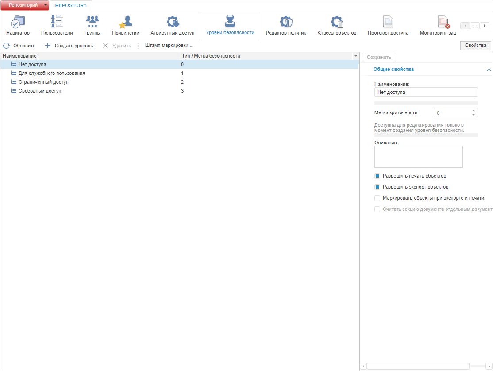

# Добавление уровней безопасности

Добавление уровней безопасности
-

# Добавление уровней безопасности

Для добавления уровней безопасности используйте раздел «Уровни
 безопасности» [панели
 навигации](../01_RunSecManager/Admin_Organizational_Starting.htm).

Примечание.
 При [разделении
 ролей](Editor_of_Politicy/Security_EditorPoliticy_Adm.htm) между администратором информационной безопасности и прикладным
 администратором раздел «Уровни безопасности»
 будет доступен только администратору информационной безопасности.

Раздел основан на принципе [метода разграничения
 доступа по уровням](Security_levels.htm), предназначен для формирования уровней безопасности,
 которые будут использоваться для разграничения прав.

Примечание.
 Метод разграничения доступа по уровням доступен для одновременного использования
 с [дискреционным методом](Admin_PermSep_D.htm).

Убедитесь, что в [контроле
 доступа](Admin_SecPolicy.htm#access_control) установлен флажок «Использовать
 уровни безопасности».

Раздел «Уровни безопасности»:

	Веб-приложение
	 Настольное
	 приложение

		

		

[Добавление уровня
 безопасности](javascript:TextPopup(this))

	Для добавления уровней безопасности:

		- в веб-приложении нажмите кнопку  «Создать уровень» на [панели
		 инструментов](../01_RunSecManager/Admin_Organizational_Starting.htm). На боковой панели «Свойства»
		 задайте [параметры
		 уровня безопасности](../03_Admin/Admin_MandatAccessParam.htm).

		- в настольном приложении нажмите кнопку «Добавить»,
		 расположенную ниже списка «Уровни».
		 Будет открыто окно «[Параметры
		 уровня безопасности](../03_Admin/Admin_MandatAccessParam.htm)».

[Удаление уровня
 безопасности](javascript:TextPopup(this))

	Для удаления уровня безопасности:

		- в веб-приложении нажмите
		 кнопку  «Удалить»
		 на [панели
		 инструментов](../01_RunSecManager/Admin_Organizational_Starting.htm);

		- в настольном приложении
		 нажмите кнопку «Удалить»
		 под списком.

Для применения заданных настроек уровней безопасности:

	- в веб-приложении нажмите кнопку  «Сохранить»
	 на [панели
	 инструментов](../01_RunSecManager/Admin_Organizational_Starting.htm) или на [боковой
	 панели](../01_RunSecManager/Admin_Organizational_Starting.htm);

	- в настольном приложении выполните
	 одно из действий:

		- выполните команду «Репозиторий
		 > Применить политику безопасности» в [главном
		 меню](../01_RunSecManager/Admin_Organizational_Starting.htm);

		- нажмите кнопку 
		 «Применить политику безопасности»
		 на [панели
		 инструментов](../01_RunSecManager/Admin_Organizational_Starting.htm).

Примечание.
 Если параметры раздела были изменены, то при попытке перехода на другой
 раздел или при закрытии менеджера безопасности будет выдан запрос о применении
 измененных настроек.

См. также:

[Выбор
 методов разграничения доступа и их настройка](Admin_SecPolicy.htm) | [Настройка
 метода разграничения доступа по уровням](Security_levels.htm)

		Справочная
		 система на версию 10.9
		 от 18/08/2025,
		 © ООО «ФОРСАЙТ»,
