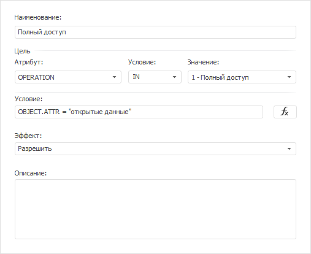

# Цель проверки контроля доступа

Цель проверки контроля доступа
-

# Цель проверки контроля доступа

Главным условием [атрибутного доступа](Admin_AttributeAccess.htm)
 является выполнение цели. Цель содержит условие для дальнейшей проверки
 доступа действий пользователя к объектам с помощью заданного [алгоритма
 комбинации](Admin_AttributeAccess.htm#properties) и сравнивается с результатом выполнения [дополнительного
 условия](Creating_conditions.htm).

Задайте цель при добавлении:

	- [набора политик](Admin_AttributeAccess.htm#policies_set);

	- [политики](Admin_AttributeAccess.htm#policy);

	- [правила](Admin_AttributeAccess.htm#rule).

Цель определяется как простое логическое выражение, состоящее из атрибута,
 условия и значения:

Для формирования логического выражения:

	- Выберите в раскрывающемся списке «Атрибут»
	 атрибут [объекта](Creating_conditions.htm#object), [субъекта](Creating_conditions.htm#subject)
	 или [среды окружения](Creating_conditions.htm#environment).

Примечание.
 Полный список доступных атрибутов и их описание содержится в разделе «[Создание дополнительного условия проверки
 доступа](Creating_conditions.htm)».

	- Выберите в раскрывающемся списке «Условие»
	 [операцию
	 отношения](Fore.chm::/07_Operations/Operations_relations.htm) или операцию «IN».

Примечание.
 Операция «IN» используется только для атрибута среды окружения «[OPERATION](Creating_conditions.htm#environment)»,
 который содержит операции над объектом. Перед началом использования атрибута
 с операцией «IN» ознакомьтесь с [особенностями](Target.htm#in).

	- Задайте значение, которое будет сравниваться со значением атрибута
	 для проверки доступа, в поле «Значение».
	 Поле формируется по типу данных выбранного атрибута.

## Особенности использования атрибута «OPERATION» и операции
 «IN»

Для атрибута среды окружения «[OPERATION](Creating_conditions.htm#environment)»
 значение задается двумя способами:

	- выберите в раскрывающемся списке поля «Значение»
	 основную [операцию](KeSom.chm::/Enums/MetabaseObjectPredefinedRights.htm)
	 над объектом;

	- введите в поле «Значение»
	 код специфической операции над объектом. Списки кодов специфических
	 операций содержатся в перечислениях сборки [Metabase](KeSom.chm::/Enums/KeSom_Enums.htm).

Особенности использования операции «IN» с атрибутом «[OPERATION](Creating_conditions.htm#environment)»:

	- если в значении атрибута установлен [код операции](KeSom.chm::/Enums/MetabaseObjectPredefinedRights.htm)
	 «1», «2» или «4», то автоматически выбираются дочерние операции. Например,
	 при заданной цели «OPERATION IN 2» входят все дочерние операции чтения:
	 чтение дескриптора, чтение параметров, чтение метаданных, дополнительные
	 операции печати, экспорта и специфические операции;

	- в значении атрибута можно задать несколько кодов операций в
	 виде суммы. Например, при заданной цели «OPERATION IN 792» в значении
	 атрибута содержится сумма кодов операций, которые может принимать
	 атрибут. Сумма 792 получается из: 8 - изменение прав, 16 - удаление,
	 256 - чтение дескриптора, 512 - изменение дескриптора.

## Пример

Политика содержит правило, разрешающее полный доступ к объектам со значением
 «открытые данные» пользовательского атрибута «ATTR». Условие полного доступа
 задается с помощью атрибута среды окружения «[OPERATION](Creating_conditions.htm#environment)».

Также использование цели приведено в примере для [настройки
 атрибутного метода](Admin_ABAC.htm).

См. также:

[Настройка
 атрибутного метода](Admin_ABAC.htm) | [Создание дополнительного
 условия проверки доступа](Creating_conditions.htm)

		Справочная
		 система на версию 10.9
		 от 18/08/2025,
		 © ООО «ФОРСАЙТ»,
