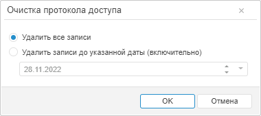

# Очистка протокола доступа

Очистка протокола доступа
-

# Очистка протокола доступа

Для очистки протокола доступа:

	- в веб-приложении нажмите кнопку  «Очистить»
	 на [панели
	 инструментов](../01_RunSecManager/Admin_Organizational_Starting.htm);

	- в настольном приложении выполните команду «Протокол
	 доступа > Очистить» в [главном
	 меню](../01_RunSecManager/Admin_Organizational_Starting.htm).

После выполнения одного из действий будет открыто окно «Очистка
 протокола доступа»:

Установите переключатель очистки протокола доступа:

	- Удалить все записи.
	 Будут удалены все записи протокола;

	- Удалить записи до указанной
	 даты. После установки переключателя укажите дату, до которой
	 требуется удалить все записи.

Перед началом очистки:

	- в веб-приложении автоматически будет произведён [экспорт](Admin_AccessProtocol_Save.htm)
	 удаляемых записей протокола доступа в файл формата *,csv;

	- в настольном приложении будет предложено [сохранение
	 протокола доступа в файл](Admin_AccessProtocol_Save.htm).

Если сохранение/экспорт прошло успешно, то начинается очистка протокола
 доступа. После очистки в протокол помещается запись, индицирующая очистку.

Примечание.
 Команда главного меню/кнопка «Очистить»
 недоступна, если пользователю разрешён только просмотр протокола. При
 [разделении
 ролей](../04_SecurityPolicy/Editor_of_Politicy/Security_EditorPoliticy_Adm.htm) между администратором информационной безопасности и прикладным
 администратором команда главного меню/кнопка «Очистить»
 доступна только для администратора информационной безопасности. При очистке
 протокола доступа будут удалены записи для активных сессий, если очистка
 производится от [служебного
 пользователя](Setup.chm::/05_RepoMngr/Setup_RepoMngr_Service_User.htm).

См. также:

[Протокол доступа](Admin_AccessProtocol.htm)
 | [Загрузка протокола доступа](Admin_AcessProtocol_ViewSaved.htm)

		Справочная
		 система на версию 10.9
		 от 18/08/2025,
		 © ООО «ФОРСАЙТ»,
