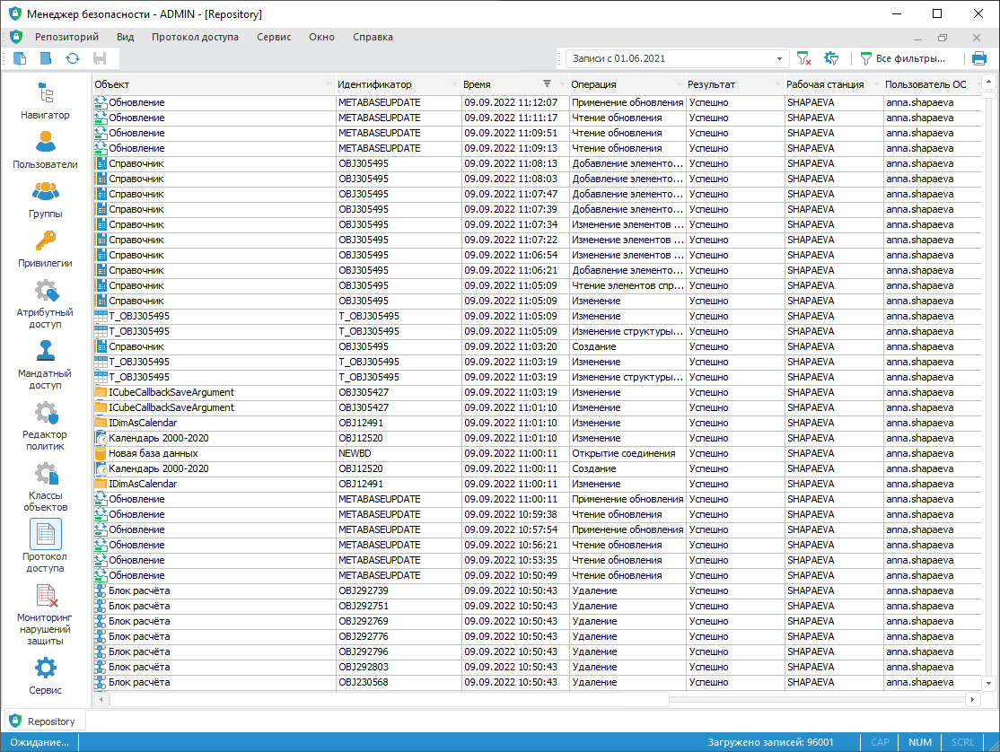

# Протокол доступа

Протокол доступа
-

# Протокол доступа

Для настройки протокола доступа используйте раздел «Протокол
 доступа» [панели
 навигации](../01_RunSecManager/Admin_Organizational_Starting.htm).

Примечание.
 При [разделении ролей](../04_SecurityPolicy/Editor_of_Politicy/Security_EditorPoliticy_Adm.htm) между администратором
 информационной безопасности и прикладным администратором раздел «Протокол
 доступа» будет доступен только администратору
 информационной безопасности.

Раздел «Протокол доступа»:

	Веб-приложение

	 Настольное
	 приложение

		

		

Отслеживайте работу пользователей через протокол доступа в соответствии
 с настроенным [аудитом](../04_SecurityPolicy/Admin_Object_Classes.htm).

Параметры протокола доступа:

[Определение
 объекта](javascript:TextPopup(this))

		- Объект. Наименование
		 объекта, к которому обращается пользователь.

		- Идентификатор. Идентификатор
		 объекта, к которому обращается пользователь.

		- Уровень доступа.
		 Поле доступно только в настольном приложении. Поле содержит наименование
		 уровня безопасности объекта и отображается, если используется
		 [мандатный метод
		 разграничения доступа](../04_SecurityPolicy/Admin_PermSep_M.htm).

[Определение
 пользователя](javascript:TextPopup(this))

		- Рабочая станция.
		 Рабочая станция, с которой осуществлялся доступ к объекту.

		- Пользователь ОС.
		 Пользователь операционной системы, осуществляющий доступ к объекту.

		- Пользователь платформы.
		 Пользователь продукта «Форсайт. Аналитическая платформа»,
		 осуществляющий доступ к объекту.

		- IP адрес. IP адрес
		 рабочей станции, с которой осуществлялся доступ к объекту. В ОС
		 Linux при использовании кластеров в зависимости от конфигурации
		 в протокол доступа записывается IP-адрес различных объектов: BI-сервера,
		 балансировщика или рабочей станции. Для получения подробной информации
		 о настройке передачи IP-адреса рабочей станции обратитесь к разделу
		 «[Настройка
		 протоколирования IP-дреса в ОС Linux](setup.chm::/UiWebSetup/04_FAQ/Balancer_Additional_Settings.htm)».

[Протоколирование
 операции](javascript:TextPopup(this))

		- Время. Дата и время
		 выполнения операции.

		- Операция. Тип [протоколируемой операции](Admin_AccessProtocol_EvetsType.htm).

		- Результат. Отображает
		 наличие прав на осуществление запрашиваемого действия: успешно
		 - права есть; неуспешно
		 - права на выполнение действия отсутствуют. Записи с неуспешными
		 действиями выделяются цветом.

	Примечание.
	 Если обращение к дочернему объекту завершилось неуспешно, то результат
	 обращения ко всем родительским объектам также считается неуспешным.

[Прочее](javascript:TextPopup(this))

		- Примечание. В данном
		 поле отображается дополнительная информация к записи протокола:

		-

			- добавление, удаление, изменение групп (включение пользователей
			 в группу);

			- добавление, удаление, изменение пользователей (изменение
			 наименования, смена пароля, и пр.);

			- выдача или отзыв (аннулирование) привилегий;

			- изменение мандатной политики: удаление/добавление/изменение
			 категорий доступа, удаление/добавление/изменение уровней категорий
			 доступа;

			- изменение политик в редакторе политик: включение/отключение
			 АИБа, включение/отключение дискреционного/мандатного контроля
			 доступа, изменение в парольной политике, объекта по умолчанию;

			- изменение прав доступа с указанием информации о предыдущих
			 и назначенных правах (были/стали). Также примечание будет
			 содержать информацию об изменении состояния флажка «[Наследовать разрешения от родительского
			 объекта](../03_Admin/Admin_AdminObjects_Discretionary.htm#inherit_permissions)»;

			- изменение аудита объектов;

			- путь к файлу:

			-

				- при сохранении/применении политики безопасности
				 в/из файла;

				- при сохранении протокола доступа в файл;

			- имя файла:

			-

				- при экспорте регламентного/экспресс-отчёта в файл;

			- имя и размер файла при работе с обновлением в веб-приложении;

			- путь к файлу, размер файла и дата последнего изменения
			 файла при работе с обновлением в настольном приложении;

			- выход пользователя был принудительным, если пользователь
			 был отключен от схемы администратором;

			- добавление, удаление, очистка списка доступных для печати
			 принтеров;

			- информация о выполнении или запрете печати на устройстве,
			 изменении уровня доступа для принтера;

			- добавление принтера субъекту;

			- версия веб-приложения «Форсайт. Аналитическая платформа».
			 Отображается при входе в систему;

			- информация о браузере, в котором открыто веб-приложение
			 (User Agent). По умолчанию данная информация не отображается.
			 Для отображения информации о браузере при входе в систему
			 установите флажок «[Производить
			 протоколирование информации о User Agent](../03_Admin/Access_control_settings.htm#user_agent)» в [настройках
			 контроля доступа](../03_Admin/Access_control_settings.htm).

		- Соединение. Поле
		 доступно только в настольном приложении. Поле заполняется только
		 при [установке
		 обновления](UpdManager.chm::/Admin_UpMBObj_DoUpdate.htm)
		 и содержит записи о соединениях с базами данных, которые были
		 открыты во время обновления.

Ключевые возможности:

	- [загрузка протокола
	 доступа](Admin_AcessProtocol_ViewSaved.htm);

	- [настройка протокола
	 доступа](Admin_AccessProtocol_Sets.htm);

	- [изменение вида отображения
	 протокола доступа](Admin_AccessProtocol_View.htm);

	- [настройка
	 отображения списка](../03_Admin/Admin_AdminObjects_AuditTuning.htm);

	- [поиск в протоколе
	 доступа](Admin_AccessProtocol_Search.htm);

	- [фильтрация протокола
	 доступа](Admin_AccessProtocol_Filter_Apply.htm);

	- [просмотр информации о событии](Admin_EventData.htm);

	- [сохранение протокола
	 доступа в файл](Admin_AccessProtocol_Save.htm);

	- [протоколирование операций в
	 файл](Logging_operations.htm);

	- [предварительный просмотр
	 и печать](Admin_AccessProtocolPrint.htm);

	- [очистка протокола доступа](Admin_AccessProtoclo_Clean.htm).

См. также:

[Настройка
 аудита действий пользователя](../04_SecurityPolicy/Admin_Object_Classes.htm) | [Загрузка
 протокола доступа](Admin_AcessProtocol_ViewSaved.htm) | [Настройка
 протокола доступа](Admin_AccessProtocol_Sets.htm)

		Справочная
		 система на версию 10.9
		 от 18/08/2025,
		 © ООО «ФОРСАЙТ»,
