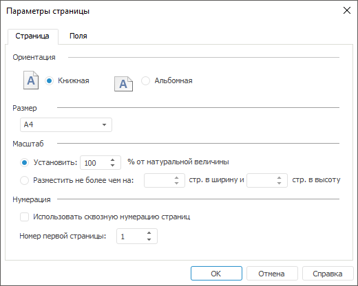
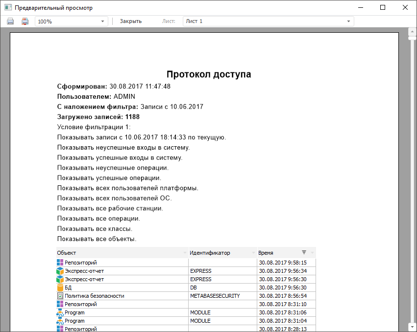
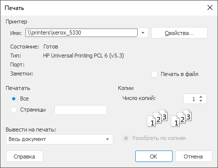

# Предварительный просмотр и печать

Предварительный просмотр и печать
-

# Предварительный просмотр и печать

Для предварительного просмотра и печати в [протоколе
 доступа](Admin_AccessProtocol.htm) учитывайте настроенное [отображение
 столбцов](../03_Admin/Admin_AdminObjects_AuditTuning.htm#columns) и используемую [фильтрацию](../03_Admin/Admin_AdminObjects_AuditTuning.htm#sort)
 в таблице.

Примечание.
 Предварительный просмотр и печать доступны только в настольном приложении.

## Параметры страницы

Для настройки параметров страницы выполните команду «Протокол
 доступа > Параметры страницы» в [главном
 меню](../01_RunSecManager/Admin_Organizational_Starting.htm).

После выполнения действия будет открыто окно «[Параметры страницы](UiReport.chm::/desktop/Tuning/ParamPage/UiReport_Tuning_ParamPage.htm)»
 для настройки вида протокола доступа на печать. Настройка параметров в
 окне «[Параметры страницы](UiReport.chm::/desktop/Tuning/ParamPage/UiReport_Tuning_ParamPage.htm)»
 аналогична настройке в регламентном отчёте.

## Предварительный просмотр

Для предварительного просмотра протокола доступа на печать выполните
 команду «Протокол доступа > Предварительный
 просмотр» в [главном
 меню](../01_RunSecManager/Admin_Organizational_Starting.htm).

После выполнения действия будет открыто окно «Предварительный
 просмотр»:

Перед таблицей протокола доступа отображается информация о дате формирования
 протокола доступа, пользователе, который сформировал протокол доступа,
 параметрах [фильтрации
 протокола доступа](Admin_AccessProtocol_Filter_Apply.htm), количестве загруженных записей, [прерывании
 загрузки протокола доступа](Admin_AcessProtocol_ViewSaved.htm#interrupting_loading).

Предварительный просмотр в окне «[Предварительный
 просмотр](UiNav.chm::/GUI/Object_preview.htm)» аналогичен предварительному просмотру
 в регламентном отчёте.

## Печать протокола доступа

Для печати протокола доступа:

	- выполните команду «Протокол
	 доступа > Печать» в [главном
	 меню](../01_RunSecManager/Admin_Organizational_Starting.htm);

	- нажмите кнопку  «Печать протокола доступа» на [панели
	 инструментов](../01_RunSecManager/Admin_Organizational_Starting.htm).

После выполнения одного из действий будет открыто стандартное окно печати.
 Выберите параметры печати, используемый принтер и нажмите кнопку «ОК».

См. также:

[Протокол
 доступа](Admin_AccessProtocol.htm) | [Протоколирование операций
 в файл](Logging_operations.htm) | [Информация о событии](Admin_EventData.htm)

		Справочная
		 система на версию 10.9
		 от 18/08/2025,
		 © ООО «ФОРСАЙТ»,
