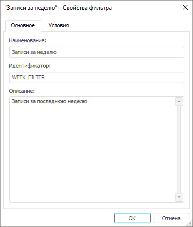
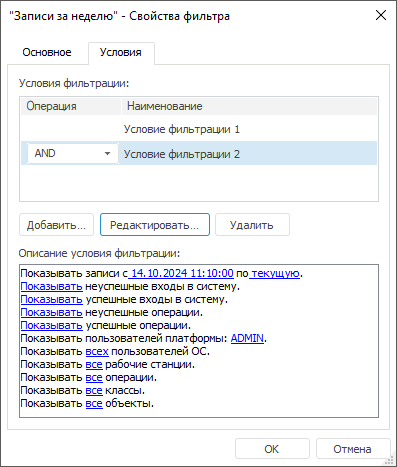
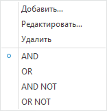

# Свойства фильтра протокола доступа

Свойства фильтра протокола доступа
-

# Свойства фильтра протокола доступа

Для установки или редактирования фильтра протокола доступа используйте
 окно «Свойства фильтра»:

[Для открытия
 окна](javascript:TextPopup(this))

		- в веб-приложении создайте или
		 отредактируйте фильтр в диалоге «[Фильтры протокола доступа](Admin_AccessProtocol_Filter_All.htm)»;

		- в настольном приложении:

			- выберите пункт «Создать
			 новый фильтр» в раскрывающемся списке на панели инструментов
			 «[Протокол
			 доступа](Admin_AccessProtocol_Filter_Apply.htm)»;

			- выполните команду контекстного меню «Настроить
			 фильтрацию» протокола доступа;

			- выполните команду главного меню «Протокол
			 доступа > Настроить фильтрацию»;

			- создайте или отредактируйте фильтр в диалоге «[Фильтры
			 протокола доступа](Admin_AccessProtocol_Filter_All.htm)».

	 Вкладка
	 «Основное»

	 Вкладка
	 «Условия»

		

		

 Задайте настройки фильтра на вкладках:

	- Основное.
	 Задаются наименование и идентификатор фильтра, при необходимости добавляется
	 описание;

	- Условия.
	 Задаются условия фильтрации данных для таблицы [протокола
	 доступа](Admin_AccessProtocol.htm):

		- Условия фильтрации.
		 Список содержит все условия, объединенные логическими операциями;

		- Описание условия фильтрации. Список содержит описание настроенных
		 операций выбранного условия.

Доступные операции на вкладке «Условия»:

[Создание условия](javascript:TextPopup(this))

	Для создания условия:

		- Нажмите кнопку «Добавить»
		 или выполните команду «Добавить»
		 в контекстном меню списка условий фильтрации.

		- Задайте параметры условия в окне «[Редактирование условия
		 фильтрации](Admin_AccessProtocol_FilterEdit.htm)».

		- Нажмите кнопку «ОК».

	После выполнения действий условие будет добавлено в список условий
	 фильтрации. В списке «Описание условия
	 фильтрации» отобразятся заданные параметры условия.

[Редактирование
 условия](javascript:TextPopup(this))

	Для редактирования условия:

		- Выберите условие.

		- Нажмите кнопку «Редактировать»
		 или выполните команду «Редактировать»
		 в контекстном меню списка условий фильтрации.

		- Измените параметры условия в окне «[Редактирование условия
		 фильтрации](Admin_AccessProtocol_FilterEdit.htm)».

		- Нажмите кнопку «ОК».

	После выполнения действий условие будет отредактировано. В списке
	 «Описание условия фильтрации»
	 изменятся параметры условия.

	Также редактировать условие можно в списке «Описание
	 условия фильтрации» при помощи гиперссылок. При переходе по
	 гиперссылкам будут открываться [окна
	 с настройкой дополнительных параметров](Admin_AccessProtocol_FilterEdit.htm#list).

[Выбор логической
 операции](javascript:TextPopup(this))

	Для выбора логической операции при объединении условий:

		- установите переключатель в контекстном меню выбранного условия
		 в списке фильтраций:

	

		- выберите логическую операцию в раскрывающемся списке напротив
		 условия фильтрации.

	После выбора логической операции выбранное условие будет объединяться
	 с предыдущим через логическую операцию.

[Удаление
 условия](javascript:TextPopup(this))

	Для удаления выбранного условия фильтрации нажмите кнопку «Удалить» или выполните команду «Удалить» в контекстном меню списка
	 условий фильтрации.

См. также:

[Протокол
 доступа](Admin_AccessProtocol.htm) | [Фильтрация
 протокола доступа](Admin_AccessProtocol_Filter_Apply.htm) | [Редактирование
 условия фильтрации](Admin_AccessProtocol_FilterEdit.htm)

		Справочная
		 система на версию 10.9
		 от 18/08/2025,
		 © ООО «ФОРСАЙТ»,
