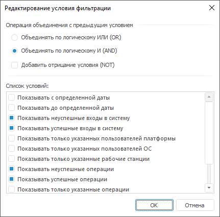
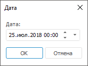
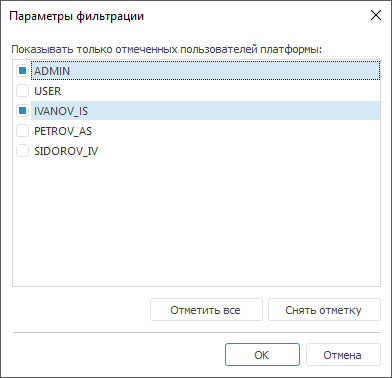
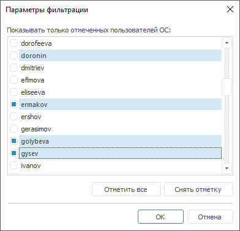
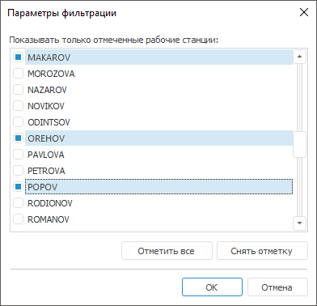
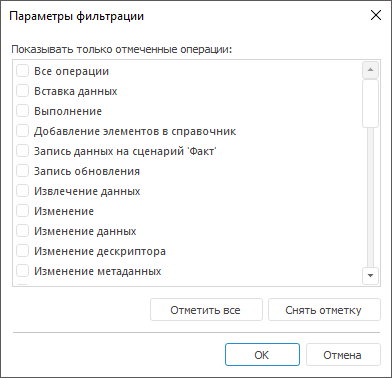
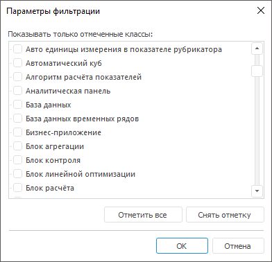

# Редактирование условия фильтрации

Редактирование условия фильтрации
-

# Редактирование условия фильтрации

Для редактирования или создания условия фильтрации используйте окно
 «Редактирование условия фильтрации»:

Задайте настройки:

	- Операция объединения с предыдущим
	 условием. Установите переключатель и/или флажок для выбора
	 одной логической операции объединения условия с предыдущим условием:

		- объединять по логическому ИЛИ (OR);

		- объединять по логическому И (AND);

		- объединять по логическому ИЛИ (OR) с добавление отрицания
		 условия (NOT);

		- объединять по логическому И (AND) с добавление отрицания
		 условия (NOT).

	- Список условий. Установите флажок в списке
	 для выбора операции условия фильтрации. Доступен выбор нескольких
	 операций. При установке некоторых флажков будут открываться окна с
	 настройкой дополнительных параметров.

Доступные операции:

[Показывать
 записи с определенной/до определенной даты](javascript:TextPopup(this))

	Условие устанавливает период времени, за который
	 будут отображаться записи в протоколе доступа. В окне «Дата» установите требуемый
	 период:

	

[Показывать неуспешные/успешные
 входы в систему](javascript:TextPopup(this))

	Условие определяет необходимость отображения в протоколе доступа
	 неудачных/успешных входов в систему. По умолчанию флажок установлен.

[Показывать
 только отмеченных пользователей платформы](javascript:TextPopup(this))

	Условие определяет необходимость отображения в протоколе доступа
	 пользователей платформы и их действий.

	При настройке условия будет открыто окно «Параметры
	 фильтрации», содержащий список пользователей продукта «Форсайт. Аналитическая платформа».
	 В окне отметьте флажками тех пользователей, действия которых необходимо
	 отобразить в протоколе доступа:

	

	При нажатии на кнопку «Отметить
	 все» флажки будут установлены для всех имеющихся пользователей.
	 При нажатии на кнопку «Снять отметку»
	 все флажки будут сняты.

[Показывать
 только отмеченных пользователей ОС](javascript:TextPopup(this))

	Условие определяет необходимость отображения в протоколе доступа
	 пользователей операционной системы и их действий.

	При настройке условия будет открыто окно «Параметры
	 фильтрации», содержащий список пользователей операционной системы.
	 В окне отметьте флажками тех пользователей, действия которых необходимо
	 отобразить в протоколе доступа:

	

	При нажатии на кнопку «Отметить
	 все» флажки будут установлены для всех имеющихся пользователей.
	 При нажатии на кнопку «Снять отметку»
	 все флажки будут сняты.

[Показывать
 только отмеченные рабочие станции](javascript:TextPopup(this))

	Условие определяет необходимость отображения в протоколе доступа
	 рабочих станций, действия которых необходимо отобразить.

	При настройке условия будет открыто окно «Параметры
	 фильтрации». В окне отметьте флажками рабочие станции, записи
	 о которых присутствуют в протоколе доступа:

	

	Отметьте флажками те рабочие станции, действия с которых будут отображены
	 в протоколе доступа. При нажатии на кнопку «Отметить
	 все» флажки будут установлены для всех имеющихся рабочих станций.
	 При нажатии на кнопку «Снять отметку»
	 все флажки будут сняты.

[Показывать
 неуспешные/успешные операции](javascript:TextPopup(this))

	Условие определяет необходимость отображения в протоколе доступа
	 запрещенных/разрешенных операций. По умолчанию флажок установлен.

[Показывать только отмеченные операции](javascript:TextPopup(this))

	Условие определяет необходимость отображения в протоколе доступа
	 операций и информации о них.

	При настройке условия будет открыто окно «Параметры
	 фильтрации», содержащий список доступных для выбора операций.
	 В окне отметьте флажками те операции, информация о которых будет отображаться
	 в протоколе доступа:

	

	При нажатии на кнопку «Отметить
	 все» флажки будут установлены для всех операций. При нажатии
	 на кнопку «Снять отметку»
	 все флажки будут сняты.

	Примечание.
	 При выборе операций следует учитывать, что [операции](Admin_AccessProtocol_EvetsType.htm)
	 могут быть привязаны к определенному [классу
	 объектов](../04_SecurityPolicy/Admin_Object_Classes.htm).

[Показывать
 только отмеченные классы](javascript:TextPopup(this))

	Условие определяет необходимость отображения в протоколе доступа
	 классов объектов и информации о них.

	При настройке условия будет открыто окно «Параметры
	 фильтрации», содержащий список доступных для выбора классов
	 объектов. В окне отметьте флажками те классы объектов, информация
	 о которых будет отображаться в протоколе доступа:

	

	При нажатии на кнопку «Отметить
	 все» флажки будут установлены для всех имеющихся классов. При
	 нажатии на кнопку «Снять отметку»
	 все флажки будут сняты.

	Примечание.
	 При выборе классов следует учитывать настроенные [параметры
	 фильтрации на операции](#operation), так как [операции](Admin_AccessProtocol_EvetsType.htm)
	 могут быть привязаны к определенному [классу
	 объектов](../04_SecurityPolicy/Admin_Object_Classes.htm).

[Показывать только отмеченные
 объекты](javascript:TextPopup(this))

	Условие определяет необходимость отображения в протоколе доступа
	 записей только для объектов, которые найдены по указанному наименованию
	 и/или идентификатору.

	При настройке условия будет открыто окно «Фильтрация
	 объектов»:

	

	Доступные настройки:

		- Имя или идентификатор содержат.
		 Укажите имя или идентификатор объекта, для которого необходимо
		 отображать записи протокола. Комбинированный список содержит историю
		 предыдущих введенных значений (хранит историю предыдущих поисков);

		- Искать по именам.
		 При установке флажка поиск осуществляется по именам объектов;

		- Искать по идентификаторам.
		 При установке флажка поиск осуществляется по идентификаторам объектов;

	Примечание.
	 При совместном использовании флажков «Искать
	 по именам» и «Искать по идентификаторам»
	 происходит поиск объектов, в которых и в имени, и в идентификаторе
	 содержится заданное слово.

		- Учитывать регистр.
		 Установка флажка позволяет при поиске учитывать регистр букв (например,
		 если для поиска указано «Отчет», то не будут найдены объекты,
		 содержащие в наименовании и/или идентификаторе «отчет» и «ОТЧЕТ»);

		- Только слова целиком.
		 Установка флажка позволяет искать только объекты, содержащие в
		 наименовании и/или идентификаторе целые слова, совпадающие с введенным
		 словом.

Примечание.
 Редактирование дополнительных параметров операций также доступно в списке
 «[Описание
 условия фильтрации](Admin_AccessProtocol_Filter.htm#edit)» окна «Свойства
 фильтра».

См. также:

[Протокол
 доступа](Admin_AccessProtocol.htm) | [Фильтрация
 протокола доступа](Admin_AccessProtocol_Filter_Apply.htm) | [Свойства
 фильтра протокола доступа](Admin_AccessProtocol_Filter.htm)

		Справочная
		 система на версию 10.9
		 от 18/08/2025,
		 © ООО «ФОРСАЙТ»,
