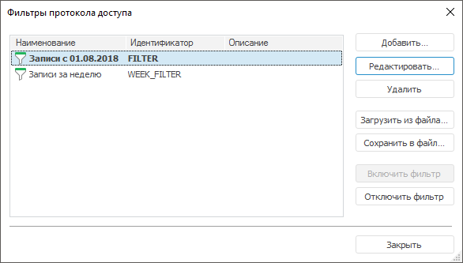
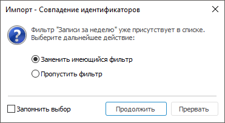

# Фильтры протокола доступа

Фильтры протокола доступа
-

# Фильтры протокола доступа

Для работы с фильтрами протокола доступа используйте окно «Фильтры
 протокола доступа»:

[Для открытия окна](javascript:TextPopup(this))

		- в веб-приложении нажмите кнопку
		  «Все фильтры»
		 на [панели
		 инструментов](../01_RunSecManager/Admin_Organizational_Starting.htm);

		- в настольном приложении:

			- на панели инструментов «[Протокол
			 доступа](Admin_AccessProtocol_Filter_Apply.htm)»:

				- выберите пункт «Все
				 фильтры» в раскрывающемся списке;

				- нажмите кнопку  «Все
				 фильтры»;

			- выполните команду «Все фильтры» в контекстном
			 меню протокола доступа;

			- выполните команду «Протокол доступ > Все фильтры»
			 в [главном
			 меню](../01_RunSecManager/Admin_Organizational_Starting.htm).

В списке отображаются все существующие фильтры протокола доступа. Текущий
 фильтр выделен жирным шрифтом.

Доступные операции:

[Создание фильтра](javascript:TextPopup(this))

	Для создания фильтра:

		- в веб-приложении нажмите кнопку
		 «Добавить»;

		- в настольном приложении:

			- нажмите кнопку «Добавить»;

			- нажмите клавишу INSERT;

			- выполните команду «Добавить» в
			 контекстном меню списка фильтров;

			- дважды щёлкните по свободному от фильтров пространству.

	После выполнения одного из действий будет открыт диалог «[Свойства фильтра](Admin_AccessProtocol_Filter.htm)»
	 для создания фильтра.

[Изменение фильтра](javascript:TextPopup(this))

	Для изменения параметров выбранного фильтра:

		- в веб-приложении нажмите кнопку
		 «Редактировать»;

		- в настольном приложении:

			- нажмите кнопку «Редактировать»;

			- нажмите клавишу ENTER;

			- выполните команду «Редактировать»
			 в контекстном меню списка фильтров;

			- дважды щёлкните по выбранному фильтру.

	После выполнения одного из действий будет открыт диалог «[Свойства фильтра](Admin_AccessProtocol_Filter.htm)»
	 для редактирования фильтра.

[Удаление фильтра](javascript:TextPopup(this))

	Для удаления выбранного фильтра:

		- в веб-приложении нажмите кнопку
		 «Удалить»;

		- в настольном приложении:

			- нажмите кнопку «Удалить»;

			- нажмите клавишу DELETE;

			- выполните команду «Удалить» в контекстном меню
			 списка фильтров.

	После выполнения одного из действий выбранный фильтр будет удален.

	Примечание.
	 В настольном приложении перед удалением отобразится диалог подтверждения
	 удаления.

[Отметка элементов
 списка](javascript:TextPopup(this))

	Для отметки всех элементов списка используйте сочетание клавиш CTRL+A.
	 Доступно только в настольном приложении.

	Для множественной отметки отдельных элементов списка, не связанных
	 между собой, зажмите клавишу CTRL.

	Для отметки сплошного блока элементов списка, одного за другим без
	 пропуска, зажмите клавишу SHIFT.

[Сохранение фильтра
 в файл](javascript:TextPopup(this))

	Для сохранения выбранных фильтров в файл:

		- нажмите кнопку «Сохранить
		 в файл»;

		- выполните команду «Сохранить
		 в файл» в контекстном меню списка выбранных фильтров;

		- используйте сочетание клавиш CTRL+S.

	После выполнения одного из действий откроется стандартный диалог
	 сохранения файла, где необходимо указать имя и месторасположение файла.
	 При нажатии на кнопку «Сохранить»
	 файл будет сохранен в формате XML.

	Примечание.
	 Сохранение фильтров в файл доступно только в настольном приложении.

[Загрузка фильтра
 из файла](javascript:TextPopup(this))

	Для загрузки ранее сохраненных фильтров:

		- нажмите кнопку «Загрузить
		 из файла»;

		- выполните команду «Загрузить
		 из файла» в контекстном меню списка фильтров;

		- используйте сочетание клавиш CTRL+O.

	После выполнения одного из действий откроется стандартный диалог
	 открытия файла, где необходимо выбрать файл фильтрации. Если выбранный
	 файл не содержит настроек фильтрации, то будет выдано сообщение об ошибке
	 чтения/записи данных. Если файл содержит настройки фильтрации, то
	 начнется процесс загрузки фильтров.

	Если в процессе загрузки будет обнаружен фильтр с идентификатором,
	 который совпадает с имеющимся фильтром в протоколе доступа, откроется
	 диалог:

	

	Выберите одно из действий с помощью переключателей:

		- Заменить имеющийся фильтр.
		 Имеющийся фильтр будет заменен фильтром из файла;

		- Пропустить фильтр.
		 Имеющийся фильтр останется без изменений;

		- Запомнить выбор. Установите флажок для применения
		 выбранного действия ко всем конфликтам, возникающим в процессе
		 загрузки. По умолчанию флажок снят.

	Нажмите кнопку «Продолжить»
	 для дальнейшей загрузки фильтров с учетом выбранного действия.

	Все загруженные фильтры будут добавлены в общий список фильтров.

	Примечание.
	 Загрузка фильтров из файла осуществляется только в настольном приложении.

[Включение фильтра](javascript:TextPopup(this))

	Для включения выбранного фильтра:

		- в веб-приложении нажмите кнопку
		 «Включить фильтр»;

		- в настольном приложении:

			- нажмите кнопку «Включить
			 фильтр»;

			- выполните команду «Протокол доступа > Включить
			 фильтр» в [главном
			 меню](../01_RunSecManager/Admin_Organizational_Starting.htm);

			- выполните команду «Включить фильтр» в контекстном
			 меню списка фильтров.

	После выполнения одного из действий выбранный фильтр включится и
	 будет выделен жирным шрифтом в списке фильтров.

	Примечание.
	 Кнопка/команда контекстного меню «Включить
	 фильтр» недоступна, если выбранный фильтр уже включен.

[Отключение фильтра](javascript:TextPopup(this))

	Для отключения текущего фильтра:

		- в веб-приложении нажмите кнопку «Отключить
		 фильтр»;

		- в настольном приложении:

			- нажмите кнопку «Отключить
			 фильтр»;

			- выполните команду «Выключить фильтрацию» в
			 контекстном меню списка фильтров.

	После выполнения одного из действий в протоколе доступа будет отключена
	 вся фильтрация.

	Примечание.
	 Кнопка «Отключить фильтр»
	 и команда контекстного меню «Выключить
	 фильтрацию» недоступны при отключенной фильтрации протокола
	 доступа.

[Создание копии
 фильтра](javascript:TextPopup(this))

	Для создания копии выбранного фильтра выполните команду «Создать
	 копию» в контекстном меню. В списке фильтров будет добавлена
	 копия выбранного фильтра. Наименование и идентификатор копии фильтра
	 будет задан по умолчанию, например, FILTER1.

	Примечание.
	 Создание копии фильтра доступно только в настольном приложении.

См. также:

[Протокол
 доступа](Admin_AccessProtocol.htm) | [Фильтрация
 протокола доступа](Admin_AccessProtocol_Filter_Apply.htm) | [Свойства
 фильтра](Admin_AccessProtocol_Filter.htm) | [Редактирование
 условия фильтрации](Admin_AccessProtocol_FilterEdit.htm)

		Справочная
		 система на версию 10.9
		 от 18/08/2025,
		 © ООО «ФОРСАЙТ»,
