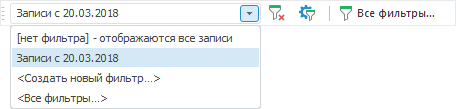
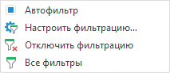

# Фильтрация протокола доступа

Фильтрация протокола доступа
-

# Фильтрация протокола доступа

Для отображения данных, соответствующих заданным условиям, используйте
 фильтрацию в таблице [протокола доступа](Admin_AccessProtocol.htm):

	- в веб-приложении нажмите кнопку  «Все фильтры»
	 на [панели
	 инструментов](../01_RunSecManager/Admin_Organizational_Starting.htm) для просмотра и редактирования списка всех существующих
	 фильтров протокола доступа с помощью диалога «[Фильтры протокола доступа](Admin_AccessProtocol_Filter_All.htm)»;

	- в настольном приложении:

	-

		- на панели инструментов «Протокол
		 доступа»:

В раскрывающемся списке:

			- [нет фильтра] – отображаются
			 все записи. Выберите пункт для отключения фильтрации
			 протокола доступа;

			- <Создать новый фильтр…>.
			 Выберите пункт для создания нового фильтра с помощью диалога
			 «[Свойства
			 фильтра](Admin_AccessProtocol_Filter.htm)»;

			- <Все фильтры…>.
			 Выберите пункт для просмотра и редактирования списка всех
			 существующих фильтров протокола доступа с помощью диалога
			 «[Фильтры
			 протокола доступа](Admin_AccessProtocol_Filter_All.htm)».

		Для быстрой работы с фильтрацией:

			- нажмите кнопку  «Очистить
			 фильтрацию» для отключения фильтрации протокола доступа;

			- нажмите кнопку  «Настроить
			 фильтрацию протокола доступа» для редактирования текущего
			 фильтра протокола доступа;

			- нажмите кнопку  «Все
			 фильтры» для просмотра и редактирования списка всех
			 существующих фильтров протокола доступа с помощью диалога
			 «[Фильтры
			 протокола доступа](Admin_AccessProtocol_Filter_All.htm)».

Для скрытия панели снимите флажок «Протокол доступа» в контекстном
 меню панели инструментов.

		- с помощью контекстного меню протокола доступа:

Установите флажок «Автофильтр»
 для отображения кнопки  в заголовках столбцов, которая
 вызывает [меню
 автофильтра](../03_Admin/Admin_AdminObjects_AuditTuning.htm#sort). Флажок установлен по умолчанию;

Настройка, отключение фильтрации, просмотр
 и редактирование списка всех существующих фильтров протокола доступа аналогично
 кнопкам на панели инструментов «Протокол
 доступа».

		- с помощью главного меню «Протокол
		 доступа». Команды для фильтрации данных аналогичны командам
		 контекстного меню.

После выполнения действий таблица протокола доступа будет отфильтрована
 в соответствии с заданными условиями.

См. также:

[Протокол
 доступа](Admin_AccessProtocol.htm) | [Фильтры протокола
 доступа](Admin_AccessProtocol_Filter_All.htm) | [Свойства фильтра](Admin_AccessProtocol_Filter.htm)
 | [Редактирование условия
 фильтрации](Admin_AccessProtocol_FilterEdit.htm)

		Справочная
		 система на версию 10.9
		 от 18/08/2025,
		 © ООО «ФОРСАЙТ»,
