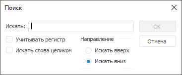

# Поиск в протоколе доступа

Поиск в протоколе доступа
-

# Поиск в протоколе доступа

Для поиска записей о необходимых объектах в разделе «[Протокол доступа](Admin_AccessProtocol.htm)»:

	- в веб-приложении нажмите кнопку  «Поиск» на [панели
	 инструментов](../01_RunSecManager/Admin_Organizational_Starting.htm);

	- в настольном приложении:

		- выполните команду «Протокол
		 доступа > Поиск» в [главном
		 меню](../01_RunSecManager/Admin_Organizational_Starting.htm);

		- выполните команду «Поиск»
		 в контекстном меню.

После выполнения одного из действий будет открыт диалог «Поиск»:

Настройте параметры поиска:

	- Искать. Введите идентификатор/наименование
	 искомого объекта или его часть;

	- Направление поиска.
	 Установите направление поиска в протоколе доступа с помощью переключателей
	 «Искать вверх», «Искать
	 вниз»;

	- Учитывать регистр. Установите
	 флажок для определения учета регистра идентификатора/наименования,
	 введенного в поле «Искать»;

	- Искать слова целиком.
	 Установите флажок для поиска целых слов, совпадающих с искомым словом.

После настройки параметров нажмите кнопку «ОК».
 В протоколе доступа будет выделен объект с искомым идентификатором/наименованием.
 Если объект не найден, то будет выдано соответствующее сообщение.

См. также:

[Протокол
 доступа](Admin_AccessProtocol.htm) | [Фильтрация
 протокола доступа](Admin_AccessProtocol_Filter_Apply.htm)

		Справочная
		 система на версию 10.9
		 от 18/08/2025,
		 © ООО «ФОРСАЙТ»,
