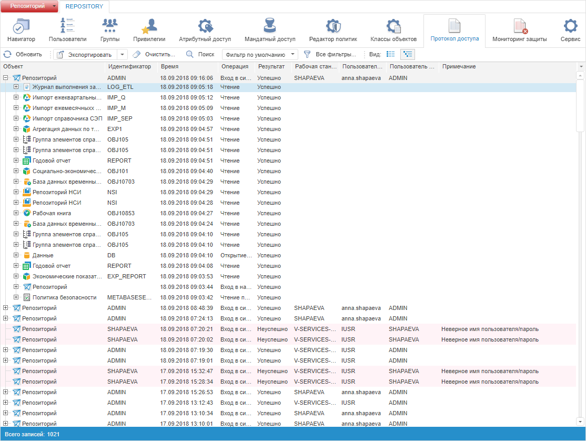
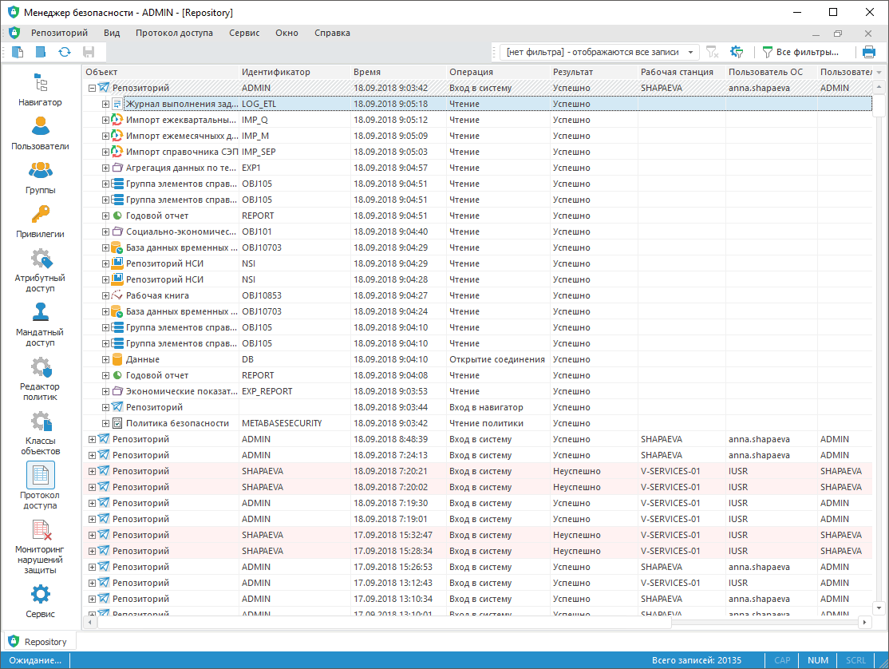

# Вид отображения протокола доступа

Вид отображения протокола доступа
-

# Вид отображения протокола доступа

Протокол доступа отображается в двух видах: линейном и древовидном.

Для изменения отображения протокола доступа в разделе «[Протокол доступа](Admin_AccessProtocol.htm)»:

	- установите переключатель в [главном
	 меню](../01_RunSecManager/Admin_Organizational_Starting.htm) настольного приложения:

		- «Вид
		 > Линейный вид»;

		- «Вид
		 > Древовидный вид»;

Примечание.
 В веб-приложении используйте кнопку  на панели инструментов
 для переключения на линейный вид и кнопку  для переключения
 на древовидный вид.

	- выполните команду «Древовидный
	 вид/Линейный вид» в
	 контекстном меню. Команда контекстного меню будет противоположной
	 текущему виду. Например, если текущий вид протокола доступа древовидный,
	 то в контекстном меню будет отображаться пункт «Линейный
	 вид».

После выполнения одного из действий вид протокола доступа изменится.

## Линейный вид

Линейный вид отображает информацию о событиях в виде таблицы. Все поля
 таблицы заполняются в соответствии с объектами репозитория.

Открытие протокола доступа может занять достаточно много времени при
 большом количестве записей, поэтому в настольном приложении предусмотрена
 возможность [остановки
 загрузки протокола доступа](Admin_AcessProtocol_ViewSaved.htm#interrupting_loading) как при открытии протокола доступа, так
 и при наложении фильтра.

Линейный вид протокола доступа:

	Веб-приложение
	 Настольное
	 приложение

		

		

## Древовидный вид

Древовидный вид отображает информацию о событиях в виде дерева. Вершиной
 дерева является репозиторий, к которому обращается пользователь. Потомками
 дерева являются объекты данного репозитория.

Примечание.
 Поля таблицы «Рабочая станция», «Пользователь ОС», «Пользователь платформы»,
 «IP адрес», «Примечание» заполняются только для вершины дерева.

При отображении протокола доступа в древовидном виде невозможно [прервать
 загрузку](Admin_AcessProtocol_ViewSaved.htm#interrupting_loading).

Древовидный вид протокола доступа:

	Веб-приложение
	 Настольное
	 приложение

		

		

См. также:

[Протокол
 доступа](Admin_AccessProtocol.htm) | [Поиск в протоколе
 доступа](Admin_AccessProtocol_Search.htm) | [Фильтрация
 протокола доступа](Admin_AccessProtocol_Filter_Apply.htm)

		Справочная
		 система на версию 10.9
		 от 18/08/2025,
		 © ООО «ФОРСАЙТ»,
