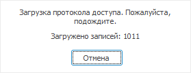

# Загрузка протокола доступа

Загрузка протокола доступа
-

# Загрузка протокола доступа

Текущий протокол доступа с сервера содержится в разделе «[Протокол доступа](Admin_AccessProtocol.htm)».

Для загрузки протокола доступа из файла выполните команду главного меню
 «Протокол доступа > Открыть файл».
 Укажите имя и месторасположение файла в стандартном диалоге открытия файла.

Примечание.
 Загрузка протокола доступа из файла доступна только в настольном приложении.

После открытия протокола доступа из файла в заголовке окна будет указан
 путь к данному файлу, в [строке
 статуса](../01_RunSecManager/Admin_Organizational_Starting.htm) отобразится количество записей в протоколе доступа.

Для возврата к текущему протоколу доступа:

	- выполните команду «Обновить»
	 в контекстном меню;

	- нажмите кнопку  «Обновить настройки безопасности»
	 на [панели
	 инструментов](../01_RunSecManager/Admin_Organizational_Starting.htm).

Если загрузка протокола доступа занимает много времени, то можно её
 [прервать](#interrupting_loading).

Для удобного просмотра информации о выбранном событии откройте окно
 «[Информация о
 событии](Admin_EventData.htm)»:

	- установите флажок «Вид >
	 Информация о событии» в [главном
	 меню](../01_RunSecManager/Admin_Organizational_Starting.htm).

По умолчанию окно располагается в нижней части менеджера безопасности.

## Прерывание загрузки протокола доступа

Прерывание загрузки протокола доступа возможно только в [линейном
 режиме просмотра](Admin_AccessProtocol_View.htm).

Процесс загрузки протокола состоит из трех этапов. Каждому этапу соответствует
 сообщение в [строке
 статуса](../01_RunSecManager/Admin_Organizational_Starting.htm):

	- Формирование протокола доступа.
	 Происходит получение данных протокола доступа. Данный этап прервать
	 нельзя;

	- Обновление протокола доступа.
	 Происходит отображение полученных данных в виде таблицы. Появляется
	 окно с актуальной информацией о процессе:

При нажатии на кнопку «Отмена»
 можно прервать данный этап. В строке статуса отобразится знак прерывания
 загрузки с сообщением о количестве записей, которые были загружены, например:
 .
 Также сообщение о прерывании загрузки выводится при [печати
 и предварительном просмотре](Admin_AccessProtocolPrint.htm) протокола доступа.

	- Наложение автофильтра.
	 Происходит наложение фильтра, установленного для протокола доступа.
	 Данный этап прервать нельзя.

Примечание.
 Прервать процесс загрузки протокола доступа можно только в настольном
 приложении.

См. также:

[Протокол доступа](Admin_AccessProtocol.htm)
 | [Настройка протокола доступа](Admin_AccessProtocol_Sets.htm)

		Справочная
		 система на версию 10.9
		 от 18/08/2025,
		 © ООО «ФОРСАЙТ»,
