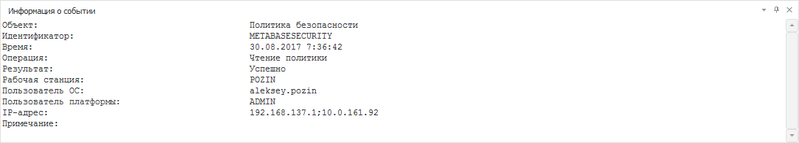

# Информация о событии

Информация о событии
-

# Информация о событии

Для просмотра информации о событии в разделах «[Протокол доступа](Admin_AccessProtocol.htm)» и «[Мониторинг
 нарушений защиты](../06_MonitoringViolations/Admin_MonitoringViolations.htm)» используйте окно «Информация
 о событии»:

	- в веб-приложении установите флажок
	 «Информация о событии» в контекстном
	 меню протокола доступа;

	- в настольном приложении:

		- установите флажок «Вид
		 > Информация
		 о событии» в [главном
		 меню](../01_RunSecManager/Admin_Organizational_Starting.htm);

		- установите флажок «Информация
		 о событии» в контекстном меню протокола доступа.

После выполнения одного из действий по умолчанию окно будет расположено
 в нижней части менеджера безопасности:

Информация о текущей выделенной записи протокола доступа или протокола
 нарушения безопасности отображается в текстовом виде.

Для копирования выделенной информации в буфер обмена:

	- в веб-приложении используйте сочетание
	 клавиш CTRL+C или CTRL+INS;

	- в настольном приложении:

		- выполните команду «Копировать»
		 в контекстном меню;

		- используйте сочетание клавиш
		 CTRL+C или CTRL+INS.

Примечание.
 Операция копирования доступна, если в политике безопасности установлен
 флажок «[Разрешить
 копирование в буфер обмена и копирование экрана](../03_Admin/Access_control_settings.htm#clipboard)».

См. также:

[Протокол
 доступа](Admin_AccessProtocol.htm) | [Протоколируемые
 операции](Admin_AccessProtocol_EvetsType.htm) | [Сохранение протокола
 доступа в файл](Admin_AccessProtocol_Save.htm)

		Справочная
		 система на версию 10.9
		 от 18/08/2025,
		 © ООО «ФОРСАЙТ»,
