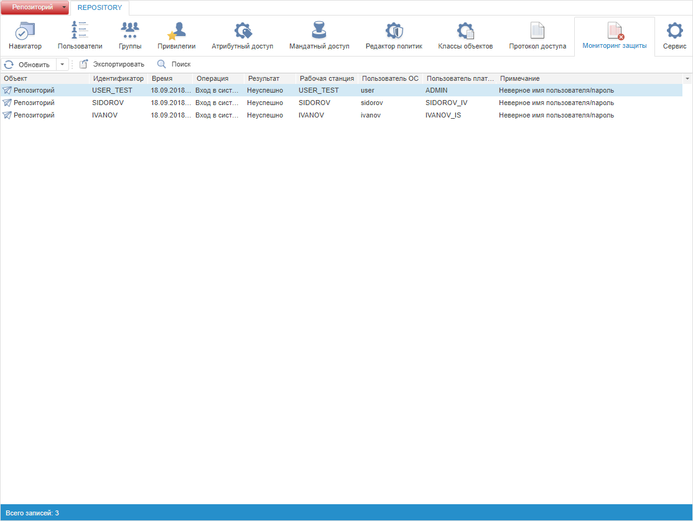
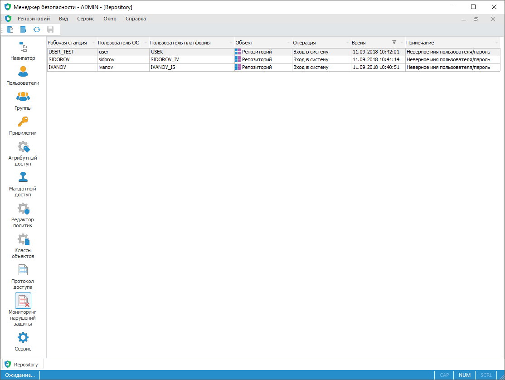
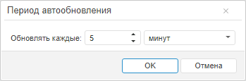

# Мониторинг нарушений защиты

Мониторинг нарушений защиты
-

# Мониторинг нарушений защиты

Для мониторинга нарушений защиты используйте раздел «Мониторинг
 нарушений защиты» [панели
 навигации](../01_RunSecManager/Admin_Organizational_Starting.htm).

Примечание.
 При [разделении
 ролей](../04_SecurityPolicy/Editor_of_Politicy/Security_EditorPoliticy_Adm.htm) между администратором информационной безопасности и прикладным
 администратором раздел «Мониторинг нарушений
 защиты» будет доступен только администратору информационной безопасности.

Раздел «Мониторинг нарушений защиты»:

	Веб-приложение
	 Настольное
	 приложение

		

		

В результате отсутствия прав доступа записываются текущие попытки нарушения
 защиты системы: неудачные попытки входа в систему и действия над объектами.

Примечание.
 В настольном приложении нарушения защиты фиксируются только при открытом
 разделе «Мониторинг нарушений защиты».
 При закрытии менеджера безопасности записи с нарушением защиты не сохраняются.

[Параметры
 нарушения защиты](javascript:TextPopup(this))

	Для каждого нарушения защиты отображаются параметры:

		- Рабочая станция.
		 Имя компьютера, с которого было совершено нарушение;

		- Пользователь ОС.
		 Имя пользователя, который попытался нарушить защиту;

		- Пользователь платформы.
		 Имя пользователя;

		- Объект. Наименование
		 объекта репозитория, при работе с которым были нарушены права
		 (пустая строка, если нарушение возникло при входе в систему);

		- Идентификатор. Идентификатор
		 объекта репозитория, при работе с которым были нарушены права
		 (пустая строка, если нарушение возникло при входе в систему);

		- Операция. Операция,
		 которая привела к нарушению защиты;

		- Время. Время возникновения
		 нарушения;

		- Примечание. Отображает
		 дополнительную информацию о нарушении.

	В веб-приложении дополнительно могут отображаться:

		- Результат. Результат
		 выполнения операции;

		- IP-адрес.
		 IP-адрес рабочей станции.

[Обновление
 и настройка отображения таблицы](javascript:TextPopup(this))

	Для обновления записей в веб-приложении выберите период времени
	 в раскрывающемся меню кнопки 
	 «Обновить» на [панели
	 инструментов](../01_RunSecManager/Admin_Organizational_Starting.htm):

		- не использовать;

		- каждые 5 секунд;

		- каждые 30 секунд;

		- каждую минуту;

		- каждые 5 минут;

		- задать период. При нажатии на кнопку будет открыто окно
		 «Период автообновления»:

	

	Установите произвольный период обновления
	 в секундах, минутах или часах.

	После выполнения действий мониторинг нарушений защиты будет обновляться
	 в соответствии с заданным периодом времени.

	Для настройки отображения, фильтрации и сортировки таблицы:

		- в
		 веб-приложении установите [сортировку](../03_Admin/Admin_AdminObjects_AuditTuning.htm#sort),
		 щелкнув по заголовку столбца;

		- в
		 настольном приложении:

			- используйте [настройку
			 отображения таблицы](../03_Admin/Admin_AdminObjects_AuditTuning.htm#columns);

			- используйте [фильтрацию
			 и сортировку таблицы](../03_Admin/Admin_AdminObjects_AuditTuning.htm#sort).

[Информация о
 событии](javascript:TextPopup(this))

	Для удобного просмотра всей информации о выбранном событии используйте
	 окно «[Информация
	 о событии](../05_AccessProtocol/Admin_EventData.htm)».

	Для включения/выключения отображения окна:

		- в веб-приложении установите/снимите
		 флажок «Информация о событии»
		 в контекстном меню мониторинга нарушений;

		- в настольном приложении:

			- установите/снимите флажок «Вид
			 > Информация
			 о событии» в [главном
			 меню](../01_RunSecManager/Admin_Organizational_Starting.htm);

			- установите/снимите флажок «Информация
			 о событии» в контекстном меню мониторинга нарушений.

	После выполнения действий информация о событии будет включена/выключена.
	 По умолчанию окно располагается в нижней части менеджера безопасности.

[Поиск записей
 нарушения защиты](javascript:TextPopup(this))

	Для поиска записей нарушения защиты:

		- в веб-приложении:

			- Нажмите кнопку 
			 «Поиск» на [панели
			 инструментов](../01_RunSecManager/Admin_Organizational_Starting.htm).

			- Настройте параметры поиска в окне «[Поиск](../05_AccessProtocol/Admin_AccessProtocol_Search.htm)».

			- Нажмите кнопку «ОК».

		- в настольном приложении используйте
		 [настройки
		 отображения списка](../03_Admin/Admin_AdminObjects_AuditTuning.htm).

	После выполнения действий искомая запись будет найдена, если параметры
	 поиска совпадают с найденным объектом.

[Очистка мониторинга
 нарушений защиты](javascript:TextPopup(this))

	Для очистки мониторинга нарушений защиты закройте менеджер безопасности.

	После выполнения действия мониторинг нарушений защиты будет очищен.

[Экспорт
 списка событий](javascript:TextPopup(this))

	Для экспорта списка нарушений защиты:

		- в веб-приложении нажмите кнопку
		  «Экспортировать»
		 на [панели
		 инструментов](../01_RunSecManager/Admin_Organizational_Starting.htm);

		- в настольном приложении выполните
		 команду «Сервис > Экспортировать»
		 в [главном
		 меню](../01_RunSecManager/Admin_Organizational_Starting.htm).

	Для получения подробной информации обратитесь к разделу «[Экспорт
	 списка](../03_Admin/Admin_AdminObjects_AuditTuning.htm#export)».

Для получения информации об обеспечении централизованного мониторинга
 событий информационной безопасности обратитесь к статье «[Поддержка работы с системами
 управления событиями информационной безопасности](Setup.chm::/01_sysreq/siem.htm)».

См. также:

[Отслеживание
 нарушений защиты системы](Monitoring_system.htm) | [Протокол доступа](../05_AccessProtocol/Admin_AccessProtocol.htm)
 | [Контроль целостности
 продукта и метаданных](../04_SecurityPolicy/Integrity_control.htm)

		Справочная
		 система на версию 10.9
		 от 18/08/2025,
		 © ООО «ФОРСАЙТ»,
