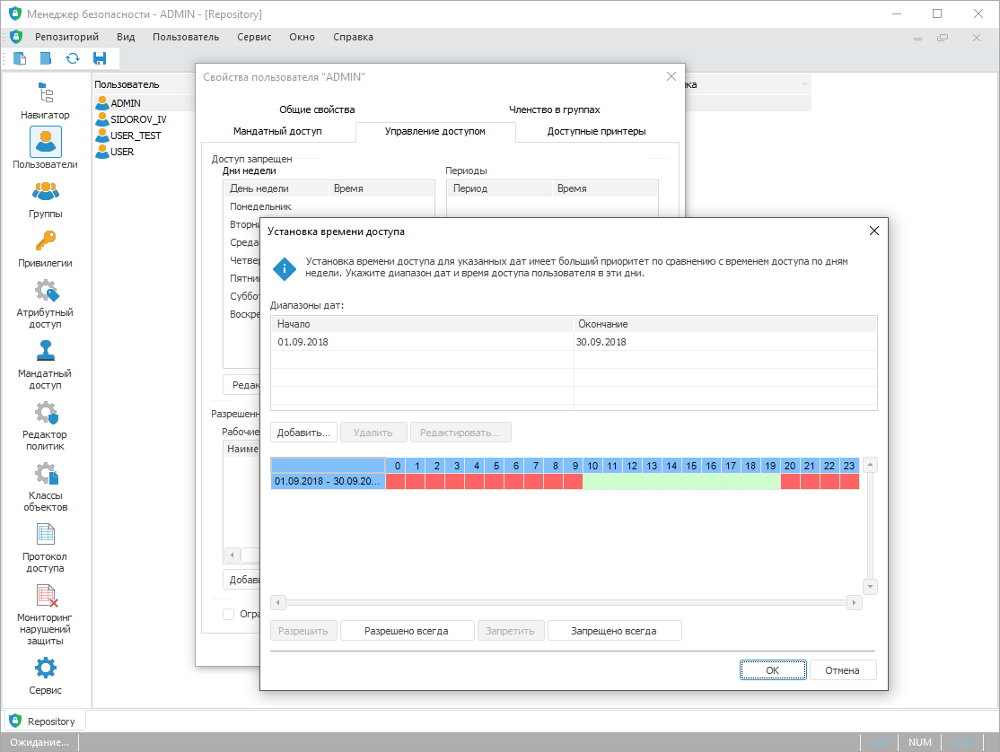

# Администрирование и контроль доступа

Администрирование и контроль доступа
-

# Администрирование и контроль доступа

Для администрирования и контроля доступа используйте инструмент «Менеджер безопасности»:

Ключевые возможности:

	- управление учетными записями пользователей и групп пользователей;

	- настройка политики безопасности;

	- раздача прав и контроль доступа отдельным пользователям и/или
	 группам пользователей к объектам системы;

	- ведение аудита доступа и контроль действий пользователей над
	 объектами системы;

	- контроль целостности политики безопасности.

Для начала работы с менеджером безопасности
 смотрите статью «[Начало
 работы с менеджером безопасности](01_RunSecManager/Admin_Organizational_Starting.htm)».

Для настройки политики безопасности
 системы смотрите статью «[Настройка
 политики безопасности системы](01_RunSecManager/Admin_Intro.htm)».

Для отслеживания нарушений защиты
 системы смотрите статью «[Отслеживание
 нарушений защиты системы](06_MonitoringViolations/Monitoring_system.htm)».

Для резервного копирования, восстановления
 политики безопасности, а также управления режимом обслуживания смотрите
 статью «[Сервисное
 обслуживание репозитория](04_SecurityPolicy/Admin_Service.htm)».

Для контроля целостности продукта
 и метаданных репозитория смотрите статью «[Контроль целостности
 продукта и метаданных](04_SecurityPolicy/Integrity_control.htm)».

См. также:

[Начало
 работы с менеджером безопасности](01_RunSecManager/Admin_Organizational_Starting.htm)

		Справочная
		 система на версию 10.9
		 от 18/08/2025,
		 © ООО «ФОРСАЙТ»,
