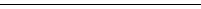
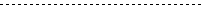
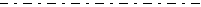
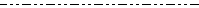
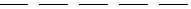
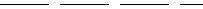
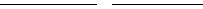
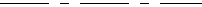

# WxDashStyle

WxDashStyle
-

# WxDashStyle

## Описание

Перечисление WxDashStyle используется
 для определения стиля начертания линии.

Перечисление используется свойством:

	- [IWxStyle.LinePenWxDashStyle](../Interface/IWxStyle/IWxStyle.LinePenWxDashStyle.htm).

## Допустимые значения

		 Значение
		 Краткое описание
		 Пример

		 -1
		 Undefined. Не определен.

		 0
		 Solid. Сплошной.
		 

		 1
		 Dash. Штрих.
		 

		 2
		 Dot. Пунктирная линия.
		 

		 3
		 DashDot. Штрих-пунктирная
		 линия.
		 

		 4
		 DashDotDot. Штрих-пунктирная
		 линия.
		 

		 5
		 DashCustom. Пользовательский
		 стиль.

		 10
		 None. Не рисовать.

		 11
		 Dash7Gap3. Широкий
		 штрих.
		 

		 12
		 Dash12Gap3.
		 

		 13
		 Dash24Gap4.
		  

		 14
		 Dash7Gap3Dot2.
		 

		 15
		 Dash12Gap3Dot2.
		 

		 16
		 Dash24Gap4Dot2.
		 

См. также:

[Перечисления сборки Andy](Enums_built_Andy.htm)

		Справочная
		 система на версию 10.9
		 от 18/08/2025,
		 © ООО «ФОРСАЙТ»,
