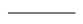
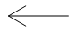
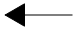
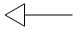
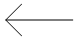
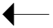
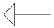
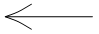
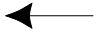
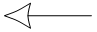

# WxLineCap

WxLineCap
-

# WxLineCap

## Описание

Перечисление WxLineCap используется
 для определения видов наконечников у линии.

Перечисление используется свойствами:

	- [IWxStyle.LinePenBeginWxCap](../Interface/IWxStyle/IWxStyle.LinePenBeginWxCap.htm);

	- [IWxStyle.LinePenEndWxCap](../Interface/IWxStyle/IWxStyle.LinePenEndWxCap.htm).

## Допустимые значения

		 Значение
		 Краткое описание

		 0
		 Flat. Наконечник отсутствует.

		 -1
		 Undefined 

		 30
		 Arrow30Degree 

		 31
		 Arrow30DegreeFilled
		 

		 32
		 Arrow30DegreeEmpty
		 

		 33
		 Arrow45Degree 

		 34
		 Arrow45DegreeFilled
		 

		 35
		 Arrow45DegreeEmpty
		 

		 36
		 ArrowRounded 

		 37
		 ArrowRoundedFilled
		 

		 38
		 ArrowRoundedEmpty 

См. также:

[Перечисления сборки Andy](Enums_built_Andy.htm)

		Справочная
		 система на версию 10.9
		 от 18/08/2025,
		 © ООО «ФОРСАЙТ»,
