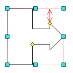

# IWxBoxArrow.ArrowHeightOffset

IWxBoxArrow.ArrowHeightOffset
-

# IWxBoxArrow.ArrowHeightOffset

## Синтаксис

ArrowHeightOffset: Double;

## Описание

Свойство ArrowHeightOffset определяет
 смещение высоты стрелки.

## Пример

Для выполнения примера в репозитории предполагается наличие [рабочего пространства](UiWsp.chm::/1_intro/UiWsp_Intro.htm)
 с идентификатором «WSP», содержащее только выноску со стрелкой.

Добавьте ссылки на системные сборки: Andy, Drawing, Metabase.

	Sub UserProc;

	Var

	    mb: IMetabase;

	    ws: IWxWorkspace;

	    BArrow: IWxBoxArrow;

	    Shapes: IWxShapes;

	Begin

	    // Получаем рабочее пространство для редактирования

	    mb := MetabaseClass.Active;

	    ws := mb.ItemById("WSP").Edit As IWxWorkspace;

	    Shapes := ws.Shapes;

	    BArrow := ws.Shapes.Item(0) As IWxBoxArrow;

	    BArrow.ArrowHeightOffset := 3;

	    BArrow.ArrowWidthOffset := 20;

	    (ws As IMetabaseObject).Save;

	End Sub UserProc;

После выполнения примера будут изменены высота и длина стрелки.

См. также:

[IWxBoxArrow](IWxBoxArrow.htm)

		Справочная
		 система на версию 10.9
		 от 18/08/2025,
		 © ООО «ФОРСАЙТ»,
