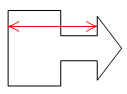

# IWxBoxArrow.ArrowWidthOffset

IWxBoxArrow.ArrowWidthOffset
-

# IWxBoxArrow.ArrowWidthOffset

## Синтаксис

		ArrowWidthOffset: Double;

## Описание

Свойство ArrowWidthOffset определяет
 длину стрелки. При задании длины следует учитывать, что длина стрелки
 должна включать в себя длину выноски.

## Пример

Пример использования приведен в описании [IWxBoxArrow.ArrowHeightOffset](IWxBoxArrow.ArrowHeightOffset.htm).

См. также:

[IWxBoxArrow](IWxBoxArrow.htm)

		Справочная
		 система на версию 10.9
		 от 18/08/2025,
		 © ООО «ФОРСАЙТ»,
