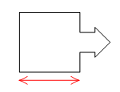

# IWxBoxArrow.BoxWidthOffset

IWxBoxArrow.BoxWidthOffset
-

# IWxBoxArrow.BoxWidthOffset

## Синтаксис

		BoxWidthOffset: Double;

## Описание

Свойство BoxWidthOffset определяет
 длину выноски.

## Пример

Пример использования приведен в описании [IWxBoxArrow.BoxHeightOffset](IWxBoxArrow.BoxHeightOffset.htm).

См. также:

[IWxBoxArrow](IWxBoxArrow.htm)

		Справочная
		 система на версию 10.9
		 от 18/08/2025,
		 © ООО «ФОРСАЙТ»,
