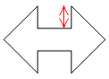

# IWxDoubleArrow.HeightOffset

IWxDoubleArrow.HeightOffset
-

# IWxDoubleArrow.HeightOffset

## Синтаксис

		HeightOffset: Double;

## Описание

Свойство HeightOffset определяет
 высоту стрелки.

## Пример

Пример использования приведен в описании [IWxWorkspace.CreateDoubleArrow](../IWxWorkspace/IWxWorkspace.CreateDoubleArrow.htm).

См. также:

[IWxDoubleArrow](IWxDoubleArrow.htm)

		Справочная
		 система на версию 10.9
		 от 18/08/2025,
		 © ООО «ФОРСАЙТ»,
