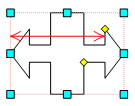

# IWxDoubleBoxArrow.ArrowWidthOffset

IWxDoubleBoxArrow.ArrowWidthOffset
-

# IWxDoubleBoxArrow.ArrowWidthOffset

## Синтаксис

		ArrowWidthOffset: Double;

## Описание

Свойство ArrowWidthOffset определяет
 длину стрелки.

## Пример

Пример использования приведен в описании [IWxWorkspace.CreateDoubleBoxArrow](../IWxWorkspace/IWxWorkspace.CreateDoubleBoxArrow.htm).

См. также:

[IWxDoubleBoxArrow](IWxDoubleBoxArrow.htm)

		Справочная
		 система на версию 10.9
		 от 18/08/2025,
		 © ООО «ФОРСАЙТ»,
