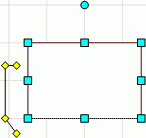

# IWxLinkedBaloon.PointCount

IWxLinkedBaloon.PointCount
-

# IWxLinkedBaloon.PointCount

## Синтаксис

PointCount: Integer;

## Описание

Свойство PointCount определяет
 количество точек на выноске.

## Комментарии

Пример выноски с четырьмя точками:

## Пример

Для выполнения примера предполагается наличие формы, расположенной на
 ней кнопки с наименованием Button1, компонента WorkspaceBox и компонента
 UiWorkspace с наименованием UiWorkspace1, являющимся источником данных
 для WorkspaceBox.

Добавьте ссылки на системные сборки: Andy, Workspace.

	Sub Button1OnClick(Sender: Object; Args: IMouseEventArgs);

	Var

	    WS: IWxWorkspace;

	    Rect: IWxLinkedBaloon;

	Begin

	    WS := UiWorkspace1.WxWorkspace;

	    WS.BeginUpdate;

	    Rect := WS.CreateLinkedBaloon;

	    Rect.PointCount := 4;

	    WS.EndUpdate;

	End Sub Button1OnClick;

После выполнения примера на рабочем пространстве будет создана выноска
 с четырьмя точками.

См. также:

[IWxSmoothBaloon](../IWxSmoothBaloon/IWxSmoothBaloon.htm)

		Справочная
		 система на версию 10.9
		 от 18/08/2025,
		 © ООО «ФОРСАЙТ»,
