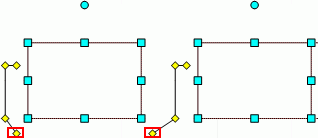

# IWxLinkedBaloon.Points

IWxLinkedBaloon.Points
-

# IWxLinkedBaloon.Points

## Синтаксис

Points(Index: Integer): [IGxPointF](ModDrawing.chm::/Interface/IGxPointF/IGxPointF.htm);

## Параметры

Index. Индекс точки на выноске.

## Описание

Свойство Points определяет координаты
 точки на выноске.

## Комментарии

Пример точки на выноске с координатами по умолчанию (слева) и изменёнными
 (справа):

## Пример

Для выполнения примера предполагается наличие формы, расположенной на
 ней кнопки с наименованием «Button1», компонента WorkspaceBox
 и компонента UiWorkspace с наименованием
 «UiWorkspace1», являющимся источником данных для WorkspaceBox.

Добавьте ссылки на системные сборки: Andy, Drawing, Workspace.

	Sub Button1OnClick(Sender: Object; Args: IMouseEventArgs);

	Var

	    WS: IWxWorkspace;

	    Rect: IWxLinkedBaloon;

	    Point: IGxPointF;

	Begin

	    WS := UiWorkspace1.WxWorkspace;

	    WS.BeginUpdate;

	    Rect := WS.CreateLinkedBaloon;

	    Rect.PointCount := 4;

	    Point := New GxPointF.Create(-0.4, 1.2);

	    Rect.Points(3) := Point;

	    WS.EndUpdate;

	End Sub Button1OnClick;

После выполнения примера координаты четвертой точки на выноске будут
 изменены.

См. также:

[IWxLinkedBaloon](IWxLinkedBaloon.htm)

		Справочная
		 система на версию 10.9
		 от 18/08/2025,
		 © ООО «ФОРСАЙТ»,
