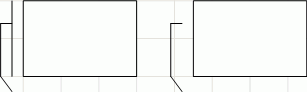

# IWxLinkedBaloon.ShowLine

IWxLinkedBaloon.ShowLine
-

# IWxLinkedBaloon.ShowLine

## Синтаксис

ShowLine: Boolean;

## Описание

Свойство ShowLine определяет
 признак отображение линии выноски.

## Комментарии

Допустимые значения:

	- True. Отображать линию
	 выноски;

	- False. Не отображать
	 линию выноски.

Пример с линией выноски (слева) и без (справа):

## Пример

Для выполнения примера предполагается наличие формы, расположенной на
 ней кнопки с наименованием «Button1», компонента WorkspaceBox
 и компонента UiWorkspace с наименованием
 «UiWorkspace1», являющимся источником данных для WorkspaceBox.

Добавьте ссылки на системные сборки: Andy, Drawing, Forms, Workspace.

	Sub Button1OnClick(Sender: Object; Args: IMouseEventArgs);

	Var

	    WS: IWxWorkspace;

	    RectT, RectF: IWxLinkedBaloon;

	    Point: IGxPointF;

	Begin

	    WS := UiWorkspace1.WxWorkspace;

	    WS.BeginUpdate;

	    // создание правой выноски с точками

	    RectF := WS.CreateLinkedBaloon;

	    RectF.PointCount := 4;

	    RectF.ShowLine := False;

	    // создание левой выноски с точками

	    RectT := WS.CreateLinkedBaloon;

	    RectT.PointCount := 4;

	    Point := New GxPointF.Create(-45, 0);

	    RectT.PinPosition := Point;

	    RectT.ShowLine := True;

	    WS.EndUpdate;

	End Sub Button1OnClick;

После выполнения примера на рабочем пространстве будут созданы две выноски.
 Первая создаётся с линией выноски, вторая - без линии выноски.

См. также:

[IWxLinkedBaloon](IWxLinkedBaloon.htm)

		Справочная
		 система на версию 10.9
		 от 18/08/2025,
		 © ООО «ФОРСАЙТ»,
