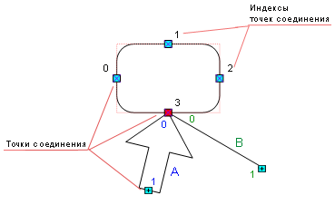

# IWxShape.ConnectedShapes

IWxShape.ConnectedShapes
-

# IWxShape.ConnectedShapes

## Синтаксис

ConnectedShapes(ConnectionPointIndex: Integer; ConnectedCPShapeIndex:
 Integer): [IWxShape](IWxShape.htm);

## Параметры

ConnectionPointIndex. Индекс
 точки соединения исходного объекта (на изображении данная точка отображена
 красным цветом);

ConnectedCPShapeIndex. Индекс
 фигуры, соединенной с объектом в точке ConnectionPointIndex
 (на изображении таких фигур две : A и B).

## Описание

Свойство ConnectedShapes позволяет
 получить фигуру, соединенную с исходным объектом в заданной точке.

## Комментарии

На схеме черным цветом изображены индексы точек соединения исходного
 объекта, синим и зеленым цветом изображены индексы точек соединения фигур,
 соединенных с объектом в точке ConnectionPointIndex,
 изображенной красным цветом:

Фигуры, соединенные с объектом в данной точке две: А и B. Свойство вернет
 фигуру A или B.

## Пример

Для выполнения примера в репозитории предполагается наличие рабочего
 пространства с идентификатором WSP, содержащего несколько соединенных
 фигур, содержащих текст.

Добавьте ссылки на системные сборки: Andy, Metabase.

	Sub UserProc;

	Var

	    MB: IMetabase;

	    Wsp: IWxWorkspace;

	    i, j: Integer;

	    Shape, CSh: IWxShape;

	Begin

	    MB := MetabaseClass.Active;

	    // Получаем рабочее пространство

	    Wsp := MB.ItemById("WSP").Edit As IWxWorkspace;

	    Shape := Wsp.Shapes.Item(0);

	    For i := 0 To Shape.ConnectionPointsCount - 1 Do

	        If Shape.ConnectedCpShapesCount(i) > 0 Then

	            For j := 0 To Shape.ConnectedCpShapesCount(i) - 1 Do

	                CSh := Shape.ConnectedShapes(i, j);

	                Debug.WriteLine(CSh.Text);

	            End For;

	        End If;

	    End For;

	    // Сохраняем изменения

	    (Wsp As IMetabaseObject).Save;

	End Sub UserProc;

В процессе выполнения примера будут поэтапно выдаваться сообщения, содержащие
 текст фигур, соединенных с исходным объектом.

См. также:

[IWxShape](IWxShape.htm)

		Справочная
		 система на версию 10.9
		 от 18/08/2025,
		 © ООО «ФОРСАЙТ»,
