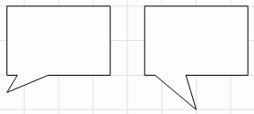

# IWxSmoothBaloon.RelativePointPosition

IWxSmoothBaloon.RelativePointPosition
-

# IWxSmoothBaloon.RelativePointPosition

## Синтаксис

RelativePointPosition: [IGxPointF](ModDrawing.chm::/Interface/IGxPointF/IGxPointF.htm);

## Описание

Свойство RelativePointPosition
 определяет положение точки выноски относительно центра фигуры.

## Комментарии

Пример обычной фигуры (слева) и фигуры со смещённой выноской (справа):

## Пример

Для выполнения примера предполагается наличие формы, расположенной на
 ней кнопки с наименованием Button1, компонента WorkspaceBox и компонента
 UiWorkspace с наименованием UiWorkspace1, являющимся источником данных
 для WorkspaceBox.

Добавьте ссылки на системные сборки: Andy, Drawing, Workspace.

	Sub Button1OnClick(Sender: Object; Args: IMouseEventArgs);

	Var

	    WS: IWxWorkspace;

	    Rect: IWxRectangleBaloon;

	Begin

	    WS := UiWorkspace1.WxWorkspace;

	    WS.BeginUpdate;

	    Rect := WS.CreateRectangleBaloon;

	    Rect.RelativePointPosition := New GxPointF.Create(0, 2);

	    WS.EndUpdate;

	End Sub Button1OnClick;

После выполнения примера на рабочем пространстве будет создана прямоугольная
 выноска. Выноска будет смещена относительно центра фигуры.

См. также:

[IWxSmoothBaloon](IWxSmoothBaloon.htm)

		Справочная
		 система на версию 10.9
		 от 18/08/2025,
		 © ООО «ФОРСАЙТ»,
