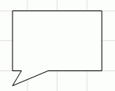

# IWxWorkspace.CreateRectangleBaloon

IWxWorkspace.CreateRectangleBaloon
-

# IWxWorkspace.CreateRectangleBaloon

## Синтаксис

CreateRectangleBaloon: [IWxRectangleBaloon](../IWxRectangleBaloon/IWxRectangleBaloon.htm);

## Описание

Метод CreateRectangleBaloon
 создает прямоугольную выноску.

## Комментарии

Вид прямоугольной выноски с настройками по умолчанию:

## Пример

Для выполнения примера предполагается наличие формы, расположенной на
 ней кнопки с наименованием Button1, компонента WorkspaceBox и компонента
 UiWorkspace с наименованием UiWorkspace1, являющимся источником данных
 для WorkspaceBox.

Добавьте ссылки на системные сборки: Andy, Drawing, Metabase.

	Sub Button1OnClick(Sender: Object; Args: IMouseEventArgs);

	Var

	    WS: IWxWorkspace;

	    Rect: IWxRectangleBaloon;

	Begin

	    WS := UiWorkspace1.WxWorkspace;

	    WS.BeginUpdate;

	    Rect := WS.CreateRectangleBaloon;

	    WS.EndUpdate;

	End Sub Button1OnClick;

После выполнения примера на рабочем пространстве будет создана прямоугольная
 выноска.

См. также:

[IWxWorkspace](IWxWorkspace.htm)

		Справочная
		 система на версию 10.9
		 от 18/08/2025,
		 © ООО «ФОРСАЙТ»,
