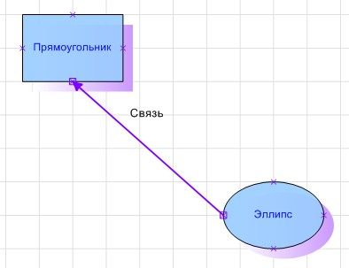

# Создание объектов, их стилей и связи между ними

Создание объектов, их стилей и связи между ними
-

# Создание объектов, их стилей и связи между ними

Для выполнения примера в репозитории предполагается наличие [рабочего пространства](UiWsp.chm::/1_intro/UiWsp_Intro.htm)
 с идентификатором «WSP».

Добавьте ссылки на системные сборки: Andy, Drawing, Metabase, Workspace.

	Sub UserProc;

	Var

	    Mb: IMetabase;

	    Wsp: IWxWorkspace;

	    Rect: IWxRectangle;

	    Ellipse: IWxEllipse;

	    Style: IWxStyle;

	    Link: IWxLink;

	Begin

	    Mb := MetabaseClass.Active;

	    Wsp := Mb.ItemById("WSP").Edit As IWxWorkspace;

	    Wsp.BeginUpdate;

	    // создание прямоугольника

	    Rect := Wsp.CreateRectangle;

	    Rect.PinPosition := New GxPointF.Create(20, 10);

	    Rect.Text := "Прямоугольник";

	    Style := Wsp.CreateStyle;

	    Style.Id := "MyStyle";

	    Style.BackgroundBrushForeColor := New GxColor.CreateRGB(153, 204, 255);

	    Style.BackgroundBrushForeTransparent := 10;

	    Style.ShadowBrushForeColor := GxColor.FromName("White");

	    Style.ShadowBrushBackColor := New GxColor.CreateRGB(204, 153, 255);

	    Style.ShadowBrushPattern := GxBrushPattern.Gradient;

	    Style.TextFontSize := 9;

	    Style.TextFontBrushColor := GxColor.FromName("Blue");

	    Rect.Style := Style;

	    // создание эллипса

	    Ellipse := Wsp.CreateEllipse;

	    Ellipse.PinPosition := New GxPointF.Create(80, 60);

	    Ellipse.Text := "Эллипс";

	    Ellipse.Style := Wsp.Styles.FindById("MyStyle");

	    // создание связи между объектами

	    Link := Wsp.CreateLink;

	    Link.Text := "Связь";

	    Link.TextVertOffset := -10;

	    Style := Wsp.CreateStyle;

	    Style.LinePenBeginWxCap := WxLineCap.ArrowRoundedFilled;

	    Style.LinePenColor := New GxColor.CreateRGB(128, 0, 255);

	    Style.LinePenWidth := 0.5;

	    Link.Style := Style;

	    Wsp.GlueConnectionPoints(Rect, 3, Link, 0);

	    Wsp.GlueConnectionPoints(Ellipse, 0, Link, 1);

	    Wsp.EndUpdate;

	    (Wsp As IMetabaseObject).Save;

	End Sub UserProc;

После выполнения примера на рабочем пространстве будут созданы прямоугольник,
 эллипс и связь между ними, для каждого из которых будет применен заданный
 стиль:

См. также:

[Примеры](Example_built_Andy.htm)

		Справочная
		 система на версию 10.9
		 от 18/08/2025,
		 © ООО «ФОРСАЙТ»,
