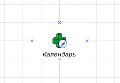

# Размещение объекта репозитория на рабочем пространстве

Размещение объекта репозитория на рабочем пространстве
-

# Размещение объекта репозитория на рабочем пространстве

Для выполнения примера в репозитории предполагается наличие [рабочего пространства](UiWsp.chm::/1_intro/UiWsp_Intro.htm)
 с идентификатором «WSP». Также необходимо наличие в репозитории календарного
 справочника с идентификатором «CALENDAR».

Добавьте ссылки на системные сборки: Andy, Metabase, Workspace.

	Sub UserProc;

	Var

	    ws: IWxWorkspace;

	    MB: IMetabase;

	    MbObj: IMetabaseObject;

	    Shape: IWxShape;

	    WxObj: IWxMetabaseObject;

	    Style: IWxStyle;

	Begin

	    Mb := MetabaseClass.Active;

	    ws := Mb.ItemById("WSP").Edit As IWxWorkspace;

	    MbObj := Mb.ItemById("CALENDAR") As IMetabaseObject;

	    ws.BeginUpdate;

	    Shape := ws.CreateRectangle;

	    Shape.CreateExtension("KeWsp.WxMetabaseObject");

	    WxObj := Shape.Extension As IWxMetaBaseObject;

	    WxObj.MetabaseObject := MbObj;

	    Shape.Id := "Dim";

	    //создание стиля

	    Style := ws.CreateStyle;

	    Style.LinePenTransparent := 100;

	    Style.PictureAlignmentVertical := GxAlignment.Center;

	    Style.TextAlignmentVertical := GxAlignment.Far;

	    Style.TextFontStyleItalic := True;

	    Shape.Style := Style;

	    ws.EndUpdate;

	    (ws As IMetabaseObject).Save;

	End Sub UserProc;

После выполнения примера на рабочем пространстве будет размещен объект
 репозитория с идентификатором «CALENDAR», к которому будет применен заданный
 стиль:

При размещении объекта репозитория на рабочем пространстве следует помнить,
 что для него будет отображена соответствующая пиктограмма и наименование.

См. также:

[Примеры](Example_built_Andy.htm)

		Справочная
		 система на версию 10.9
		 от 18/08/2025,
		 © ООО «ФОРСАЙТ»,
