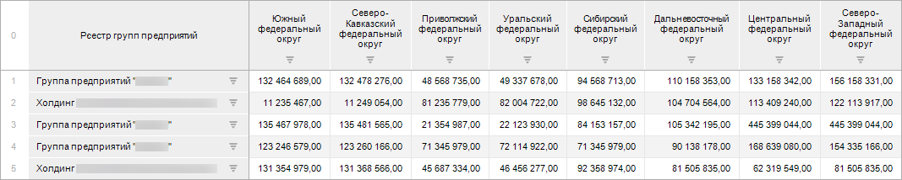
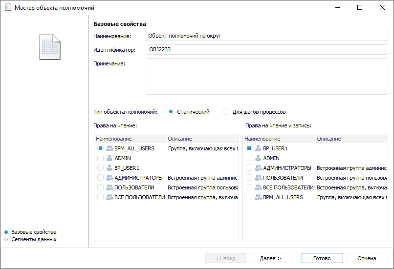
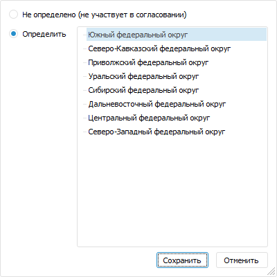
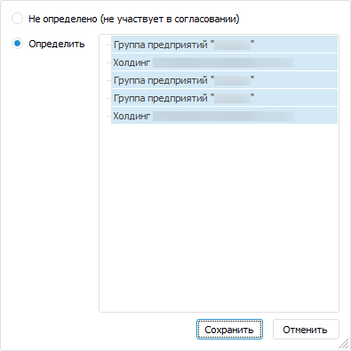
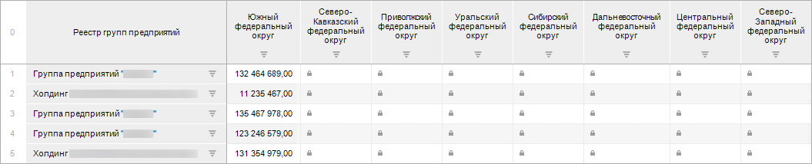
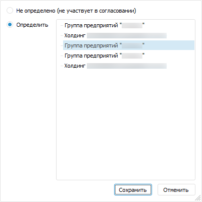
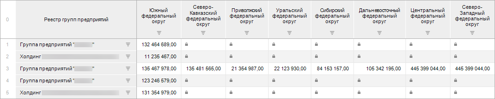

# Пример создания и использования объектов полномочий

Пример создания и использования объектов полномочий
-

# Пример создания и использования объектов полномочий

Необходимо предоставить пользователю доступ для определённого элемента
 одного измерения и всем элементам второго одновременно с этим для определённого
 элемента второго измерения и всем элементам первого.

Например, предоставить доступ пользователю к группе предприятий в строке
 под номером три и для южного федерального округа.

Данные хранятся в кубе «Данные о финансовых
 результатах», в котором в есть два измерения: «Федеральные
 округа» и «Реестр групп предприятий»:

Поставленную задачу можно решить двумя способами:

	- С использованием нескольких объектов полномочий.

	- С использованием одного объекта полномочий.

## Несколько объектов полномочий

Рассмотрим пример создания и использования двух объектов полномочий
 для разграничения доступа к данным. При наложении нескольких объектов
 полномочий используемое условие разграничения доступа - «ИЛИ».

Для этого требуется создать:

	- Учётную запись пользователя в менеджере безопасности. Для получения
	 подробной информации о создании учётной записи пользователя обратитесь
	 к статье «[Создание
	 учётных записей пользователей и работа с ними](Admin.chm::/03_Admin/Users/Admin_Users.htm)».

[Включить
 пользователя](Admin.chm::/03_Admin/Users/Admin_UserProp_Groups.htm) в группу пользователей.

Примечание.
 Убедитесь, что для группы пользователей [настроены
 разрешения](Admin.chm::/03_Admin/Admin_AdminObjects_Discretionary.htm) на чтение и изменение объектов репозитория
 для дискреционного метода контроля доступа.

	- Объект полномочий на округ.

	- Объект полномочий на группу предприятий.

### Создание объекта полномочий на округ

Для создания первого объекта полномочий «Объект
 полномочий на округ»:

	- Создайте объект полномочий, выполнив одно из действий в [навигаторе
	 объектов](GetStarted.chm::/Interface/Interface_Navigator.htm):

		- нажмите кнопку  «Новый
		 объект > Пользовательские объекты > Объект полномочий»,
		 расположенную в группе «Создать»
		 вкладки «Главная» ленты
		 инструментов навигатора объектов;

		- выполните команду «Создать
		 > Пользовательские объекты > Объект полномочий» в
		 контекстном меню навигатора объектов.

В результате выполнения будет открыто окно
 мастера объекта полномочий.

	- Задайте базовые свойства:

		- Задайте наименование объекта полномочий.

		- Выберите тип объекта «Статический».

		- Укажите пользователя или группу пользователей, которые получат
		 права на чтение и на чтение и запись.

Для продолжения настройки объекта полномочий
 нажмите кнопку «Далее».

	- Сформируйте сегмент данных:

		- Добавьте источник данных. Нажмите кнопку «Добавить
		 источник», в открывшемся окне выберите куб «Данные
		 о финансовых результатах».

		- Отметьте элемент «Южный
		 федеральный округ» в измерении «Федеральные
		 округа». Для этого дважды щёлкните по измерению или выделите
		 его и нажмите кнопку «Редактировать
		 значение». В открывшемся окне установите переключатель
		 «Определить» и отметьте
		 элемент:

Нажмите кнопку «Сохранить».

		- Отметьте все элементы в измерении «Реестр
		 групп предприятий». Для этого дважды щёлкните по измерению
		 или выделите его и нажмите кнопку «Редактировать
		 значение». В открывшемся окне установите переключатель
		 «Определить» и отметьте
		 все элементы, выполнив команду «Отметить
		 все» контекстного меню:

Нажмите кнопку «Сохранить».

		- Закончите настройку объекта полномочий. Нажмите кнопку «Готово».

После применения первого объекта полномочий для пользователя BP_USER1
 куб будет отображаться следующим образом:

Примечание.
 Для отображения пиктограмм прав доступа к данным установите флажок «[Отметить запрещенные для редактирования
 ячейки](UiAnalyticalArea.chm::/TableView/Formatting/Cells_icons.htm)».

### Создание объекта полномочий на группу предприятий

Для создания второго объекта полномочий «Объект
 полномочий на группу предприятий»:

	- Повторите шаги один и два из создания первого объекта полномочий.

	- Сформируйте сегмент данных:

		- Добавьте источник данных. Нажмите кнопку «Добавить
		 источник», в открывшемся окне выберите куб «Данные
		 о финансовых результатах».

		- Отметьте элемент «Группа
		 предприятий …», располагающийся третьим в измерении «Реестр групп предприятий».
		 Для этого дважды щёлкните по измерению или выделите его и нажмите
		 кнопку «Редактировать значение».
		 В открывшемся окне установите переключатель «Определить»
		 и отметьте элемент:

Нажмите кнопку «Сохранить».

		- Отметьте все элементы в измерении «Федеральные
		 округа». Для этого дважды щёлкните по измерению или выделите
		 его и нажмите кнопку «Редактировать
		 значение». В открывшемся окне установите переключатель
		 «Определить» и отметьте
		 все элементы, выполнив команду «Отметить
		 все» контекстного меню:

Нажмите кнопку «Сохранить».

		- Закончите настройку объекта полномочий. Нажмите кнопку «Готово».

После завершения настройки обоих объектов полномочий для пользователя
 BP_USER1 куб будет отображаться следующим образом:

## Один объект полномочий

Рассмотрим пример создания и использования одного объекта полномочий
 для разграничения доступа к данным.

Для этого требуется создать:

	- Учётную запись пользователя в менеджере безопасности. Для получения
	 подробной информации о создании учётной записи пользователя обратитесь
	 к статье «[Создание
	 учётных записей пользователей и работа с ними](Admin.chm::/03_Admin/Users/Admin_Users.htm)».

[Включить
 пользователя](Admin.chm::/03_Admin/Users/Admin_UserProp_Groups.htm) в группу пользователей.

Примечание.
 Убедитесь, что для группы пользователей [настроены
 разрешения](Admin.chm::/03_Admin/Admin_AdminObjects_Discretionary.htm) на чтение и изменение объектов репозитория
 для дискреционного метода контроля доступа.

	- Объект полномочий с несколькими сегментами.

### Создание объекта полномочий с несколькими сегментами

Для создания объекта полномочий с несколькими сегментами:

	- Повторите шаги один и два из создания первого объекта полномочий.

	- Сформируйте несколько сегментов данных:

		- Дважды добавьте источник данных - куб «Данные
		 о финансовых результатах».

		- Для первого добавленного источника создайте отметку, как
		 при настройке первого объекта полномочий при использовании нескольких
		 объектов полномочий.

		- Для второго добавленного источника создайте отметку, как
		 при настройке второго объекта полномочий при использовании нескольких
		 объектов полномочий.

После применения объекта полномочий, для пользователя BP_USER1 куб будет
 отображаться так же, как и при применении нескольких объектов полномочий.

		Справочная
		 система на версию 10.9
		 от 18/08/2025,
		 © ООО «ФОРСАЙТ»,
