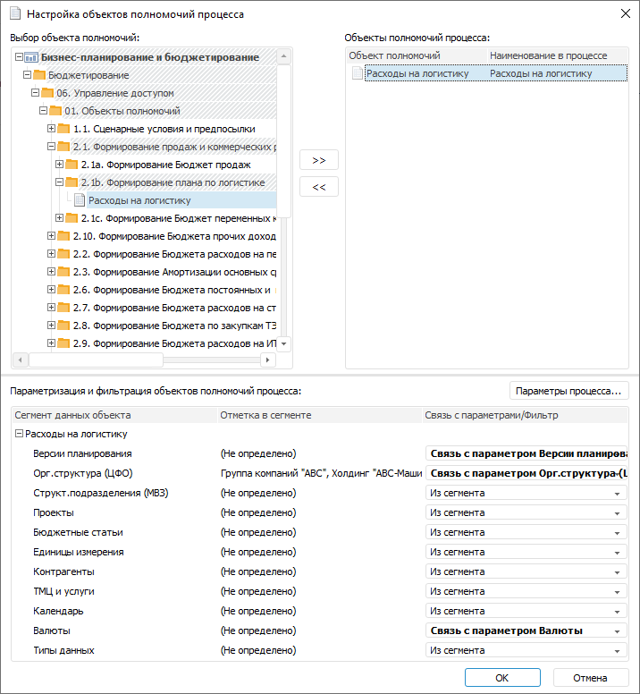
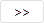
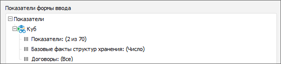
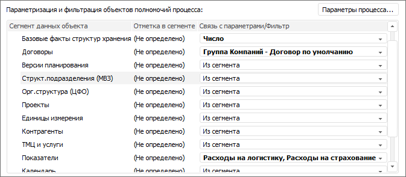

# Настройка объектов полномочий процесса: Настольное приложение

Настройка объектов полномочий процесса: Настольное приложение
-

# Настройка объектов полномочий процесса

Окно настройки объектов полномочий процесса предназначено для определения
 объектов полномочий, используемых в рамках процесса, и настройки связи
 отметок в сегментах данных объекта с параметрами процесса. Для корректной
 работы объектов полномочий убедитесь, что настроено [серверное
 исполнение](../Process/Setting_Server_Process_Execution.htm) процессов.

[Для открытия
 окна](javascript:TextPopup(this))

	Для открытия окна:

		- нажмите кнопку  «Объекты
		 полномочий» в группе «Настройка»
		 на вкладке «Процесс» ленты
		 инструментов окна «[Настройка
		 бизнес-процесса](../Starting/Starting.htm#setting_business_process)».

		- выполните команду  «Объекты
		 полномочий» контекстного меню:

			- рабочей области окна настройки бизнес-процесса;

			- корневого элемента на боковой панели окна.

	Открыть окно настройки объекта полномочий возможно также в мастере
	 шага [ввода данных](../Process/StepsProcess/Data_Entry.htm)
	 и [согласования данных](../Process/StepsProcess/Agreement.htm)
	 при помощи кнопки «Все объекты полномочий
	 процесса».

[Области окна
 «Настройка объектов полномочий процесса»](javascript:TextPopup(this))

	Окно «Настройка объектов полномочий
	 процесса» состоит из областей:

		- Выбор объекта полномочий.
		 Область содержит список всех объектов полномочий репозитория;

		- Объекты полномочий процесса.
		 В области формируется список объектов полномочий процесса;

		- Параметризация и фильтрация
		 объектов полномочий процесса. Область содержит таблицу,
		 состоящую из столбцов:

			- Сегмент данных объекта.
			 Содержит иерархический список [источников
			 данных](Create_Authorization_Object.htm#add_source) выбранного объекта полномочий и их измерений;

			- Отметка в сегменте.
			 Содержит [отметку
			 по измерениям источника](Create_Authorization_Object.htm#set_selection_for_source_dimensions), заданную в объекте полномочий;

			- Связь с параметром/фильтр.
			 Служит для определения связи отметок измерений с параметрами
			 процесса.

Для настройки объектов полномочий процесса:

	- Выберите объект полномочий в области «Выбор
	 объекта полномочий».

	- Переместите выбранный объект полномочий в область «Объекты
	 полномочий процесса» с помощью кнопки 
	 или механизма Drag&Drop.

	- Настройте связи [отметок
	 в сегментах данных](Create_Authorization_Object.htm#set_selection_for_source_dimensions) объекта полномочий с [параметрами
	 процесса](../Process/Params_control.htm) в области «Параметризация
	 и фильтрация объектов полномочий процесса». В раскрывающемся
	 списке «Связь с параметрами/Фильтр»
	 выберите один из переключателей:

		- Из сегмента. Для
		 измерения будет использоваться [отметка
		 из объекта полномочий](Create_Authorization_Object.htm#set_selection_for_source_dimensions). Переключатель установлен по умолчанию;

		- Не определено. Измерение
		 не будет участвовать в процессе;

		- Связать. Выберите
		 справочник, являющийся параметром процесса, для связи с измерением;

Примечание.
 Если в раскрывающемся списке параметров процесса нет нужного, то для добавления
 нажмите кнопку «Параметры процесса».
 Будет открыто окно «[Настройки и параметры
 процесса](../Process/Setting_Process_Parameters.htm)», в котором можно добавить параметр процесса.

		- Фиксировать. Отметьте
		 конкретные значения справочника, являющегося параметром процесса.
		 При использовании объекта полномочий в шагах «[Ввод
		 данных](../Process/StepsProcess/Data_Entry.htm)» и «[Согласование](../Process/StepsProcess/Agreement.htm)»
		 фиксированная отметка по измерениям должна полностью содержаться
		 в [отметке
		 по измерениям](DataEntryForms.chm::/desktop/Table/Select_dimension_elements.htm) формы ввода, используемой в шаге
		 процесса.

[Пример
 фиксированной отметки по измерениям](javascript:TextPopup(this))

	Пример [структуры
	 показателей](DataEntryForms.chm::/desktop/Table/Factors_Structure.htm) формы ввода:

	

	В примере используется следующая [отметка
	 элементов измерения](DataEntryForms.chm::/desktop/Table/Select_dimension_elements.htm):

				- для измерения «Показатели»
				 отмечены элементы «Расходы
				 на логистику» и «Расходы
				 на страхование»;

				- для измерения «Базовые
				 факты структур хранения» отмечен элемент «Число»;

				- для измерения «Договоры»
				 отмечены все элементы.

	Пример фиксированной отметки по измерениям
	 в настройках объекта полномочий процесса:

	

	В примере используется следующая отметка:

				- для измерения «Показатели»
				 отмечены элементы «Расходы
				 на логистику» и «Расходы
				 на страхование»;

				- для измерения «Базовые
				 факты структур хранения» отмечен элемент «Число»;

				- для измерения «Договоры»
				 отмечен элемент «Группа
				 Компаний - Договор по умолчанию».

	Таким образом, отметка по измерениям
	 в объекте полномочий процесса полностью содержится в отметке по измерениям
	 формы ввода.

	- Нажмите кнопку «ОK»
	 для сохранения.

После настройки объектов полномочий процесса перейдите к созданию [этапов](../Process/Create_Stage.htm) и [шагов](../Process/StepsProcess/CreateStepsProcess.htm)
 процесса.

См. также:

[Настройка
 ролевой модели](Role_model.htm) | [Создание
 объектов полномочий](Create_Authorization_Object.htm)

		Справочная
		 система на версию 10.9
		 от 18/08/2025,
		 © ООО «ФОРСАЙТ»,
