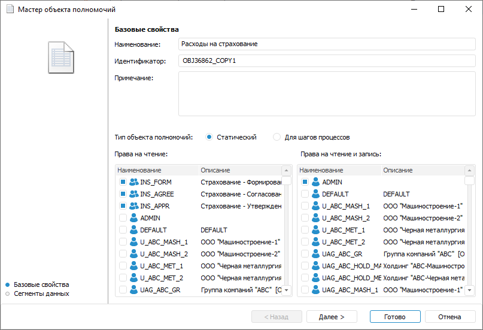
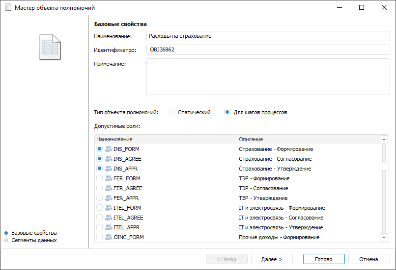
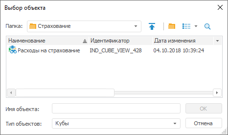

# Создание объектов полномочий

Создание объектов полномочий
-

# Создание объектов полномочий

Объект полномочий - объект репозитория,
 предназначенный для разграничения прав доступа пользователей/групп пользователей
 с помощью создания сегментов данных.

Сегмент данных - совокупность
 среза данных [куба](UiNavObj.chm::/Cube/CreateCube/Master_Standart/UiMd_Cube_CreateCube_Master_Standart.htm)
 и прав субъектов безопасности на эти данные. Для создания сегментов данных
 доступны следующие кубы:

	- [стандартные
	 кубы](UiNavObj.chm::/Cube/CreateCube/Master_Standart/UiMd_Cube_CreateCube_Master_Standart.htm);

	- [представления-кубы](UiNavObj.chm::/Cube/CreateCube/Master_Conception/UiMd_Cube_CreateCube_Master_Conception.htm).

Срез данных куба - двумерная
 таблица данных, полученная путём обязательной фиксации минимум одного
 измерения куба. Фиксация измерения заключается в отметке элементов данного
 измерения.

Объекты полномочий могут быть двух типов:

	- [Статические](#static).
	 Определяют статистические права, постоянно действующие во времени;

	- [Динамические](#for_process_steps).
	 Определяют динамические права, действующие только во время выполнения
	 отдельного шага процесса. До и после выполнения данного шага процесса
	 указанные права доступа отсутствуют.

Примечание.
 Объекты полномочий с динамическими правами доступа настраиваются только
 для шагов «[Ввод
 данных](../Process/StepsProcess/Data_Entry.htm)» и «[Согласование](../Process/StepsProcess/Agreement.htm)»
 при их [создании](../Process/StepsProcess/CreateStepsProcess.htm).

При создании объекта полномочий любого типа происходит ограничение прав
 на куб для пользователей/групп пользователей. Для предоставления прав
 для пользователей/групп пользователей, укажите их при создании объекта
 полномочий и определите сегмент данных для них.

Для создания новых и редактирования готовых объектов полномочий используется
 «Мастер объекта полномочий».

[Для открытия
 мастера](javascript:TextPopup(this))

	Для открытия мастера в [навигаторе
	 объектов](GetStarted.chm::/Interface/Interface_Navigator.htm) выполните одно из действий:

		- при создании нового объекта полномочий:

			- нажмите кнопку 
			 «Новый объект > Пользовательские
			 объекты > Объект полномочий» в группе «Создать»
			 вкладки «Главная»
			 ленты инструментов;

			- выполните команду «Создать
			 > Пользовательские объекты > Объект полномочий»
			 в контекстном меню навигатора объектов;

		- при редактировании готового объекта
		 полномочий. Выделите объект полномочий в навигаторе объектов и
		 выполните одно из действий:

			- нажмите кнопку «Редактировать»
			 в группе «Открыть»
			 вкладки «Главная»
			 ленты инструментов;

			- выполните команду «Редактировать»
			 в контекстном меню объекта полномочий;

			- нажмите клавишу F4.

## Базовые свойства

Первая страница мастера объекта полномочий «Базовые
 свойства». Вид страницы зависит от типа объекта полномочий:

	 Статический Динамический

		

		

На первой странице мастера задайте базовые свойства объекта полномочий:

	- Наименование. Введите
	 наименование объекта полномочий;

	- Идентификатор. Измените
	 уникальный идентификатор объекта полномочий при необходимости;

	- Примечание. Укажите
	 примечание к объекту полномочий при необходимости;

	- Тип объекта полномочий.
	 Определите тип доступа для пользователей/групп пользователей:

		- Статический.
		 При установке переключателя появятся две области «Права
		 на чтение» и «Права на
		 чтение и запись», где отмечаются пользователи/группы пользователей,
		 полномочия которых действуют постоянно во времени, независимо
		 от выполнения шагов процесса, на основе принадлежности пользователя
		 к определённой группе пользователей;

		- Для
		 шагов процесса. При установке переключателя появляется
		 область «Допустимые роли»,
		 где отмечаются пользователи/группы пользователей, полномочия которых
		 будут определяться при настройке отдельных шагов процесса. Полномочия
		 действуют только при выполнении конкретных шагов процесса и отсутствуют
		 в остальное время.

После определения базовых свойств объекта полномочий нажмите кнопку
 «Далее».

## Сегменты данных

Следующая страница мастера «Сегменты
 данных» предназначена для определения списка сегментов данных.
 Сегменты данных задаются с помощью установки отметок по измерениям выбранного
 источника. Это позволяет разделить источник данных на сегменты, доступные
 для работы отдельным группам пользователей.

На второй странице мастера выполните действия:

[Добавление
 источника](javascript:TextPopup(this))

	Для добавления источника данных:

		- Нажмите кнопку 
		 «Добавить источник». Будет
		 открыто окно выбора объекта:

	

		- Выберите один или несколько кубов, которые являются источниками
		 данных.

		- Нажмите кнопку «OК».

[Удаление
 источника](javascript:TextPopup(this))

	Для удаления источника данных:

		- Отметьте в списке источник, который необходимо удалить.

		- Нажмите кнопку  «Удалить».
		 После подтверждения операции источник будет удален.

[Установка
 отметки по измерениям источника](javascript:TextPopup(this))

	Для установки отметок по измерениям источников:

		- Дважды щёлкните по измерению или выделите его и нажмите
		 кнопку  «Редактировать
		 значение». Будет открыто окно для определения значений
		 по измерению.

		- Выберите один из переключателей:

			- Не определено (не участвует
			 в согласовании). При установке переключателя сегмент
			 будет включать все элементы данного измерения. Для создания
			 сегмента данных задайте отметку минимум в одном другом измерении
			 куба;

			- Определить.
			 При установке переключателя отметьте элементы в справочнике,
			 которые будут задавать сегмент данных:

	

	Убедитесь, что хотя бы для одного измерения
	 куба отметка определена.

		- Нажмите кнопку «Сохранить».

Для завершения работы мастера нажмите кнопку «Готово».

Примечание.
 Для корректной работы сегментов данных, ограничивающих доступ к различным
 операциям над объектами, для пользователей/групп пользователей требуются
 права только [на
 чтение](admin.chm::/03_admin/admin_adminobjects_discretionary.htm) для сегментов и/или контейнеров, содержащих
 сегменты.

Таким образом, вне процессов с помощью объектов полномочий создаются
 статические сегменты данных, к которым предоставляются права выбранным
 пользователям/группам пользователей. Права доступа к статическим сегментам
 данных определяются дискреционным методом разграничения доступа. Дополнительно
 с дискреционным методом возможно использовать [атрибутный метод](Admin.chm::/04_SecurityPolicy/Admin_ABAC.htm).

Подробное описание выбора методов разграничения доступа и их настройки
 приведено в статье «[Выбор
 методов разграничения доступа и их настройка](Admin.chm::/04_SecurityPolicy/Admin_SecPolicy.htm)».

Для работы в процессах с помощью объектов полномочий определяются динамические
 сегменты данных, которые создаются в момент запуска шага процесса и действуют
 до его завершения. Динамические сегменты данных предоставляют права доступа
 только на указанных шагах процесса и блокируют их вне данных шагов. Правами
 доступа на конкретном шаге процесса обладают только те пользователи/группы
 пользователей, которые были указаны при [создании
 динамического объекта полномочий](#for_process_steps). Для остальных пользователей доступ
 ограничен.

Примечание.
 Пользователи из [группы](Admin.chm::/03_Admin/Groups/Admin_Groups.htm)
 «Администраторы» всегда обладают
 правами доступа независимо от настройки объектов полномочий.

После создания объектов полномочий перейдите к их [настройке](Configuring_the_Authorization_Object.htm)
 в процессе.

См. также:

[Настройка
 ролевой модели](Role_model.htm) | [Настройка
 объектов полномочий процесса](Configuring_the_Authorization_Object.htm)

		Справочная
		 система на версию 10.9
		 от 18/08/2025,
		 © ООО «ФОРСАЙТ»,
