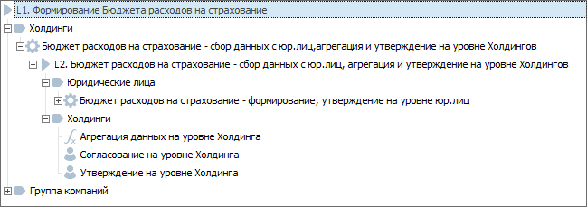
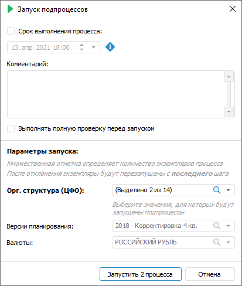

# Выполнение шагов подпроцесса: Настольное приложение

Выполнение шагов подпроцесса: Настольное приложение
-

# Выполнение шагов подпроцесса

Выполнение шага «[Вызов
 подпроцесса](../Process/StepsProcess/Subprocess.htm)» при установленном параметре «[Групповой
 вызов](../Process/StepsProcess/Subprocess.htm#parameters)» подразумевает, что при исполнении подпроцесса будут
 запускаться несколько [экземпляров](../Starting/Monitoring_process_execution.htm)
 подпроцесса в соответствии с заданным [параметром
 разбивки](../Process/StepsProcess/Subprocess.htm). Подпроцессы могут запускаться в [ручном
 или автоматическом режиме](../Process/StepsProcess/CreateStepsProcess.htm#method_of_execution) в зависимости от настроек шага.

Рассмотрим процеcс с двумя вложенными подпроцессами:

	- подпроцесс «Бюджет расходов
	 на страхование – сбор данных с юр.лиц, агрегация и утверждение на
	 уровне Холдингов» с ручным способом запуска;

	- подпроцесс для юридических лиц
	 «Бюджет расходов на страхование – формирование, утверждение на уровне
	 юр.лиц» с автоматическим способом запуска.

Например, [дерево
 процесса](../Starting/Starting.htm#legend_monitoring) «Формирование Бюджета расходов на страхование»:

 

Для выполнения шага «Вызов подпроцесса» выполните следующие
 шаги:

	- [Запустите процесс](../Process/Start_Process.htm).

	- Выделите в дереве процессов или в рабочей области подпроцесс
	 с ручным способом запуска и нажмите на кнопку  «Завершить».

Для задания параметров запуска подпроцесса
 будет открыто окно «Запуск подпроцессов»:

В области «Параметры
 запуска» автоматически заданы
 значения параметров, для которых будут запущены подпроцессы, в соответствии
 с настройками [связей
 процесса и подпроцесса](../Process/StepsProcess/Subprocess.htm#parameters).

Изменение значения доступно для [параметра](../Process/StepsProcess/Subprocess.htm#splitting_parameter),
 по которому выполняется разбиение подпроцесса, для остальных параметров
 доступен только просмотр значений.

	- Нажмите кнопку «Запустить N
	 процесса», где N –
	 количество запускаемых экземпляров подпроцесса. Количество экземпляров
	 подпроцесса:

		- определяется отметкой в параметре разбивки, если настроен
		 [групповой
		 вызов](../Process/StepsProcess/Subprocess.htm#group_call). В результате для каждого отмеченного элемента
		 параметра разбивки будет запущен отдельный экземпляр подпроцесса;

		- не зависит от отметки в параметрах, если не настроен[
		 групповой вызов](../Process/StepsProcess/Subprocess.htm#group_call). В результате будет запущен один экземпляр
		 подпроцесса.

	- Для подпроцесса с автоматическим способом исполнения экземпляры
	 вложенных подпроцессов запустятся автоматически.

В окне мониторинга список запущенных подпроцессов
 и экземляров подпроцессов отобразится в [дереве
 процессов](../Starting/Starting.htm#legend_monitoring).

	- Выполните все шаги отдельного экземпляра подпроцесса. После
	 выполнения всех шагов выполненный экземпляр подпроцесса удаляется
	 из окна с мониторингом.

Примечание.
 Выполненный экземпляр подпроцесса отображается в дереве процессов со всеми
 шагами после его выполнения, если установлен флажок «[Показывать
 завершенные экземпляры процессов, являющихся подпроцессами](../Process/Parameters_setting.htm#tree)» на странице
 «Параметры» окна «[Настройка параметров и администрирование
 бизнес-процессов](../Process/Setting_and_administrating_process_parameters.htm)».

	- [Перезапустите
	 экземпляры подпроцесса](Restarting_subprocess_instances.htm) при необходимости.

В процессе выполнения шагов подпроцесса имеется возможность просмотреть
 [журнал выполнения](Log_Stages_Steps_Pprocess.htm).

См. также:

[Мониторинг
 процесса](../Starting/Monitoring_process_execution.htm) | [Выполнение шагов процесса в ручном
 режиме](Manual_mode.htm) | [Отклонение шага процесса](Reject_step.htm) |
 [Журнал выполнения этапов/шагов
 процесса](Log_Stages_Steps_Pprocess.htm)

		Справочная
		 система на версию 10.9
		 от 18/08/2025,
		 © ООО «ФОРСАЙТ»,
