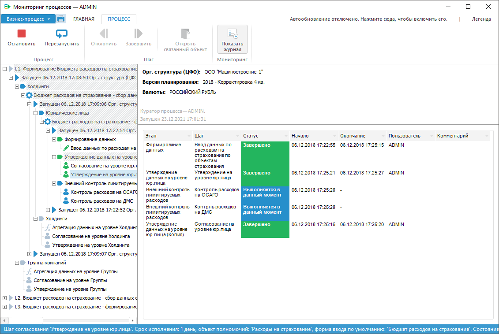

# Журнал выполнения этапов/шагов процесса: Настольное приложение

Журнал выполнения этапов/шагов процесса: Настольное приложение
-

# Журнал выполнения этапов/шагов процесса

В журнал выполнения этапов/шагов процесса записываются все изменения,
 связанные с выполнением шагов [экземпляров
 процесса/подпроцесса](../Starting/Monitoring_process_execution.htm).

Для просмотра журнала в окне «[Мониторинг
 процессов](../Starting/Starting.htm#setting_business_process)» нажмите кнопку 
 «Показать журнал» на вкладке «Процесс» панели инструментов. Для
 возврата к режиму мониторинга нажмите кнопку  «Показать журнал» повторно.

Окно расширения «Мониторинг процессов»
 в режиме просмотра журнала:

В рабочей области отображается таблица с основными сведениями по выполнению
 шагов [экземпляра
 процесса](../Starting/Monitoring_process_execution.htm):

	- Этап. Содержит наименование
	 этапа;

	- Шаг. Содержит наименование
	 шага;

	- Статус. Содержит значение
	 статуса выполнения шага и цветовую индикацию. Возможные варианты статусов:

		- Выполняется
		 в данный момент. Шаг доступен для выполнения;

		- Завершено.
		 Шаг выполнен корректно;

		- Ошибка.
		 Шаг выполнен, но при его выполнении произошёл сбой. Например:

			- если в шаге «Расчёт»
			 выбран алгоритм, у которого в формуле расчёта допущена ошибка,
			 то такой шаг выполнится, но в окне «Мониторинг
			 процессов» статус шага будет «Завершено
			 с ошибкой»;

			- если экземпляры подпроцесса были принудительно остановлены,
			 то в окне «Мониторинг процессов»
			 статус шага «Вызов подпроцесса»
			 будет «Завершено с ошибкой»;

		- Отклонено.
		 Шаг отменён и возвращён на предыдущий шаг;

		- Просрочено.
		 Шаг не выполнен в срок;

		- Пропущено.
		 Шаг отключён на этапе создания/редактирования процесса;

Примечание.
 Для просмотра цветовой индикации статусов выполнения шагов процесса воспользуйтесь
 командой «[Легенда](../Starting/Starting.htm#legend)»
 главного меню.

	- Начало. Содержит время
	 начала операции по изменению статуса шага;

	- Окончание. Содержит
	 время окончания операции по изменению статуса шага;

	- Пользователь. Содержит
	 имя пользователя, [завершившего](Executing_Subprocess.htm)
	 или [отклонившего](Reject_step.htm) выполнение шага;

	- Комментарий. Содержит
	 комментарий, оставленный пользователем при [завершении](Executing_Subprocess.htm)
	 или [отклонении](Reject_step.htm) шага.

При выборе в дереве процессов другого запущенного экземпляра рабочая
 область с журналом обновится.

См. также:

[Мониторинг
 процесса](../Starting/Monitoring_process_execution.htm) | [Выполнение шагов процесса в автоматическом
 режиме](Auto_mode.htm) | [Выполнение шагов процесса в ручном
 режиме](Manual_mode.htm) | [Выполнение шагов подпроцесса](Executing_Subprocess.htm)
 | [Отклонение шага процесса](Reject_step.htm)

		Справочная
		 система на версию 10.9
		 от 18/08/2025,
		 © ООО «ФОРСАЙТ»,
