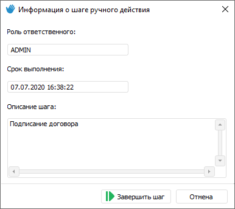
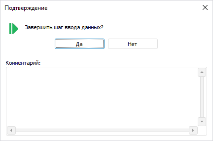

# Выполнение шагов процесса в ручном режиме: Настольное приложение

Выполнение шагов процесса в ручном режиме: Настольное приложение
-

# Выполнение шагов процесса в ручном режиме

Ручной способ исполнения доступен для шагов:

	- [Расчёт](../Process/StepsProcess/Calculation.htm);

	- [Вызов подпроцесса](../Process/StepsProcess/Subprocess.htm);

	- [Ввод данных](../Process/StepsProcess/Data_Entry.htm);

	- [Согласование](../Process/StepsProcess/Agreement.htm);

	- [Ручное действие](../Process/StepsProcess/Manual_Task.htm).

Для выполнения шагов процесса в ручном режиме:

	- Откройте [мониторинг
	 процессов](../Starting/Monitoring_process_execution.htm) после [запуска
	 процесса](../Process/Start_Process.htm).

	- Выделите [экземпляр](../Starting/Monitoring_process_execution.htm)
	 с необходимым набором параметров в дереве процессов;

	- Выберите шаг в рабочей области.

	- Откройте связанный объект.
	 Для этого выполните одно из действий:

		- нажмите кнопку  «Открыть
		 связанный объект» в группе «Шаг»
		 вкладки «Процесс» ленты
		 инструментов;

		- выполните команду «Открыть
		 связанный объект» в контекстном меню шага в рабочей области
		 или дереве процессов;

		- дважды щёлкните по выбранному шагу.

В открывшемся окне, которое зависит от типа
 выбранного шага, выполните необходимые действия:

		- в форме ввода – [введите
		 данные](DataEntryForms.chm::/desktop/Work/Agreement.htm#enter_data);

		- в форме ввода для шага согласования – [согласуйте
		 данные](DataEntryForms.chm::/desktop/Work/Agreement.htm#approval_step);

		- в алгоритме расчёта – [выполните
		 расчёт](CalculationAlgorithm.chm::/desktop/Work/Perform_calculations.htm).

		- в информации о шаге ручного действия – ознакомьтесь с описанием
		 шага и, если необходимое действие было выполнено, то можно завершить
		 шаг прямо из окна информации, нажав кнопку «Завершить
		 шаг»:

	- Завершите шаг:

		- нажмите кнопку  «Завершить» в группе «Шаг» вкладки «Процесс»
		 ленты инструментов;

		- выполните команду «Завершить»
		 в контекстном меню шага в рабочей области или дереве процессов.

Откроется окно подтверждения завершения шага,
 в котором при необходимости введите пояснения в поле «Комментарий»:

Если шаг «[Вызов
 подпроцесса](../Process/StepsProcess/Subprocess.htm)» выполняется в ручном режиме, то после завершения шага
 будет открыто окно «[Запуск
 подпроцессов](Executing_Subprocess.htm)» для запуска подпроцессов.

После завершения шага доступно [отклонение](Reject_step.htm)
 следующего шага на предыдущий. Если шаг был отклонен, то для дальнейшего
 завершения отклоненного шага повторите завершение предыдущего шага. При
 выполнении всех шагов [экземпляр
 процесса](../Starting/Monitoring_process_execution.htm) будет удален из дерева процессов.

См. также:

[Мониторинг
 процесса](../Starting/Monitoring_process_execution.htm) | [Выполнение шагов процесса в автоматическом
 режиме](Auto_mode.htm) | [Выполнение шагов подпроцесса](Executing_Subprocess.htm)
 | [Отклонение шага процесса](Reject_step.htm) | [Журнал
 выполнения этапов/шагов процесса](Log_Stages_Steps_Pprocess.htm)

		Справочная
		 система на версию 10.9
		 от 18/08/2025,
		 © ООО «ФОРСАЙТ»,
