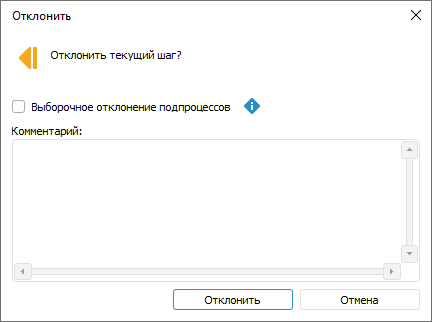
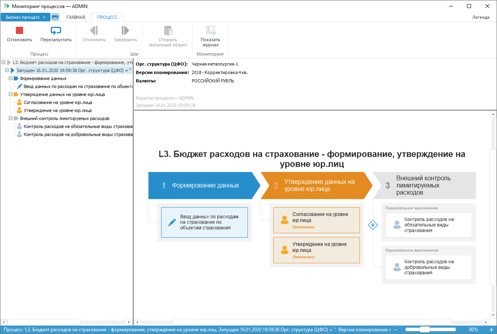

# Отклонение шага процесса: Настольное приложение

Отклонение шага процесса: Настольное приложение
-

# Отклонение шага процесса

Для отклонения активного шага процесса на предыдущий:

	- Выполните одно из действий:

		- нажмите кнопку  «Отклонить»
		 в группе «Шаг» вкладки
		 «Процесс» ленты инструментов;

		- выполните команду «Отклонить»
		 в контекстном меню шага в рабочей области или дереве процессов.

После выполнения одного из действий будет
 открыто окно подтверждения отклонения шага:

	- При необходимости в окне отклонения шага:

		- установите флажок «Выборочное
		 отклонение подпроцессов» для отклонения выбранных экземпляров
		 подпроцесса. При снятом флажке шаг процесса будет отклонен до
		 ручного шага вместе с экземплярами подпроцесса автоматического
		 шага;

Примечание.
 После установки флажка «Выборочное отклонение
 подпроцессов» [способ
 исполнения](../Process/StepsProcess/CreateStepsProcess.htm#method_of_execution) будет изменен с автоматичекого на ручной.

		- введите комментарий в поле «Комментарий»
		 для пояснения отклонения шага процесса.

Примечание.
 Из связанного объекта доступно отклонение шага, в котором используется
 [форма
 ввода](DataEntryForms.chm::/desktop/Work/Agreement.htm).

Окно мониторинга бизнес-процесса:

См. также:

[Мониторинг
 процесса](../Starting/Monitoring_process_execution.htm) | [Выполнение шагов процесса в автоматическом
 режиме](Auto_mode.htm) | [Выполнение шагов процесса в ручном
 режиме](Manual_mode.htm) | [Выполнение шагов подпроцесса](Executing_Subprocess.htm)
 | [Журнал выполнения этапов/шагов
 процесса](Log_Stages_Steps_Pprocess.htm)

		Справочная
		 система на версию 10.9
		 от 18/08/2025,
		 © ООО «ФОРСАЙТ»,
