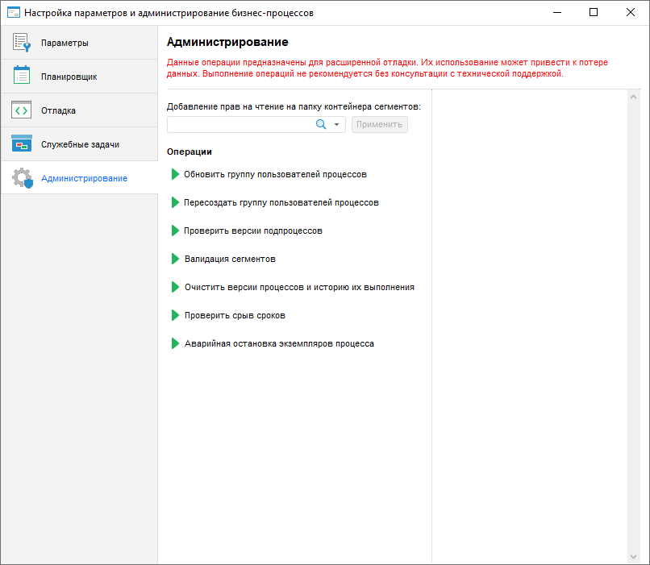

# Администрирование бизнес-процессов: Настольное приложение

Администрирование бизнес-процессов: Настольное приложение
-

# Администрирование бизнес-процессов

Администрирование бизнес-процессов предназначено для расширенной отладки
 процессов: добавления прав доступа к бизнес-процессам, повторного создания
 группы пользователей, удаления всей истории процессов. Для администрирования
 бизнес-процессов используется страница «Администрирование»
 в окне «[Настройка
 параметров и администрирование бизнес-процессов](Setting_and_administrating_process_parameters.htm)».

[Для открытия
 страницы «Администрирование»](javascript:TextPopup(this))

	- Запустите утилиту с идентификатором BP_UTIL в [навигаторе
	 объектов](GetStarted.chm::/Interface/Interface_Navigator.htm). После чего будет открыто окно «[Настройка параметров и администрирование
	 бизнес-процессов](Setting_and_administrating_process_parameters.htm)».

		- Перейдите на страницу «Администрирование».

Важно. Данные
 операции предназначены для расширенной отладки. Их использование может
 привести к потере данных. Выполнение операций не рекомендуется без консультации
 с технической поддержкой.

Задайте параметры:

	- Добавление
	 прав на чтение на папку контейнера сегментов. Выберите [пользователя](Admin.chm::/03_Admin/Users/Admin_Users.htm)
	 в раскрывающемся списке субъектов [менеджера
	 безопасности](Admin.chm::/01_RunSecManager/Admin_Organizational_Starting.htm) для предоставления доступа к бизнес-процессам.
	 Нажмите кнопку «Применить»
	 для добавления прав пользователю на чтение на папку контейнера сегментов;

	- Операции.
	 Выполните операции при необходимости:

		- Обновить группу пользователей.
		 Перед выполнением действия, убедитесь, что пользователи состоят
		 в группе пользователей бизнес-процессов BPM_ALL_USERS, которая
		 создается при [установке
		 расширения](Setup.chm::/Extensions/install_or_update_extensions.htm). При выполнении операции пользователям
		 добавляются права доступа к бизнес-процессам, если они не были
		 получены раннее;

		- Пересоздать группу пользователей
		 процессов. При выполнении операции создается группа пользователей
		 BPM_ALL_USERS с доступом к бизнес-процессам, если [установка
		 расширения](Setup.chm::/Extensions/install_or_update_extensions.htm) была выполнена с ошибками. При корректной
		 установке расширения группа создается автоматически;

		- Проверить версии подпроцессов;

Примечание.
 Операция устарела, обновление версий подпроцессов выполняется автоматически.

		- Валидация сегментов;

Примечание.
 Операция устарела, воспользуйтесь командой «Очистить
 мониторинг» на странице «Отладка».

		- Очистить версии процессов
		 и историю их выполнения. При выполнении операции удаляется
		 вся история процессов, хранящихся в таблицах. Для выполнения операции
		 будет открыто информационное окно с подтверждением действия;

		- Проверить срыв сроков.
		 При выполнении операции проверяется наличие нарушений сроков выполнения
		 шагов. При наличии нарушений будет отправлено e-mail оповещение
		 и/или выполнен Fore-метод, в зависимости от настроек на странице
		 «События» [мастера
		 шага](StepsProcess/CreateStepsProcess.htm).

Примечание.
 Для выполнения автоматической проверки нарушений выполнения шагов настройте
 [серверное исполнение](Setting_planner.htm#server) процессов,
 установите флажок «Проверять срыв сроков
 исполнения шагов» и задайте интервал проверки на странице «[Планировщик](Setting_planner.htm)».

		- Аварийная остановка экземпляров
		 процесса. Принудительная остановка экземпляров бизнес-процесса
		 в случае, если невозможно [остановить
		 процесс](../Starting/Monitoring_process_execution.htm#process_curator) в окне [мониторинга](../Starting/Monitoring_process_execution.htm).

Примечание.
 Не рекомендуется работа пользователей с процессами в момент аварийной
 остановки экземпляров.

При выполнении операции будет открыто «Аварийная остановка экземпляров процесса»:

Для остановки экземпляров бизнес-процессов
 укажите:

			- Процессы. В
			 раскрывающемся списке выберите один или несколько процессов.
			 Список содержит дерево объектов репозитория, в котором отображаются
			 только процессы и папки, содержащие их.

			- Экземпляры.
			 В раскрывающемся списке выберите экземпляры процессов, выполнение
			 которых необходимо остановить. Иерархический список состоит
			 из процессов и экземпляров, которые были запущены. Для остановки
			 всех экземпляров процесса в раскрывающемся списке выберите
			 сам процесс.

После выбора экземпляров процессов, которые нужно остановить, нажмите
 кнопку «Выполнить». В результате
 указанные экземпляры будут остановлены и пропадут из окна [мониторинга
 процессов](../Starting/Monitoring_process_execution.htm).

Процесс выполнения операций будет выведен в правой части диалога «Администрирование».

См. также:

[Настройка
 параметров и администрирование бизнес-процессов](Setting_and_administrating_process_parameters.htm) | [Настройка
 параметров бизнес-процессов](Parameters_setting.htm) | [Настройка
 планировщика бизнес-процессов](Setting_planner.htm) | Настройка отладки бизнес-процессов
 | [Создание служебных задач для бизнес-процессов](Creating_service_tasks.htm)

		Справочная
		 система на версию 10.9
		 от 18/08/2025,
		 © ООО «ФОРСАЙТ»,
