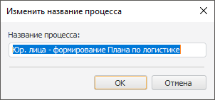
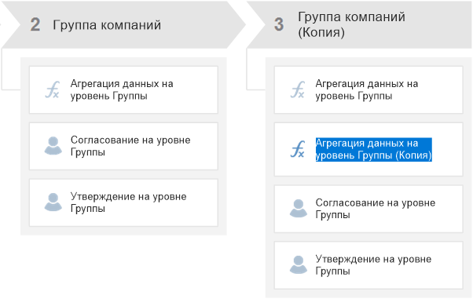
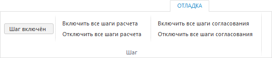
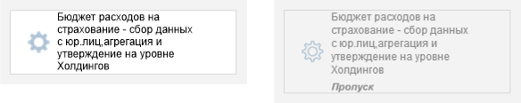
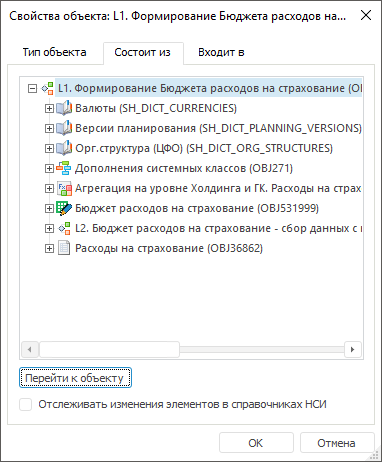
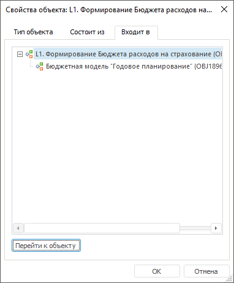

# Редактирование процесса: Настольное приложение

Редактирование процесса: Настольное приложение
-

# Редактирование процесса

Редактирование процесса осуществляется в окне [настройки
 бизнес-процесса](../Starting/Starting.htm#setting_business_process). При редактировании процесса в его состав добавляются
 или удаляются этапы/шаги, а также изменяется последовательность их выполнения.

Для редактирования отдельного шага используйте [мастер
 шага](StepsProcess/CreateStepsProcess.htm#steps_process_firs_page).

При редактировании процесса доступны следующие действия:

[Изменение
 названия процесса](javascript:TextPopup(this))

	Для изменения названия процесса:

		- дважды щёлкните по названию процесса в рабочей области;

		- выполните команду контекстного меню «Изменить
		 заголовок»;

		- выделите название процесса и нажмите клавишу F2.

	Будет открыто окно «Изменить название
	 процесса», в котором задайте новое наименование процесса:

	

[Изменение
 названия этапа/шага](javascript:TextPopup(this))

	Для изменения названия этапа/шага выполните одно из действий:

		- выполните команду контекстного меню «Переименовать»
		 этапа/шага. Будет открыто окно «Изменить
		 название этапа»/«Изменить
		 название шага», в котором задайте новое наименование этапа/шага;

		- выделите название этапа/шага и нажмите клавишу F2. Будет
		 открыто окно «Изменить название
		 этапа»/«Изменить название
		 шага», в котором задайте новое наименование этапа/шага;

		- дважды щёлкните по наименованию этапа в рабочей области
		 и задайте новое наименование этапа.

	Примечание.
	 Изменение наименования шага возможно также при [редактировании
	 шага](BPM_Edit_Process.htm#editing_step).

[Редактирование
 шага](javascript:TextPopup(this))

	Для редактирования шага дважды щёлкните по его наименованию в рабочей
	 области. Будет открыт [мастер
	 шага](StepsProcess/CreateStepsProcess.htm#steps_process_firs_page). Внесите требуемые изменения на страницах мастера, для сохранения
	 изменений нажмите кнопку «Готово».

	Примечание.
	 Редактирование шага возможно также с помощью команд контекстного меню.

[Изменение
 способа запуска шага: ручной/автоматический](javascript:TextPopup(this))

	Для изменения способа запуска шага выполните одно из действий

		- выполните команду контекстного меню шага «Автоматическое
		 выполнение шага»;

	Примечание.
	 Изменение способа запуска шага через контекстное меню доступно только
	 для шагов с ручным и автоматическим способом выполнения, таких как
	 «[Расчёт](StepsProcess/Calculation.htm)»
	 и «[Вызов
	 подпроцесса](StepsProcess/Subprocess.htm)». Для шагов только с автоматическим или только с ручным
	 способом запуска команда недоступна.

		- дважды щёлкните наименованию шага в рабочей области. Будет
		 открыт [мастер
		 шага](StepsProcess/CreateStepsProcess.htm#steps_process_firs_page). На странице мастера «Управление
		 параметрами», на которой установите способ запуска шага.
		 Для сохранения изменений нажмите кнопку «Готово».

[Копирование
 и вставка шага/этапа](javascript:TextPopup(this))

	Для копирования и последующей вставки шага или этапа процесса:

		- Выделите блок для копирования в рабочей области или дереве
		 процесса.

		- Нажмите кнопку  «Копировать»
		 на вкладке «Процесс» ленты
		 инструментов или выполните аналогичную команду контекстного меню.
		 На панели инструментов и в контекстном меню станет доступна операция
		  «Вставить».

		- Выделите блок, после которого необходимо вставить скопированный
		 блок, в рабочей области или дереве процесса.

		- Нажмите кнопку  «Вставить»
		 или выполните аналогичную команду контекстного меню. Название
		 вставленного блока будет иметь суффикс «(Копия)»:

	

	Примечание.
	 Копирование этапа выполняется со всеми его шагами.

		- При необходимости удаления исходного блока после копирования
		 нажмите кнопку  «Вырезать».

		- При необходимости отредактируйте скопированные блоки, дважды
		 щёлкнув по наименованию блока или используя команды контекстного
		 меню.

		- Для сохранения изменений нажмите кнопку ,
		 расположенную на [панели
		 быстрого доступа](../Starting/Starting.htm#setting_business_process), или выполните команду «Бизнес-процесс
		 > Сохранить» главного меню. Для отмены изменений закройте
		 окно без сохранения изменений.

	Примечание.
	 Для операций копирования, вставки и вырезания доступны стандартные
	 сочетания клавиш: CTRL+C, CTRL+V, CTRL+X.

	В результате выполнения действий будут выполнены копирование и вставка
	 шага или этапа процесса.

[Изменение
 последовательности этапов/шагов](javascript:TextPopup(this))

	Для изменения последовательности выполнения этапов или шагов процесса:

		- Выделите этап/шаг в рабочей
		 области или дереве процессов;

		- Выполните одно из действий:

			- нажмите кнопку  «Переместить
			 вверх» или  «Переместить
			 вниз» на вкладке «Процесс»
			 ленты инструментов;

			- выполните аналогичные команды контекстного меню;

			- нажмите сочетание клавиш CTRL+UP или CTRL+LEFT для перемещения
			 элемента вверх, CTRL+DOWN или CTRL+RIGHT для перемещения элемента
			 вниз.

	Примечание.
	 При перемещении шагов учитывается их последовательное или параллельное
	 выполнение. Если два шага выполнялись параллельно, то при изменении
	 последовательности в пределах этапа параллельное выполнение изменяется
	 на последовательное и наоборот. При перемещении шага в другой этап
	 по умолчанию применяется параллельный шлюз.

	В результате выполнения действий последовательность этапов/шагов
	 будет изменена.

[Удаление
 этапа/шага](javascript:TextPopup(this))

	Для удаления этапа/шага:

		- Выделите этап/шаг в рабочей области или дереве процессов;

		- Выполните одно из действий:

			- нажмите клавишу DELETE;

			- нажмите кнопку  «Удалить»
			 на вкладке «Процесс»
			 ленты инструментов;

			- выполните команду контекстного
			 меню «Удалить».

	Примечание.
	 Перед удалением этапа/шага пользователю выводится окно для подтверждения
	 операции удаления.

	В результате выполнения действий выделенный этап/шаг будет удалён.

[Включение/отключение
 шага](javascript:TextPopup(this))

	Для включения/отключения шага из выполнения процесса: выделите шаг
	 в рабочей области и измените состояние шага с помощью команды «Шаг включён» на вкладке «Отладка»
	 ленты инструментов:

	

	Команды «Включить все шаги расчёта/согласования»
	 позволяют включить все отключенные шаги соответствующих типов.

	Команды «Отключить все шаги расчёта/согласования»
	 позволяют отключить все активные шаги соответствующих типов.

	Примечание.
	 Включение/отключение выполнения шага возможно также с помощью команды
	 контекстного меню «Шаг включен».

	Фон блока отключенного шага выделяется серым цветом и устанавливается
	 статус шага «Пропуск». Например,
	 слева шаг, участвующий в процессе, справа - исключённый из процесса:

	

[Просмотр
 свойств процесса](javascript:TextPopup(this))

	Для просмотра свойств процесса, в том числе входящих в его состав
	 объектов, используйте команду контекстного меню «Свойства
	 процесса». Откроется диалог «[Свойства объекта](UiNav.chm::/03_Objects/UiNav_Obj_BasicProp.htm)»:

		- на вкладке «Состоит из»
		 отображаются все объекты, которые включены в текущий процесс;

		- на вкладке «Входит в»
		 отображаются все процессы, в которые включён текущий процесс.

	Например, свойства процесса «L1. Формирование Бюджета расходов на
	 страхование»:

		Состоит изВходит в

			

			

	Для просмотра входящих в процесс объектов выделите объект и нажмите
	 кнопку «Перейти к объекту».

См. также:

[Построение
 процесса](Create_process_screenshot.htm) | [Запуск процесса](Start_Process.htm)

		Справочная
		 система на версию 10.9
		 от 18/08/2025,
		 © ООО «ФОРСАЙТ»,
