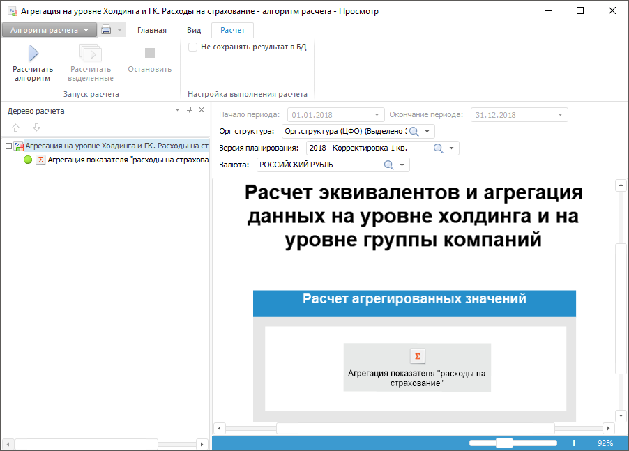

# Симуляция выполнения шагов процесса

Симуляция выполнения шагов процесса
-

# Симуляция выполнения шагов процесса

Симуляция предназначена для проверки правильности запуска и выполнения
 шагов процесса.

Симуляция запускается для отдельного шага процесса: для шагов ввода
 и согласования открываются формы ввода с заданными параметрами, для шага
 расчёта – алгоритмы расчёта показателей с заданными параметрами.

Для запуска симуляции выполните следующие действия:

	- В окне «[Настройка
	 бизнес-процесса](../Starting/Starting.htm#setting_business_process)» выделите в рабочей области или дереве
	 процессов отдельный шаг процесса.

	- Нажмите кнопку  «Симуляция» или выполните соответствующую
	 команду контекстного меню шага.

	- В открывшемся окне задайте [параметры
	 запуска](Start_Process.htm) шага процесса.

	- В открывшемся окне, которое зависит от типа выбранного шага,
	 выполните необходимые действия:

		- в форме ввода – [введите
		 данные](DataEntryForms.chm::/desktop/Work/DataEnter.htm);

		- в форме ввода для шага согласования – согласуйте или утвердите
		 данные;

		- в форме с алгоритмом расчёта – выполните [расчёт](Calculation.chm::/desktop/Algorithm/Work/Work.htm):

	- Проанализируйте результат симуляции и, если необходимо, выполните
	 [редактирование](BPM_Edit_Process.htm) этапов/шагов процесса.

См. также:

[Редактирование
 процессов](BPM_Edit_Process.htm) | [Запуск процесса](Start_Process.htm)

		Справочная
		 система на версию 10.9
		 от 18/08/2025,
		 © ООО «ФОРСАЙТ»,
