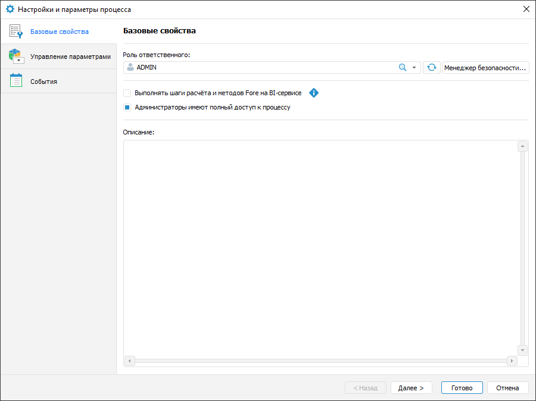

# Настройка базовых свойств: Процесс, настольное приложение

Настройка базовых свойств: Процесс, настольное приложение
-

# Настройка базовых свойств

Настройка базовых свойств процесса выполняется на странице «Базовые
 свойства» окна «[Настройки
 и параметры процесса](Setting_Process_Parameters.htm)»:

Задайте параметры:

	- Роль
	 ответственного. Выберите [куратора](../Starting/Monitoring_process_execution.htm#process_curator)
	 в раскрывающемся списке субъектов [менеджера
	 безопасности](admin.chm::/01_RunSecManager/Admin_Organizational_Starting.htm) продукта «Форсайт. Аналитическая платформа».
	 Куратор является ответственным за весь процесс и может выступать в
	 качестве пользователя или группы пользователей. По умолчанию выбран
	 пользователь, являющийся создателем процесса.

Дополнительные возможности задания ответственного:

		- для обновления списка субъектов менеджера безопасности нажмите
		 кнопку  «Обновить список»;

		- для поиска субъекта в списке субъектов менеджера безопасности
		 нажмите кнопку  «Найти»
		 и введите наименование субъекта частично или полностью в строку
		 поиска. В списке субъектов будут отображаться найденные субъекты.
		 Для очистки строки поиска нажмите кнопку  «Очистить»;

		- для формирования списка субъектов в менеджере безопасности
		 нажмите кнопку «Менеджер безопасности».
		 После выполнения действия будет открыт [менеджер
		 безопасности](admin.chm::/01_RunSecManager/Admin_Organizational_Starting.htm);

	- Выполнять
	 шаги расчёта и методов Fore на BI-сервисе. Установите флажок
	 для выполнения ресурсоёмких шагов «[Расчёт](StepsProcess/Calculation.htm)»
	 и «[Вызов
	 Fore-метода](StepsProcess/Fore.htm)» на [BI-сервере](Setup.chm::/UiWebSetup/UiWebSetup_TitlePage.htm).
	 По умолчанию флажок снят.

Примечание.
 Адрес BI-сервера задается с помощью флажка «URL
 BI-сервиса» на странице «[Планировщик](Setting_planner.htm)».

При настройке выполнения ресурсоёмких шагов
 убедитесь, что на [BI-сервере](Setup.chm::/UiWebSetup/UiWebSetup_TitlePage.htm)
 размещён файл [registry.reg](Setup.chm::/UiWebSetup/03_Setup_Web/config_and_setting.htm)
 или [Metabases.xml](Setup.chm::/06_AK_Client_Config/Configuring_repository_list_in_the_system_registry.htm)
 с настройками подключения к репозиториям;

	- Администраторы
	 имеют полный доступ к процессу. Установите флажок для выдачи
	 прав полного доступа пользователям из встроенной группы администраторов
	 на запуск процесса, завершение и отклонение шагов, даже если они не
	 являются ответственными за процесс и/или шаги. При снятом флажке доступ
	 к процессу для пользователей из встроенной группы администраторов
	 запрещён. По умолчанию флажок установлен;

	- Описание. Введите дополнительную
	 информацию о процессе при необходимости.

После настройки базовых свойств процесса выберите справочники в качестве
 параметров процесса на странице «[Управление
 параметрами](Params_control.htm)».

См. также:

[Настройка
 параметров процесса](Setting_Process_Parameters.htm) | [Управление
 параметрами](Params_control.htm) | [Настройка событий](Events.htm)

		Справочная
		 система на версию 10.9
		 от 18/08/2025,
		 © ООО «ФОРСАЙТ»,
