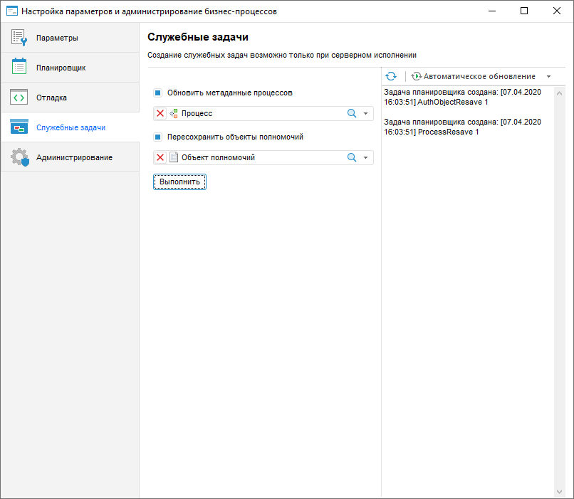
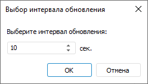

# Создание служебных задач для бизнес-процессов

Создание служебных задач для бизнес-процессов
-

# Создание служебных задач для бизнес-процессов

Служебные задачи предназначены для сохранения целостности данных после
 [переноса](UpdManager.chm::/Admin_UpdateTitle.htm)
 [объектов
 полномочий](../Facility_Agreement/Create_Authorization_Object.htm) и [процессов](Create_process_screenshot.htm)
 между репозиториями. Создание служебных задач возможно только при [серверном
 исполнении](Setting_planner.htm#server) процессов. Создание служебных задач для бизнес-процессов
 выполняется на странице «Служебные задачи»
 в окне «[Настройка
 параметров и администрирование бизнес-процессов](Setting_and_administrating_process_parameters.htm)».

[Для открытия
 страницы «Служебные задачи»](javascript:TextPopup(this))

	- Запустите утилиту с идентификатором BP_UTIL в [навигаторе
	 объектов](GetStarted.chm::/Interface/Interface_Navigator.htm). После чего будет открыто окно «[Настройка параметров и администрирование
	 бизнес-процессов](Setting_and_administrating_process_parameters.htm)».

		- Перейдите на страницу «Служебные
		 задачи».

Для создания служебных задач:

	- Убедитесь, что [настроено
	 серверное исполнение](Setting_Server_Process_Execution.htm) процессов и запущен [экземпляр
	 планировщика задач](Setting_Server_Process_Execution.htm#scheduler). Проверьте, что в окне планировщика задач отображается
	 сервер, репозиторий, процессы которого будут выполняться на сервере,
	 и контейнер с идентификатором BPM_EXECUTOR_CONTAINER.

	- Установите флажки:

		- Обновить
		 метаданные процессов. Установите флажок для обновления
		 метаданных процессов после [установки обновления](UpdManager.chm::/Admin_UpMBObj_DoUpdate.htm), содержащего процессы. По умолчанию
		 флажок снят.

При установке флажка автоматически выбираются
 все процессы из репозитория. Для выбора отдельных процессов снимите отметку,
 нажав кнопку , и отметьте необходимые процессы
 из раскрывающегося списка.

		- Пересохранить
		 объекты полномочий. Установите флажок для пересохранения
		 [объектов
		 полномочий](../Facility_Agreement/Create_Authorization_Object.htm) после [установки обновления](UpdManager.chm::/Admin_UpMBObj_DoUpdate.htm), содержащего объекты полномочий
		 или процессы, связанные с ними. По умолчанию флажок снят.

При установке флажка автоматически выбираются
 все объекты полномочий из репозитория. Для выбора отдельных объектов полномочий
 снимите отметку, нажав кнопку , и отметьте
 необходимые объекты полномочий из раскрывающегося списка.

Примечание.
 Для пересохранения объектов полномочий на локальном компьютере установите
 флажок «Пересохранить объекты полномочий» на странице «Отладка».

	- Нажмите кнопку «Выполнить»
	 для добавления служебных задач в [контейнер запланированных
	 задач](uiappsrv.chm::/Getting_Started.htm) с идентификатором BPM_EXECUTOR_CONTAINER.
	 Будет открыто информационное окно для подтверждения действия.

Примечание.
 При выполнении задачи «Пересохранить
 объекты полномочий» процессы для выбранных объектов полномочий
 будут остановлены. Не рекомендуется работать с объектами репозитория во
 время выполнения служебных задач. После завершения задачи перезайдите
 в репозиторий.

Служебные задачи будут выполняться в [планировщике задач](uiappsrv.chm::/UiAppSrv_purpose.htm).
 Процесс выполнения задач будет выведен в правой части диалога «Служебные
 задачи».

Для обновления информации о выполнении задач нажмите кнопку .

Для автоматического обновления информации о выполнении задач в раскрывающемся
 меню кнопки  «Автоматическое
 обновление» выполните команду  «Интервал
 обновления». В открывшемся диалоге «Выбор
 интервала обновления» задайте интервал обновления:

Для отключения автоматического обновления нажмите кнопку  «Автоматическое
 обновление». При повторном включении автоматического обновления
 интервал обновления будет сохранен.

См. также:

[Настройка
 параметров и администрирование бизнес-процессов](Setting_and_administrating_process_parameters.htm) | [Настройка
 параметров бизнес-процессов](Parameters_setting.htm) | [Настройка
 планировщика бизнес-процессов](Setting_planner.htm) | [Настройка
 отладки бизнес-процессов](Setting_debug.htm) | [Администрирование
 бизнес-процессов](Administrating.htm)

		Справочная
		 система на версию 10.9
		 от 18/08/2025,
		 © ООО «ФОРСАЙТ»,
