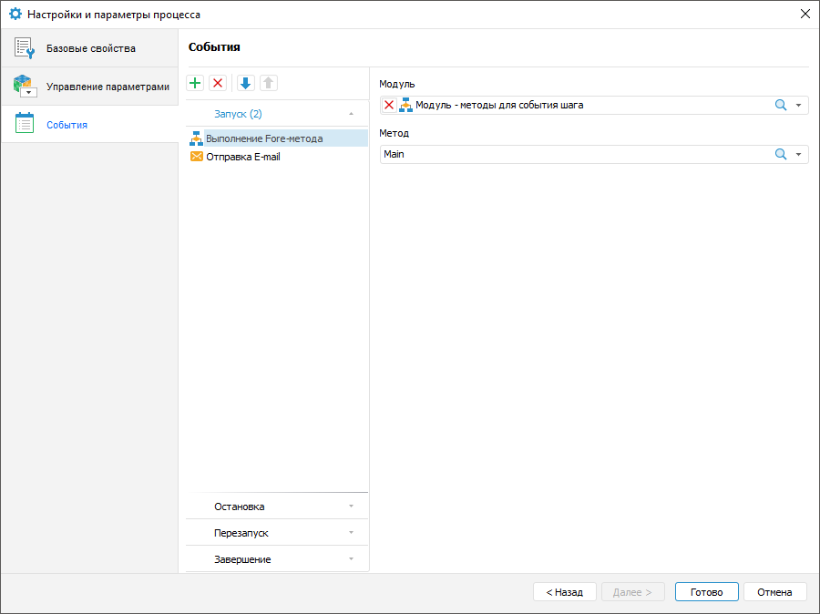

# Настройка событий: Процесс, настольное приложение

Настройка событий: Процесс, настольное приложение
-

# Настройка событий

Настройка событий процесса при выполнении определенного шага выполняется
 на странице «События» в окне «[Настройки
 и параметры процесса](Setting_Process_Parameters.htm)».

Настройте автоматически выполняемые действия, запускаемые при наступлении
 одного из событий: [запуск процесса](Start_Process.htm), [остановка
 выполнения шагов процесса](../Starting/Monitoring_process_execution.htm#process_curator), [перезапуск
 шагов процесса](../Starting/Monitoring_process_execution.htm#process_curator), [завершение
 выполнения процесса:](../MonitoringProcess/Manual_mode.htm)

Для формирования списка выполняемых действий выберите соответствующую
 вкладку с событием: «Запуск»,
 «Остановка», «Перезапуск»,
 «Завершение», нажмите кнопку  «Добавить»
 на панели инструментов и выберите добавляемое действие:

	-  «Выполнение Fore-метода». В правой
	 части окна заполните обязательные поля, подсвеченные розовым цветом:

		- Модуль. Обязательное
		 для заполнения поле. В раскрывающемся списке выберите модуль,
		 написанный на языке Fore. Список содержит все модули в репозитории
		 и папки, в которых содержатся модули. Доступен поиск по наименованию
		 модуля;

		- Метод. Обязательное
		 для заполнения поле. В раскрывающемся списке выберите метод. Список
		 содержит все методы модуля, соответствующие сигнатуре:

Sub <наименование Fore-метода>(Sender: IBProcessInstance; Args: IBProcessStepStateEventArgs);

Параметр:

Sender.
 Экземпляр процесса;

Args.
 Информация о событии: шаг, старое состояние шага, новое состояние;

	-  «Отправка e-mail». Задайте параметры
	 сообщения:

		- Кому. Введите адрес
		 одного или нескольких основных получателей сообщения через разделитель
		 «;». Поле обязательно
		 для заполнения;

		- Копия. Введите
		 адрес одного или нескольких получателей для ознакомления с сообщением
		 через разделитель «;»;

		- Скрытая
		 копия. Введите адрес одного или нескольких получателей
		 для ознакомления с сообщением через разделитель «;». Адрес будет
		 скрыт от других получателей сообщения;

		- Тема. Тема письма
		 вводится вручную с использованием функций копирования/вставки
		 значений из буфера обмена;

		- Содержание. Вводится
		 вручную с использованием возможности [подстановки
		 значений переменных](StepsProcess/E-mail.htm#letter_options) с параметрами шага, добавления ссылок
		 на объекты шага для просмотра в веб-приложении, вложения файлов:

			- @(STEPROLEBACK). Роль предыдущего шага. Тип: строковый;

			- @(STEPNAMEBACK). Наименование предыдущего шага. Тип:
			 строковый;

			- @(STEPROLENEXT). Роль следующего шага. Тип: строковый;

			- @(STEPNAMENEXT). Наименование следующего шага. Тип:
			 строковый;

			- @(STEPNAME). Наименование шага. Тип: строковый;

			- @(PROCESSNAME). Наименование процесса. Тип: строковый;

			- @(PROCESSCUSTOMER). Куратор процесса. Тип: строковый;

			- @(PROCESSSTARTTIME). Время запуска процесса. Тип: дата
			 и время;

			- @(STEPDEADLINE). Крайний срок выполнения шага. Тип:
			 дата и время;

			- @(EVENTUSER). Пользователь, выполнивший событие. Тип:
			 строковый;

			- @(EVENTCOMMENT). Комментарий события. Тип: строковый;

			- @(STEPBACKFINISHUSER). Пользователь, выполнивший предыдущий
			 ручной шаг. Тип: строковый;

			- @(STEPBACKFINISHCOMMENT). Комментарий при выполнении
			 предыдущего ручного шага. Тип: строковый;

			- @(STEPDECLINEUSER). Пользователь, отклонивший ручной
			 шаг. Тип: строковый;

			- @(STEPDECLINECOMMENT). Комментарий при отклонении с
			 ручного шага. Тип: строковый.

Примечание.
 Количество добавляемых действий не ограничено.

Для изменения очерёдности выполнения действий
 используйте кнопки  «Переместить вверх» и  «Переместить
 вниз» на панели инструментов, для удаления - кнопку  «Удалить».

После выполнения действий будет сформирован список действий, запускаемых
 в указанной последовательности при наступлении определенного события.
 Список автоматически выполняемых действий может быть пустым.

См. также:

[Настройка
 параметров процесса](Setting_Process_Parameters.htm) | [Настройка
 базовых свойств](Basic_properties.htm) | [Управление параметрами](Params_control.htm)

		Справочная
		 система на версию 10.9
		 от 18/08/2025,
		 © ООО «ФОРСАЙТ»,
