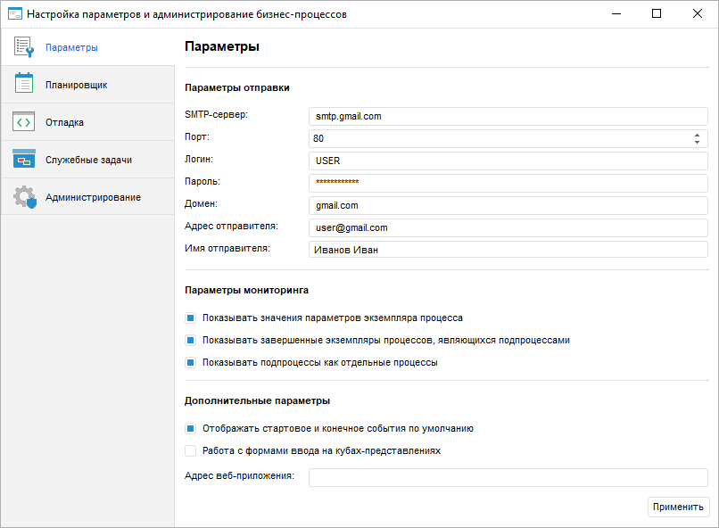
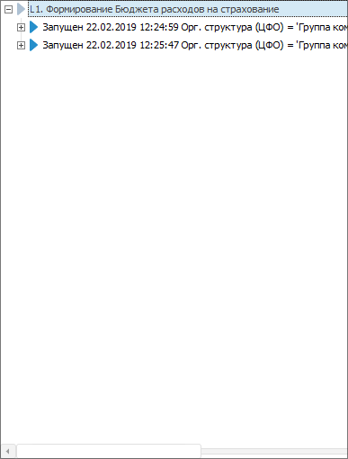
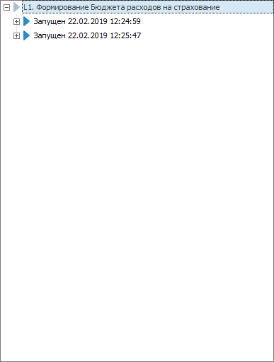
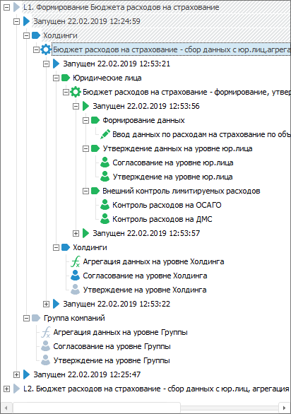
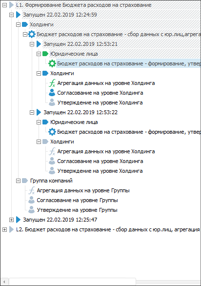
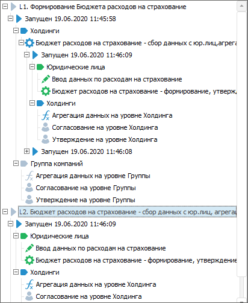
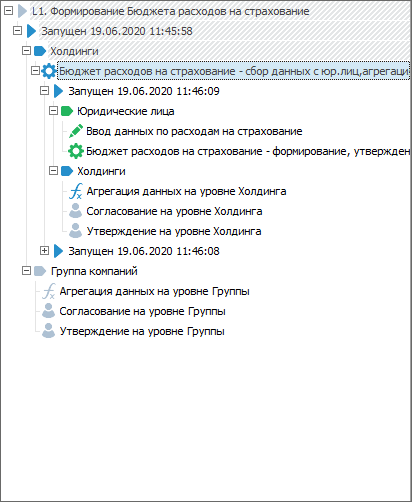
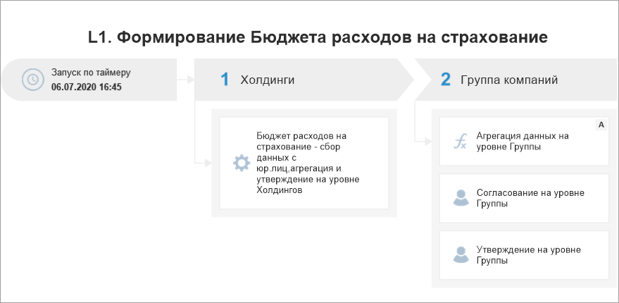

# Настройка параметров бизнес-процессов: Настольное приложение

Настройка параметров бизнес-процессов: Настольное приложение
-

# Настройка параметров бизнес-процессов

Настройка параметров бизнес-процессов включает параметры отправки e-mail
 оповещений, параметры [мониторинга](../Starting/Monitoring_process_execution.htm)
 и дополнительные параметры процессов. Для настройки параметров бизнес-процессов
 используйте страницу «Параметры»
 в окне «[Настройка
 параметров и администрирование бизнес-процессов](Setting_and_administrating_process_parameters.htm)».

[Для открытия
 страницы «Параметры»](javascript:TextPopup(this))

	- Откройте на просмотр утилиту «Настройка
	 параметров и администрирование бизнес-процессов» с идентификатором
	 BP_UTIL, которая входит в состав компонента «Бизнес-процессы».
	 Будет открыто окно «Настройка параметров
	 и администрирование бизнес-процессов».

		- Перейдите на страницу «Параметры».

Задайте параметры:

	- Параметры
	 отправки. Заполните поля для настройки отправки e-mail оповещений:

		- SMTP-сервер. Укажите
		 DNS-имя, по которому доступен SMTP-сервер. Поле обязательно для
		 заполнения;

		- Порт. Укажите TCP-порт,
		 по которому доступен SMTP-сервер. Поле обязательно для заполнения;

		- Логин. Введите имя
		 пользователя учётной записи для доступа к SMTP-серверу. Поле обязательно
		 для заполнения;

		- Пароль. Введите
		 пароль пользователя. Поле обязательно для заполнения;

		- Домен. Укажите доменное
		 имя SMTP-сервера. Поле обязательно для заполнения;

		- Адрес отправителя.
		 Введите адрес электронной почты для отправки сообщений. Поле обязательно
		 для заполнения;

		- Имя отправителя.
		 Введите имя отправителя оповещения;

	- Параметры
	 мониторинга. Установите соответствующие флажки для настройки
	 отображения/скрытия параметров запуска, шагов подпроцессов и выполненных
	 шагов подпроцессов [дерева
	 процессов](../Starting/Starting.htm#tree):

		- Показывать значения параметров
		 экземпляра процесса. По умолчанию флажок установлен, параметры
		 запущенных [экземпляров
		 процесса](../Starting/Starting.htm#tree) отображаются в дереве процессов. Если флажок снят,
		 то параметры не отображаются;

		- Показывать завершенные
		 экземпляры процессов, являющихся подпроцессами. По умолчанию
		 флажок установлен, выполненные шаги экземпляров подпроцессов отображаются
		 в дереве процесса. Если флажок снят, то выполненные шаги подпроцессов
		 скрываются до уровня шага с подпроцессом;

		- Показывать подпроцессы
		 как отдельные процессы. По умолчанию флажок установлен,
		 подпроцессы отображаются в виде отдельных процессов со всеми шагами
		 и возможностью перехода по ним. Если флажок снят, то подпроцессы
		 отображаются без вложенных шагов в дереве процессов;

[Примеры
 отображения параметров мониторинга](javascript:TextPopup(this))

	Пример дерева процессов с отображением
	 и без отображения значений параметров запущенных экземпляров процесса:

	
	  

	Пример дерева процессов с отображением
	 и без отображения выполненных шагов подпроцесса:

	
	 

	Пример дерева с отображением подпроцессов
	 в виде отдельных процессов со всеми шагами и подпроцессов без отображения
	 вложенных шагов:

	
	  

	- Дополнительные
	 параметры. Укажите дополнительные параметры при необходимости:

		- Отображать
		 стартовое и конечное события по умолчанию. События по умолчанию
		 являются визуальными элементами начала и окончания выполнения
		 процесса. Установите флажок для отображения стартового и конечного
		 [событий](Setting_up_Events.htm) по умолчанию в окне
		 [настройки](../Starting/Starting.htm#setting_business_process)
		 и [мониторинга
		 процесса](../Starting/Starting.htm#setting_business_process).

[Примеры
 отображения стартового и конечного событий](javascript:TextPopup(this))

	Пример отображения стартового и конечного
	 событий по умолчанию:

	

	Пример отображения событий без отображения
	 по умолчанию:

	

		- Работа с формами ввода на кубах-представлениях.
		 Разберем случай, когда требуется установка флажка. Исходные объекты:

			- форма ввода с [отметкой
			 элементов измерения](DataEntryForms.chm::/desktop/Table/Select_dimension_elements.htm), основанной на [кубах-представлениях](UiNavObj.chm::/Cube/CreateCube/Master_Conception/UiMd_Cube_CreateCube_Master_Conception.htm),
			 которые созданы на основе стандартных кубов;

			- [объект
			 полномочий](../Facility_Agreement/Create_Authorization_Object.htm), где в качестве источника сегмента данных используются
			 те же стандартные кубы.

Если объект полномочий и форма ввода используются
 в одном процессе и их отметка элементов измерений совпадает, то установите
 флажок для отображения шагов запущенного процесса в [дереве процессов](DataEntryForms.chm::/desktop/Work/Agreement.htm)
 формы ввода;

		- Адрес веб-приложения. Укажите адрес
		 веб-приложения, в котором будет осуществляться просмотр объектов
		 по ссылке из e-mail оповещения. [Ссылка
		 на объект](StepsProcess/E-mail.htm#link_to_object) настраивается в шаге «[Отправка
		 e-mail оповещения](StepsProcess/E-mail.htm)».

После настройки параметров бизнес-процессов нажмите кнопку «Применить».

См. также:

[Настройка
 параметров и администрирование бизнес-процессов](Setting_and_administrating_process_parameters.htm) | [Настройка
 планировщика бизнес-процессов](Setting_planner.htm) | [Настройка
 отладки бизнес-процессов](Setting_debug.htm) | [Создание
 служебных задач для бизнес-процессов](Creating_service_tasks.htm) | [Администрирование
 бизнес-процессов](Administrating.htm)

		Справочная
		 система на версию 10.9
		 от 18/08/2025,
		 © ООО «ФОРСАЙТ»,
